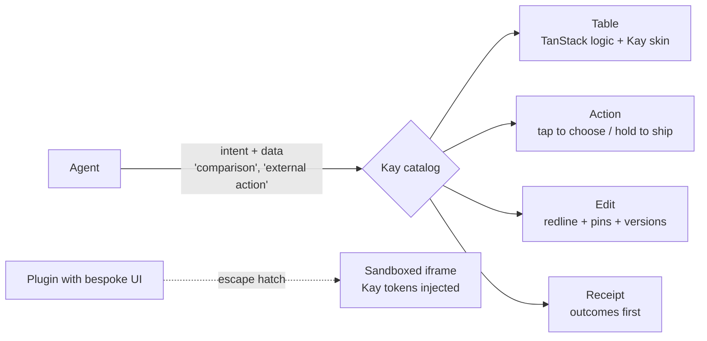
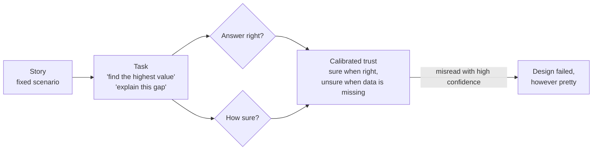

# For Ethan

A living log of what we are building, why, and what we learned along the way.

## 1. The Story So Far

We are preparing for a founding design-engineer interview at YakLabs, whose product is Kay: a desktop AI workspace that turns non-technical knowledge workers into AI power users.
We picked one of the three problems in the posting - making agent work legible - and have been arguing our way to a set of interaction principles, recorded as ADRs in `docs/adr/adr.md`.
The first code exists: `catalog-lab/`, a React + Storybook experiment where an agent may only pick from a strict catalog of chart and table cards.
Next: fit those cards into a chat thread panel (ADR-023), then the site of working prototypes.

## 2. Cast & Crew

Nothing is built yet, so the cast is the set of ideas the prototypes will be made of.

- **The compose box** is the teleprompter: it never moves while the anchor reads (ADR-003).
- **The skill chip** is the slate clapped at the top of a take: proof of what is rolling before anyone acts (ADR-009).
- **Hold-to-ship** is the director's "and... action": tap to set up the shot, hold to roll with the usual settings (ADR-010).
- **Pins** are picture lock: the cut you like is frozen while everything else keeps moving (ADR-012).
- **The redline** is the script revision page: struck lines out, new lines marked, nothing silently replaced (ADR-013).
- **The component catalog** is the show bible: it makes a thousand guest directors produce one show (see Director's Commentary).

## 3. Behind the Scenes

- **Legibility over the other two problems.** It is the product's core promise and it shows timing, hierarchy, and progressive disclosure directly.
- **Plain-language skill matching over `/` commands.** A slash command asks a non-technical person to learn syntax; plain words plus a chip give the same confirmation without the exam.
- **Autosave inside Kay, deliberate actions outside it.** Saving is never the user's job; consequences always are.
- **TanStack versus shadcn is not either/or.** One is the engine, the other is the paint job; what keeps agent-built UI coherent is the catalog above both (see `docs/03-generative-ui-research.md`).

## 4. Bloopers

- **The docs were behind a locked door.** The environment's network policy blocked docs.meetkay.ai, so Kay's vocabulary was reconstructed from search snippets and Ramp's Glass. Everything inferred is labeled; verify before the interview.
- **The push that was not a network problem.** GitHub was reachable, but the Claude GitHub App was not installed on the repo, so pushes returned 403. Network allowlist and repo permission are two different gates.

- **The screenshots that looked like a phone.** Review captures were taken at 2x pixel density, tightly cropped around a 707px panel, so a desktop column read as a mobile app. They also hid a real bug: a fixed 720px panel height clipped the compose box in Storybook's preview. Lesson: judge UI at 1x, in a realistic window (1440x900), with its surroundings visible, because scale is only legible in context.

## 5. Director's Commentary

### The agent only states intent; the design system does the rest

The big insight for problem 2 ("a design system agents can build with") is that the agent should never draw UI.
It should say *what* it means - "this is a comparison", "this action sends something outside Kay" - and the system decides how that looks, moves, and asks for confirmation.

You already built a small version of this in `pm-interview-dashboard-main`.
In `src/App.tsx`, the model only names a tool; your code picks the component:

```tsx
// The LLM never writes UI. It names a tool and emits JSON args;
// this switch turns each result into a typed, designed component.
switch (result.tool) {
  case "listRecent":
    return <AgentRunsTable rows={toAgentRunRows(result.data)} />;
  case "listCostRollups":
    return <CostBreakdown rows={result.data} />;
  case "dailyUniqueUsers":
    return <DailyUsersLineChart data={toDailyUsersLineData(result.data)} />;
  default: {
    // Exhaustiveness check: adding a tool without a render decision
    // is a compile error, so no surface ever ships undesigned.
    const _exhaustive: never = result;
    return _exhaustive;
  }
}
```



What the same move looks like at Kay's scale:

| Without a system | With one |
| --- | --- |
| The agent writes a custom "Send" button with a confirm popup | The agent uses `<Action effect="external">`, and it automatically gets tap-to-choose / hold-to-ship (ADR-010) |
| The agent overwrites a doc however it likes | The agent uses `<Edit>`, and it automatically gets a redline, respects pins, and records a version (ADR-011/012/013) |
| The agent writes a wall of text about what it did | The agent emits events, and the outcomes-first receipt renders itself (ADR-005/006) |

Why this matters:
the legibility patterns stop being one-off screens and become building blocks that every future surface gets for free.
Problem 2 falls out of problem 1.

The film version: episodic TV has a different guest director almost every week, yet it feels like one show because of the showrunner and the show bible.
The catalog is the show bible, written so well that a thousand guest directors - most of them agents - still make one show without the showrunner reviewing every cut.

Senior-engineer takeaway: when output volume outgrows review capacity, stop reviewing outputs and start constraining inputs.
Your `never` exhaustiveness check is the same idea in miniature: the compiler, not a reviewer, guarantees coverage.

### Test screenings, not beauty contests

The usual way to test a chart is to show two versions and ask "which do you prefer?"
People pick the prettier one, and UX research keeps finding that preference and performance often disagree: the chart someone likes can be the one they misread.

`catalog-lab` flips this.
Every Storybook story is a scenario that carries the question a real user would ask, so the same fixture serves development and research:

```ts
// catalog-lab/src/fixtures.ts
// Each scenario pairs a user question with a fixed agent payload,
// so a test session never depends on a live model's mood.
export const scenarios: Record<
  string,
  { label: string; question: string; payload: unknown }
> = {
  trend: {
    label: "Weekly trend",
    question: "How did closed cases change this week?",
    payload: trend,
  },
  // ...snapshot, comparison, sparse, missing, empty, unsupported, unsafe
};
```



Two measurements matter: task success (did they get it right?) and confidence (how sure were they?).
Confidence is the one AI products forget.
The dangerous user is not the confused one; it is the confidently wrong one, who reads a missing value as zero and acts on it.
Good legibility produces calibrated trust: sure when the data supports it, unsure when it does not.
That is the posting's "show too little and they cannot trust it" problem, measured.

The film version: at a test screening, the useful question is not "did you like the cut?" but "what happened in act two?"
If the audience cannot retell the story, the edit failed, however beautiful it looks.

Say it in the interview in one line: "I don't ask users which chart they like; I give them a task and measure whether they got it right and how confident they were, because with AI the danger is confident misreading."
