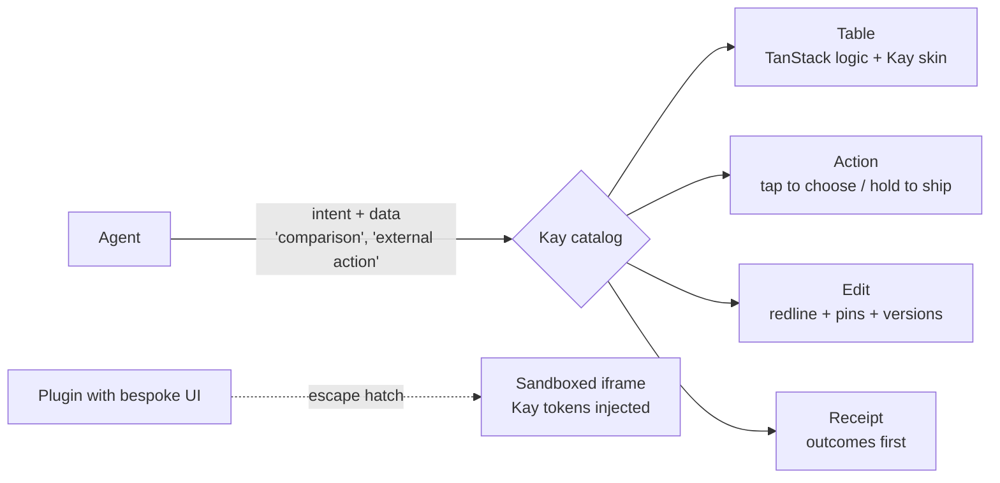
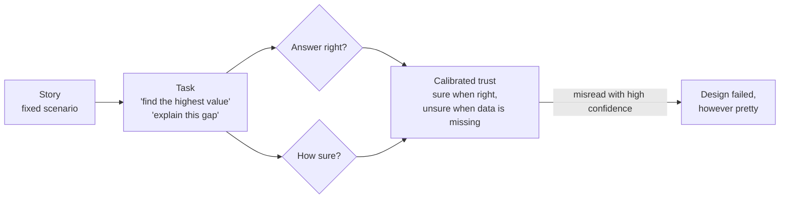
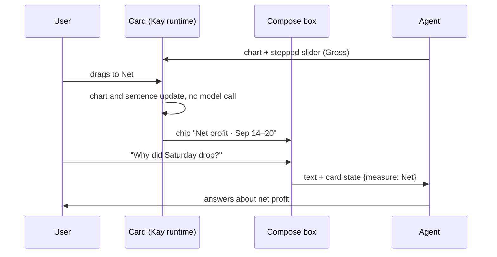
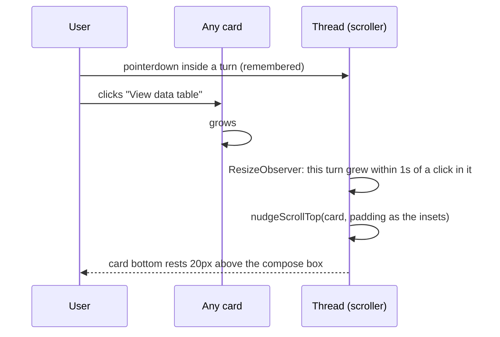
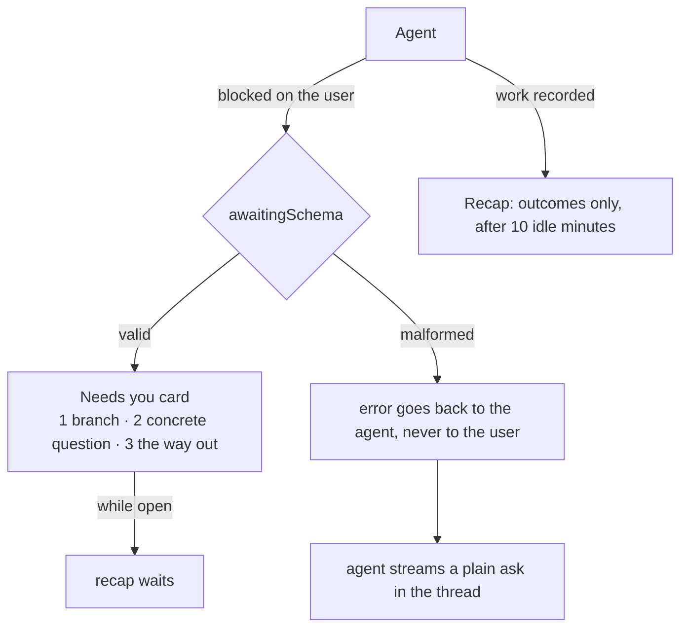
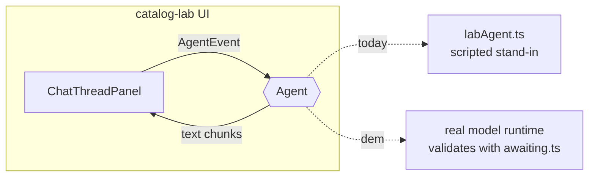

# For Ethan

A living log of what we are building, why, and what we learned along the way.

## 1. The Story So Far

We are preparing for a founding design-engineer interview at YakLabs, whose product is Kay: a desktop AI workspace that turns non-technical knowledge workers into AI power users.
We picked one of the three problems in the posting - making agent work legible - and have been arguing our way to a set of interaction principles, recorded as ADRs in `docs/adr/adr.md`.
The first code exists: `catalog-lab/`, a React + Storybook experiment where an agent may only pick from a strict catalog of chart and table cards.
Next: fit those cards into a chat thread panel (ADR-023), then the site of working prototypes.
The thread now keeps every expanded card 20px above the compose box (ADR-038), and a question the agent is blocked on gets its own "Needs you" card instead of hiding inside the recap (ADR-039).

## 2. Cast & Crew

Nothing is built yet, so the cast is the set of ideas the prototypes will be made of.

- **The compose box** is the teleprompter: it never moves while the anchor reads (ADR-003).
- **The skill chip** is the slate clapped at the top of a take: proof of what is rolling before anyone acts (ADR-009).
- **Hold-to-ship** is the director's "and... action": tap to set up the shot, hold to roll with the usual settings (ADR-010).
- **Pins** are picture lock: the cut you like is frozen while everything else keeps moving (ADR-012).
- **The redline** is the script revision page: struck lines out, new lines marked, nothing silently replaced (ADR-013).
- **The component catalog** is the show bible: it makes a thousand guest directors produce one show (see Director's Commentary).

## 3. Behind the Scenes

- **Legibility over the other two problems.** It is the product's core promise and it shows timing, hierarchy, and progressive disclosure directly.
- **Plain-language skill matching over `/` commands.** A slash command asks a non-technical person to learn syntax; plain words plus a chip give the same confirmation without the exam.
- **Autosave inside Kay, deliberate actions outside it.** Saving is never the user's job; consequences always are.
- **TanStack versus shadcn is not either/or.** One is the engine, the other is the paint job; what keeps agent-built UI coherent is the catalog above both (see `docs/03-generative-ui-research.md`).

- **"Show my work", not "Show recipe", and always closed.** "Recipe" is our word, the builder's word; a teacher's "show your work" is the user's. It starts collapsed on every card because the goal is trust: like a finished cut, the audience watches the film, and the edit decision list exists for whoever asks (ADR-036).

- **Nudge, don't center.** Centering an opened card (ADR-037) moved the frame even when nothing was hidden, and every component had to remember to ask for it. Now the thread only moves when a card would be clipped, and only far enough to rest 20px above the compose box, the same line the last card rests on (ADR-038).
- **The recap reports; it never asks.** A "Needs you" line inside the recap mixed two jobs, "here is what happened" and "I need a decision", and hid the decision behind ten idle minutes. A blocked agent now asks right away in its own card, with numbered choices and a "Chat about something else" exit, and the recap goes back to reporting (ADR-039).

- **A malformed question is the agent's problem to fix, not the user's to see.** When the card's check rejects a question, the error goes back to the agent, and the agent simply asks in plain words, streamed like any reply. The card either shows complete or not at all, and the user never reads a validation error (ADR-040).

- **Two short sentences, or it isn't a card.** Four rows only look considered if each one is brief, so the question and every detail are capped at two short sentences (120 characters, about three lines in the narrow card, measured). A question that needs more words is really the agent needing more context, so it asks in the thread instead. The caps come from the layout, not a guess: 48 characters per line, 43 in the one-line answer field.

- **The UI reports; the agent decides.** The panel used to hold three canned replies of its own. Now it only tells an `Agent` what happened and streams back whatever it says, so the same components can run against the lab stand-in today and a real model for the demo (ADR-041).

- **A question to answer should look like a place to type.** In the "Needs you" card, row 2 looked like a third statement. It now uses a new text-field primitive with the button's outline and 4px corners, and a greyer placeholder, so "answer me" never reads as "pick me" (ADR-043).

- **Choose, then confirm.** The "Needs you" card used to send the moment a row was clicked. Now a click, number, or arrow only selects (the number fills in), and Enter or Submit sends, with Skip beside it, the way Claude and Amp ask questions. The header folds the card to one line so the thread above stays readable (ADR-045).

## 4. Bloopers

- **The docs were behind a locked door.** The environment's network policy blocked docs.meetkay.ai, so Kay's vocabulary was reconstructed from search snippets and Ramp's Glass. Everything inferred is labeled; verify before the interview.
- **The push that was not a network problem.** GitHub was reachable, but the Claude GitHub App was not installed on the repo, so pushes returned 403. Network allowlist and repo permission are two different gates.

- **The screenshots that looked like a phone.** Review captures were taken at 2x pixel density, tightly cropped around a 707px panel, so a desktop column read as a mobile app. They also hid a real bug: a fixed 720px panel height clipped the compose box in Storybook's preview. Lesson: judge UI at 1x, in a realistic window (1440x900), with its surroundings visible, because scale is only legible in context.

- **Two tapes labelled "recap" and "RECAP".** `recap.ts` (rules) and `Recap.tsx` (component) sat in one folder. Linux treats them as different files, so every check passed in the cloud container; macOS ignores letter case by default, so `import "./Recap"` found `recap.ts` first and Storybook broke on Ethan's machine. Fix: rename to `recapRules.ts`, plus a test that fails if two modules ever differ only by case. Lesson: never let file names differ only by capitalization, and turn a bug into a guard, not just a fix.

- **The screenshot that was a rerun.** Figma's screenshot service showed Sunday's bar at about 18px, while the live file said 119px. The live file was right (Sunday's gross profit is about $8.6k); the render was from an older save. Lesson: when two views of one thing disagree, check which is the source of truth before blaming the edit.

- **A card that needed a window to exist.** The first test to render the interactive card outside a browser crashed, because it read `window` during render to check reduced motion. Kay is a desktop app, so users would never hit it, but a component should not assume its stage. Fix: guard the check and return the default.

- **The accordion that opened offstage.** Opening "Show my work" grew the card downward while the scroll position stayed put, so 140 to 170px of the steps landed below the visible edge, behind the compose box, from every starting position. When the view did sometimes shift, that was the browser's scroll anchoring guessing, not a rule. Fix: the thread owns one reveal rule (ADR-037). Lesson: when something expands, decide who moves the camera; if nobody does, the browser will, inconsistently.

- **The rule that only one card followed.** ADR-037 asked each component to call `reveal`, and only the interactive card did, so "View data table" still opened 31px under the compose box beside a split pane. Fix: the thread panel enforces the rule itself by watching every turn grow after a click (ADR-038). Lesson: a rule that depends on every component remembering it is a suggestion; put it where nothing can skip it.

- **The 20px that was really 16.** The last card was meant to rest 20px above the compose box but measured 16 to 20px, because the thread scrolled to its end before the charts and fonts finished sizing, then stopped a few pixels short. Fix: while the thread is at its end, it stays there as content settles, and the padding subtracts the compose row's 4px inset so the visible gap is exactly 20px. Lesson: measure the resting state after everything has loaded, not the frame after mount.

- **The question that vanished.** Writing "Chat about a plan to capture a different selection of sales data" into the typed-answer row broke the card: at 64 characters it passed the row's 60-character limit, so the strict schema dropped the whole question, as designed. It was also in the wrong row, which made rows 2 and 3 both ask "what do you want to chat about?". Fix: the way out got its own agent-worded field (`elsewhere`), and row 2 became a concrete question ("How many weeks ahead should it forecast?"). Lesson: fail-closed means a small content slip hides the whole card, so every row needs one clear job and a field of its own, and the rejection must go somewhere: back to the agent, which then asks in plain words (ADR-040).

## 5. Director's Commentary

### The agent only states intent; the design system does the rest

The big insight for problem 2 ("a design system agents can build with") is that the agent should never draw UI.
It should say *what* it means - "this is a comparison", "this action sends something outside Kay" - and the system decides how that looks, moves, and asks for confirmation.

You already built a small version of this in `pm-interview-dashboard-main`.
In `src/App.tsx`, the model only names a tool; your code picks the component:

```tsx
// The LLM never writes UI. It names a tool and emits JSON args;
// this switch turns each result into a typed, designed component.
switch (result.tool) {
  case "listRecent":
    return <AgentRunsTable rows={toAgentRunRows(result.data)} />;
  case "listCostRollups":
    return <CostBreakdown rows={result.data} />;
  case "dailyUniqueUsers":
    return <DailyUsersLineChart data={toDailyUsersLineData(result.data)} />;
  default: {
    // Exhaustiveness check: adding a tool without a render decision
    // is a compile error, so no surface ever ships undesigned.
    const _exhaustive: never = result;
    return _exhaustive;
  }
}
```



What the same move looks like at Kay's scale:

| Without a system | With one |
| --- | --- |
| The agent writes a custom "Send" button with a confirm popup | The agent uses `<Action effect="external">`, and it automatically gets tap-to-choose / hold-to-ship (ADR-010) |
| The agent overwrites a doc however it likes | The agent uses `<Edit>`, and it automatically gets a redline, respects pins, and records a version (ADR-011/012/013) |
| The agent writes a wall of text about what it did | The agent emits events, and the outcomes-first receipt renders itself (ADR-005/006) |

Why this matters:
the legibility patterns stop being one-off screens and become building blocks that every future surface gets for free.
Problem 2 falls out of problem 1.

The film version: episodic TV has a different guest director almost every week, yet it feels like one show because of the showrunner and the show bible.
The catalog is the show bible, written so well that a thousand guest directors - most of them agents - still make one show without the showrunner reviewing every cut.

Senior-engineer takeaway: when output volume outgrows review capacity, stop reviewing outputs and start constraining inputs.
Your `never` exhaustiveness check is the same idea in miniature: the compiler, not a reviewer, guarantees coverage.

### Test screenings, not beauty contests

The usual way to test a chart is to show two versions and ask "which do you prefer?"
People pick the prettier one, and UX research keeps finding that preference and performance often disagree: the chart someone likes can be the one they misread.

`catalog-lab` flips this.
Every Storybook story is a scenario that carries the question a real user would ask, so the same fixture serves development and research:

```ts
// catalog-lab/src/fixtures.ts
// Each scenario pairs a user question with a fixed agent payload,
// so a test session never depends on a live model's mood.
export const scenarios: Record<
  string,
  { label: string; question: string; payload: unknown }
> = {
  trend: {
    label: "Weekly trend",
    question: "How did closed cases change this week?",
    payload: trend,
  },
  // ...snapshot, comparison, sparse, missing, empty, unsupported, unsafe
};
```



Two measurements matter: task success (did they get it right?) and confidence (how sure were they?).
Confidence is the one AI products forget.
The dangerous user is not the confused one; it is the confidently wrong one, who reads a missing value as zero and acts on it.
Good legibility produces calibrated trust: sure when the data supports it, unsure when it does not.
That is the posting's "show too little and they cannot trust it" problem, measured.

The film version: at a test screening, the useful question is not "did you like the cut?" but "what happened in act two?"
If the audience cannot retell the story, the edit failed, however beautiful it looks.

Say it in the interview in one line: "I don't ask users which chart they like; I give them a task and measure whether they got it right and how confident they were, because with AI the danger is confident misreading."

### Continuity: every interactive surface reports back

The moment a card becomes interactive, the agent and the user can end up looking at different things.
The agent answered about gross profit; the user dragged the slider to net; the user asks "why did Saturday drop?"; the agent confidently explains a chart the user is no longer looking at.
Nothing looks broken, which is what makes it the worst kind of legibility failure.

The film version is continuity: the script supervisor makes sure the next shot matches what the audience last saw.
Dragging the slider changed the set, so the next take has to know.

The fix (ADR-030): the card's current state rides along with the user's next message as a visible, removable chip, the same rule as the skill chip (ADR-009).
Silent context would also work technically, but then the user cannot see or control what the agent acts on.

```ts
// Sketch: what the next message carries when the user has moved a control.
type OutgoingMessage = {
  text: string; // "Why did Saturday drop?"
  attachments: {
    kind: "card-state";
    turnId: string; // the card the state came from
    label: string; // shown on the chip: "Net profit · Sep 14–20"
    state: Record<string, string>; // { measure: "Net" }
  }[];
};
```



Say it in the interview: "When a surface is interactive, the agent has to know what the user changed, and the user has to see that the agent knows."

### Reframe on the action: one rule for anything that expands

A camera operator does not wait for the director to shout "tilt up" every time an actor stands; reframing on movement is the operator's standing job.
In the thread, the scroller is the camera operator, and it now reframes on its own: no component has to ask.

```ts
// catalog-lab/src/threadReveal.ts: move only if the card is clipped, and only enough to rest
// it 20px above the compose box; a card taller than the view starts at its top; never scroll up.
export function nudgeScrollTop(target: Span, view: Viewport): number {
  const bandBottom = view.scrollTop + view.height - view.insetBottom;
  if (target.bottom <= bandBottom) return view.scrollTop;
  const bottomAligned = target.bottom - view.height + view.insetBottom;
  const topAligned = target.top - view.insetTop;
  return clamp(Math.max(view.scrollTop, Math.min(bottomAligned, topAligned)), view.maxScrollTop);
}
```



Two details make it hold up.
The insets come from the scroller's own padding, which already includes the dock card, so a nudged card lands exactly where the thread's last card rests: one resting line, not two.
And growth nobody asked for (a chart sizing, a font loading) never nudges; it only keeps a thread that was at its end at its end.

Say it in the interview: "Expansion is a camera move, so the thread owns it, and it moves the camera as little as possible: only when something would be hidden, only as far as the resting line."

### Separation of concerns: the recap reports, "Needs you" asks

A "previously on" montage recaps the story; it never stops to ask the audience a question.
When the recap carried a "Needs you" line, a blocked agent waited ten idle minutes to be noticed, and the user had to read history to find a decision.
Now the question is its own validated payload, and the host always adds the exit.

```ts
// catalog-lab/src/awaiting.ts: the agent supplies the question and its branches; the host
// renders them numbered and always appends "Chat about something else" (AwaitingInputCard.tsx).
export const awaitingSchema = z.strictObject({
  question: text,
  options: z.array(z.strictObject({ label: ..., detail: text.optional() })).min(1).max(4),
  answer: z.strictObject({ placeholder: ... }), // one concrete question, typed in the card
  elsewhere: z.string()...optional(), // the way out, worded for the moment
});
```



Say it in the interview: "A recap is for catching up; a question is for deciding. Mixing them made the decision wait and made the history noisy."

### One seam for a real model: the UI reports, the agent answers

A film set does not care whether the voice on the other end of the walkie-talkie is the real director or a stand-in reading the script; it only needs the channel to work the same way.
The thread panel now talks to the agent through one channel, `Agent`, and the lab's scripted stand-in is just one voice on it.

```ts
// catalog-lab/src/agent.ts: the only contract the thread knows.
export type AgentEvent =
  | { kind: "message"; text: string; attachments: CardAttachment[] }
  | { kind: "answer"; text: string }
  | { kind: "question-rejected"; reason: string; question: unknown };

export type Agent = {
  respond(event: AgentEvent, signal: AbortSignal): AsyncIterable<string>;
};
```



Two details make it hold up.
A reply is an `AsyncIterable` of text chunks, which is exactly the shape a model's token stream already has, so a real agent is an adapter, not a rewrite.
And the `AbortSignal` lets the panel stop a reply the moment it unmounts, so nothing streams into a thread nobody is looking at.

To run the UI against a real model later: write an `Agent` whose `respond` calls a small server route (keeping the API key off the browser), stream its text back, and pass it as `<ChatThreadPanel agent={realAgent} />`.

Say it in the interview: "The components never know who is answering; that is how the same UI is tested with a script and shipped with a model."
