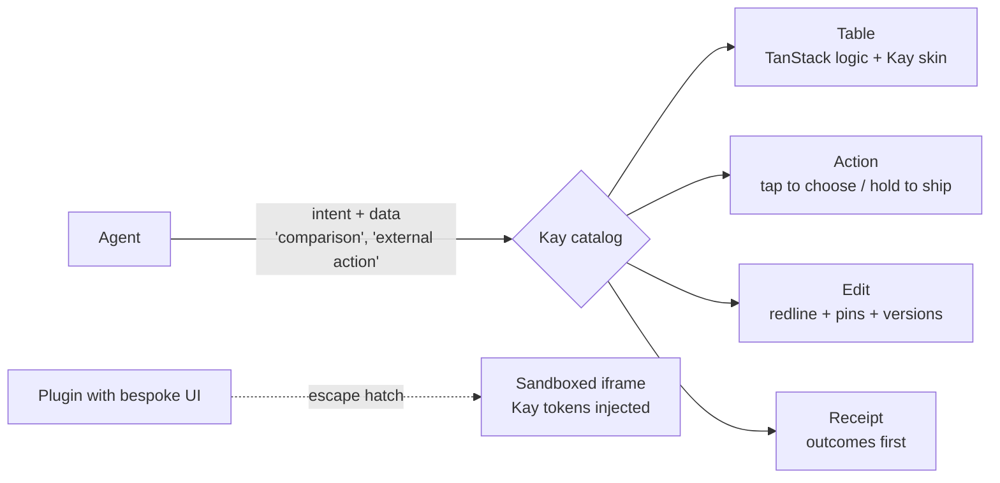
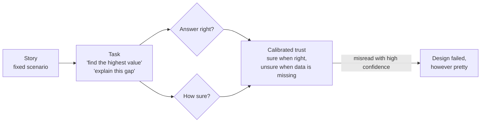
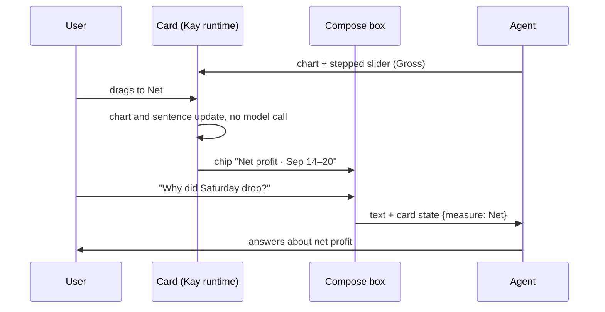
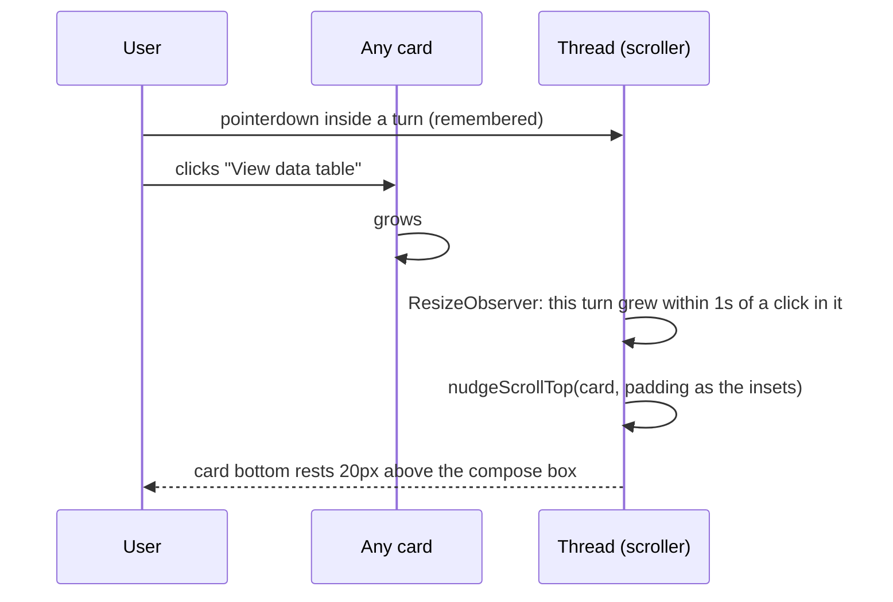
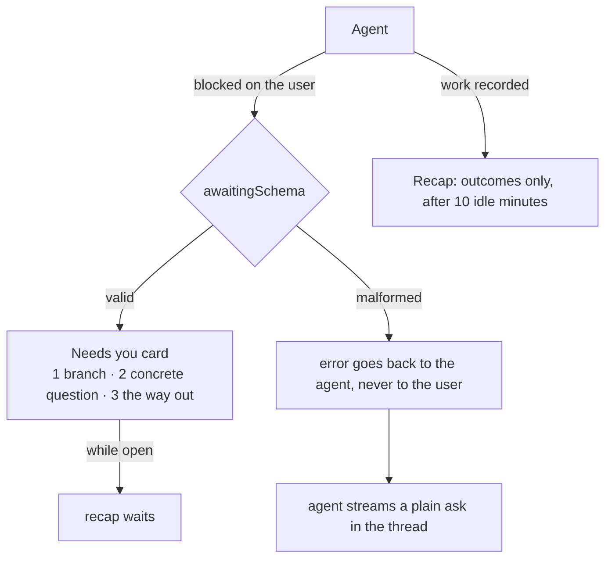
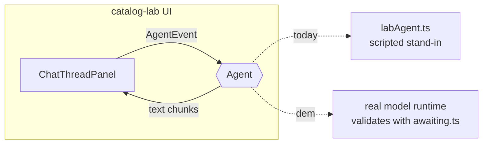
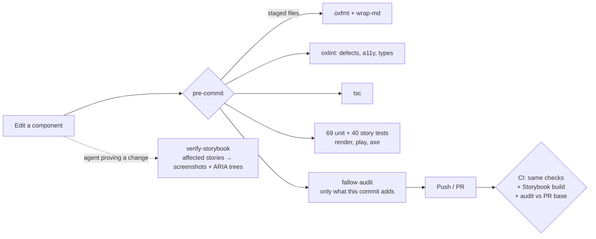
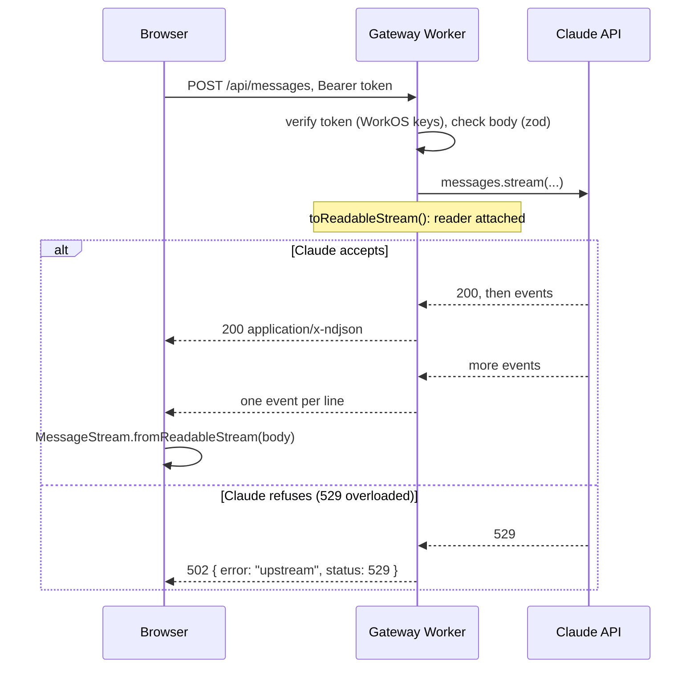
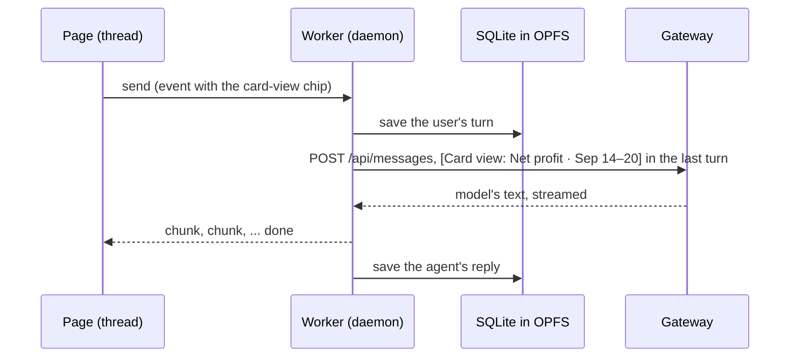
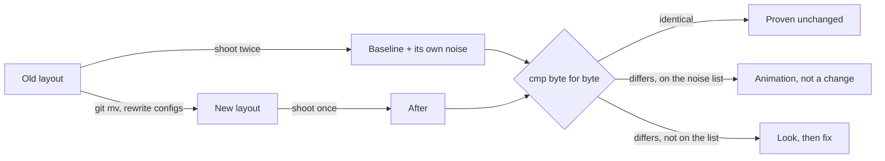

# For Ethan

A living log of what we are building, why, and what we learned along the way.

## 1. The Story So Far

We are preparing for a founding design-engineer interview at YakLabs, whose product is Kay: a
desktop AI workspace that turns non-technical knowledge workers into AI power users.
We picked one of the three problems in the posting - making agent work legible - and have been
arguing our way to a set of interaction principles, recorded as ADRs in `docs/adr/adr.md`.
The first code exists: `catalog-lab/`, a React + Storybook experiment where an agent may only pick
from a strict catalog of chart and table cards.
Next: fit those cards into a chat thread panel (ADR-023), then the site of working prototypes.
Ideas we agreed on but have not started live in `docs/LATER.md`.
The thread now keeps every expanded card 20px above the compose box (ADR-038), and a question the
agent is blocked on gets its own "Needs you" card instead of hiding inside the recap (ADR-039).
Every component is now run, not just read: all 40 stories render in headless Chromium with an axe
check on each commit and in CI, beside oxlint, oxfmt, `tsc` and fallow, and a `verify-storybook`
skill lets an agent screenshot whatever a change reaches.
The lab has become an app. The repo is now a pnpm monorepo in Better-T-Stack's layout
(ADR-087): the catalog is a package beside its stories, `apps/web` is the React Router site that
renders the profit thread, `packages/runtime` runs the agent loop and keeps every conversation in
SQLite inside the browser's private file system, and `apps/gateway` is the one Cloudflare Worker
that checks a WorkOS sign-in and streams Claude's reply back without keeping a copy. The moment it
all exists for: the user steps the profit card to net profit, asks "why is Saturday high?", that
choice rides into the model's prompt as `[Card view: Net profit · Sep 14–20]`, and the reply is
about the view they set (ADR-030, ADR-031). Proven in headless Chromium: the reply names the view,
and a reload brings all four turns back from disk. What still waits: a model key in the gateway,
and replies that produce cards, since the seam between thread and agent still carries only text.
The app has a shape now, not just a thread. A rail on the left holds the mark, Thread and Lab, the
theme and the account. Beside the thread sits the compose canvas (ADR-089): a dotted field where a
highlight dragged out of the thread starts a new thread of the same project, with the highlight
quoted in its compose box, and a card dragged by its header opens large in a lane of its own, with
open ground always kept to the right for the next drop. The divider between thread and canvas drags
anywhere along its length. And dark mode is real (ADR-090): the night green page, cream ink, every
ratio measured, where before only the attention cards changed.

## 2. Cast & Crew

Nothing is built yet, so the cast is the set of ideas the prototypes will be made of.

- **The compose box** is the teleprompter: it never moves while the anchor reads (ADR-003).
- **The skill chip** is the slate clapped at the top of a take: proof of what is rolling before
  anyone acts (ADR-009).
- **Hold-to-ship** is the director's "and... action": tap to set up the shot, hold to roll with the
  usual settings (ADR-010).
- **Pins** are picture lock: the cut you like is frozen while everything else keeps moving
  (ADR-012).
- **The redline** is the script revision page: struck lines out, new lines marked, nothing silently
  replaced (ADR-013).
- **The component catalog** is the show bible: it makes a thousand guest directors produce one show
  (see Director's Commentary).
- **The web app** (`apps/web`) is the theatre: the one room the audience sits in, with the thread
  on stage and sign-in at the door (ADR-083, ADR-084).
- **The runtime worker** (`packages/runtime`) is the production office behind the stage. It keeps
  the call sheets (the conversation store) and runs the shoot (the agent loop); the stage only
  passes notes through one door, and each note is checked on both sides (ADR-076, ADR-086).
- **The gateway** (`apps/gateway`) is the stage door and the runner. The guard checks every pass
  against the list WorkOS publishes (its signing keys); the runner carries the pages to the
  writers' room (Claude), relays each line back as it is spoken, and keeps no copy (ADR-085).
- **The Storybook app** (`apps/storybook`) is the screening room: every card and panel plays there
  alone, under the same lights, before it goes on stage.
- **The ui package** (`packages/ui`) is the paint shop: shadcn primitives mixed only from Kay's
  tokens, so anything an agent builds comes out in the house colours (ADR-082).
- **The rail** is the corridor outside the theatre: the mark on the door, one icon per room, and at
  the far end the light switch and the cloakroom.
- **The compose canvas** is the cutting-room wall: pull a line out of the thread and pin it up to
  start a new cut, drag a card over to see it at size, and there is always bare wall to the right
  for the next idea (ADR-089).

## 3. Behind the Scenes

- **Legibility over the other two problems.** It is the product's core promise and it shows timing,
  hierarchy, and progressive disclosure directly.
- **Plain-language skill matching over `/` commands.** A slash command asks a non-technical person
  to learn syntax; plain words plus a chip give the same confirmation without the exam.
- **Autosave inside Kay, deliberate actions outside it.** Saving is never the user's job;
  consequences always are.
- **TanStack versus shadcn is not either/or.** One is the engine, the other is the paint job; what
  keeps agent-built UI coherent is the catalog above both (see `docs/03-generative-ui-research.md`).

- **"Show my work", not "Show recipe", and always closed.** "Recipe" is our word, the builder's
  word; a teacher's "show your work" is the user's. It starts collapsed on every card because the
  goal is trust: like a finished cut, the audience watches the film, and the edit decision list
  exists for whoever asks (ADR-036).

- **Nudge, don't center.** Centering an opened card (ADR-037) moved the frame even when nothing was
  hidden, and every component had to remember to ask for it. Now the thread only moves when a card
  would be clipped, and only far enough to rest 20px above the compose box, the same line the last
  card rests on (ADR-038).
- **The recap reports; it never asks.** A "Needs you" line inside the recap mixed two jobs, "here is
  what happened" and "I need a decision", and hid the decision behind ten idle minutes. A blocked
  agent now asks right away in its own card, with numbered choices and a "Chat about something else"
  exit, and the recap goes back to reporting (ADR-039).

- **A malformed question is the agent's problem to fix, not the user's to see.** When the card's
  check rejects a question, the error goes back to the agent, and the agent simply asks in plain
  words, streamed like any reply. The card either shows complete or not at all, and the user never
  reads a validation error (ADR-040).

- **Two short sentences, or it isn't a card.** Four rows only look considered if each one is brief,
  so the question and every detail are capped at two short sentences (120 characters, about three
  lines in the narrow card, measured). A question that needs more words is really the agent needing
  more context, so it asks in the thread instead. The caps come from the layout, not a guess: 48
  characters per line, 43 in the one-line answer field.

- **The UI reports; the agent decides.** The panel used to hold three canned replies of its own. Now
  it only tells an `Agent` what happened and streams back whatever it says, so the same components
  can run against the lab stand-in today and a real model for the demo (ADR-041).

- **Copy the scaffold, then take out what fights the design.** Better-T-Stack scaffolded only the
  frontend; Varlock (an env codegen step), the server entry and `next-themes` did not survive,
  because the app parses its settings once with zod, renders no server, and React 19 refuses the
  inline script `next-themes` needs. Fourteen of seventeen generated shadcn components went too:
  nothing imported them, and `shadcn add` restores any in seconds (ADR-087).
- **Kay's stylesheet sits in its own cascade layer.** `tokens.css` styles bare buttons, links and
  headings. Unlayered it would beat every Tailwind utility on a shadcn primitive; below preflight
  the catalog's own look would reset. So it loads in a `catalog` layer between the two.
- **Save the line before the take.** The worker writes the user's message to disk before the agent
  answers, so a failed reply never loses what the user typed; the reply is saved when it ends, or
  when the user stops it, with whatever streamed so far, which is what the screen showed.
- **Pass the reel through; don't re-edit it.** The gateway streams the SDK's own events, one JSON
  object per line, and the browser rebuilds them with the same SDK
  (`MessageStream.fromReadableStream`). A format of our own would need a second decoder, kept in
  step with every block type Claude adds; passing the reel through means the projector already
  reads it.
- **Check at both doors.** The worker checks every command, and the page checks its own before
  sending. A malformed command (say, an empty token) then fails where it was made, instead of
  arriving as an `error` nobody can match to a call.
- **Nothing environment-specific in the Worker's config.** Both bindings live in the Cloudflare
  dashboard, the key as a secret and the client id as a variable, with `keep_vars` on so a deploy
  keeps them. A value named under `vars`, even an empty placeholder, would replace the
  dashboard's on every deploy.
- **A failed reply ends in plain words.** The gateway can answer 401 or 5xx. The thread now ends
  such a turn with one sentence and stops the streaming state, and the cause goes to the console,
  never the thread (ADR-040).

- **A question to answer should look like a place to type.** In the "Needs you" card, row 2 looked
  like a third statement. It now uses a new text-field primitive with the button's outline and 4px
  corners, and a greyer placeholder, so "answer me" never reads as "pick me" (ADR-043).

- **Choose, then confirm.** The "Needs you" card used to send the moment a row was clicked. Now a
  click, number, or arrow only selects (the number fills in), and Enter or Submit sends, with Skip
  beside it, the way Claude and Amp ask questions. The header folds the card to one line so the
  thread above stays readable (ADR-045).

- **Speak the site's language.** Our tokens now carry yaklabs.ai's own names and values (`--paper`,
  `--ink`, `--soft-ink`, `--rule`, `--hairline`, ...), read straight from its stylesheet, and follow
  its pattern of two inks and two line weights. Anything the site doesn't declare is prefixed
  `--yak-`, so you can tell at a glance what is theirs and what is ours (ADR-049).

- **Primitives before polish.** Disclosure, Menu, Modal, CardHeader and IconButton now sit under
  every surface, each with its own story, so a new card or panel is assembled rather than invented
  (ADR-062). The attach menu (with a real screenshot) and the card share menu are the same Menu.
- **Share the view, not the chat.** Each card can become a public page on its own; the card rides in
  the link and is validated again on arrival, so the catalog's safety travels with it (ADR-064).
- **Taste proposes, numbers dispose.** The eye adapts to whatever it is looking at, so a colour that
  feels fine can still be unreadable; a cinematographer trusts the light meter, not the monitor.
  Every colour is now measured against each surface it touches, hover included, and a failing pick
  is flagged with its ratio before it ships (ADR-065).
- **One editor holds the cut.** Anyone can watch the dailies, but only one editor works on the
  timeline at a time, or two people's changes overwrite each other. Parallel sessions read the
  branch freely; one writes, and handing over the branch is an explicit handoff with its head commit
  and open PR (ADR-066).
- **Fill is for the hand, not the rest.** The question card's options used to sit in grey pills even
  when nobody touched them, so the card looked busy before it was read. Now it rests on plain paper
  and a row fills only under the pointer, like a spotlight that follows the actor instead of
  lighting the whole stage; its label says "Needs attention" on a caution orange pill, warm like a
  yellow card rather than red like a stop (ADR-067, ADR-068).

- **One set of house rules at the root.** oxlint, oxfmt and fallow install once at the repo root,
  with `catalog-lab` as an npm workspace, so the next app inherits the same rules instead of
  copying them. Like one colour pipeline for the whole show, not one per episode.
- **Gate on what this change did, not on the whole history.** `fallow audit --base HEAD` fails
  only on findings a commit introduces; the older backlog is reported but never blocks. A gate
  that blocks unrelated work gets skipped with `--no-verify` within a day.
- **Vitest 4, on purpose.** Storybook's stable test addon supports Vitest 3 and 4; only a
  Storybook 11 alpha accepts 5. Stable tools under the proof layer beat the newest version.
- **Read the fine print; it is the architecture diagram.** Kay's legal pages say more about its
  build than any tech-detection plugin: the DPA names the hosts (Fly.io, Cloudflare), the database
  (Postgres), the app data folder, and the rule that conversations never leave the device. The slice
  follows that rule (ADR-075) and mirrors the process split, with a Web Worker as the daemon's
  stand-in (ADR-076). The reference lives in `docs/05-kay-stack-and-data.md`.

- **The slice is a location shoot, not a studio build.** Kay's app is a desktop "studio" with a
  daemon backstage; the web slice recreates the same blocking on location: React Router as a static
  single-page app for the stage (ADR-083), a Web Worker as the daemon backstage, owning the agent
  loop and SQLite in the browser's private file system (ADR-081), WorkOS at the door (ADR-084), and
  one Hono Worker on Cloudflare as the gateway that holds the keys and keeps nothing (ADR-085,
  ADR-086). Every piece maps to a part of Kay, so moving to their stack is recasting, not rewriting.

## 4. Bloopers

- **The rulebook with a missing chapter.** The first oxlint config listed five plugins. In oxlint,
  a `plugins` list replaces the defaults instead of adding to them, and `eslint` was not on the
  list, so core rules like `no-unused-vars` never ran and the output looked clean. Lesson: an
  empty report proves nothing until you know what was switched on.
- **The installer that dropped the unit tests.** Adding Storybook's test addon wrote a Vitest
  `projects` list with only the story project, so the 69 unit tests would silently stop running.
  Caught because the count was checked: 109 tests (69 unit plus 40 stories), not 40.
- **The screenshot shot mid-dissolve.** The first proof capture of the "Needs attention" card came
  out washed out, because the card fades in and the camera fired during the fade. Fix: wait for
  fonts and finish animations before each capture. Lesson: evidence of a fade-in must be the last
  frame, like grabbing a still after the dissolve, not during it.
- **The modal that never took focus.** Driving the modal in a real browser showed focus staying on
  the button that opened it, so Escape did nothing until you tabbed in. Reading the code had
  suggested a working focus trap; only running it showed the trap had no one inside.

- **The docs were behind a locked door.** The environment's network policy blocked docs.meetkay.ai,
  so Kay's vocabulary was reconstructed from search snippets and Ramp's Glass. Everything inferred
  is labeled; verify before the interview.
- **The push that was not a network problem.** GitHub was reachable, but the Claude GitHub App was
  not installed on the repo, so pushes returned 403. Network allowlist and repo permission are two
  different gates.

- **The screenshots that looked like a phone.** Review captures were taken at 2x pixel density,
  tightly cropped around a 707px panel, so a desktop column read as a mobile app. They also hid a
  real bug: a fixed 720px panel height clipped the compose box in Storybook's preview. Lesson: judge
  UI at 1x, in a realistic window (1440x900), with its surroundings visible, because scale is only
  legible in context.

- **Two tapes labelled "recap" and "RECAP".** `recap.ts` (rules) and `Recap.tsx` (component) sat in
  one folder. Linux treats them as different files, so every check passed in the cloud container;
  macOS ignores letter case by default, so `import "./Recap"` found `recap.ts` first and Storybook
  broke on Ethan's machine. Fix: rename to `recapRules.ts`, plus a test that fails if two modules
  ever differ only by case. Lesson: never let file names differ only by capitalization, and turn a
  bug into a guard, not just a fix.

- **The screenshot that was a rerun.** Figma's screenshot service showed Sunday's bar at about 18px,
  while the live file said 119px. The live file was right (Sunday's gross profit is about $8.6k);
  the render was from an older save. Lesson: when two views of one thing disagree, check which is
  the source of truth before blaming the edit.

- **A card that needed a window to exist.** The first test to render the interactive card outside a
  browser crashed, because it read `window` during render to check reduced motion. Kay is a desktop
  app, so users would never hit it, but a component should not assume its stage. Fix: guard the
  check and return the default.

- **The accordion that opened offstage.** Opening "Show my work" grew the card downward while the
  scroll position stayed put, so 140 to 170px of the steps landed below the visible edge, behind the
  compose box, from every starting position. When the view did sometimes shift, that was the
  browser's scroll anchoring guessing, not a rule. Fix: the thread owns one reveal rule (ADR-037).
  Lesson: when something expands, decide who moves the camera; if nobody does, the browser will,
  inconsistently.

- **The rule that only one card followed.** ADR-037 asked each component to call `reveal`, and only
  the interactive card did, so "View data table" still opened 31px under the compose box beside a
  split pane. Fix: the thread panel enforces the rule itself by watching every turn grow after a
  click (ADR-038). Lesson: a rule that depends on every component remembering it is a suggestion;
  put it where nothing can skip it.

- **The typecheck that ran a package install.** `react-router typegen` hung Turbo for eleven
  minutes. React Router 8 installs `isbot` by itself when a project lacks it, and the install it
  spawned could not reach the registry through the proxy. Fix: keep `isbot` as a dependency and
  tell fallow why. Lesson: a hang in a type check is rarely the type check; read what the tool
  does before it checks anything.
- **The example config that was linting the repo.** After the move, oxlint reported rules nobody
  had turned on. It had found an example `.oxlintrc.json` under the vendored skills and applied it
  as a nested config. Fix: nested configs off, and ignore patterns that cover the whole vendored
  tree. Lesson: a file that looks like config is config to any tool that walks the tree.
- **The hook path that pointed at a ghost.** A throwaway worktree of `main` ran the old
  `prepare: husky` script, which wrote an absolute `core.hooksPath` into the shared repo config.
  Git ran no hook on any commit for an hour; every gate ran because someone ran it by hand. Fix:
  `pnpm install` reinstalls Lefthook with the hooks path reset, so the setup converges on its
  own. Lesson: when a hook is silent, check where git is looking before checking the hook.
- **Two `--accent`s.** shadcn's `--accent` is its hover fill; Kay's `--accent` was the olive on the
  slider. Loading both stylesheets would have turned the slider grey. Kay's became `--olive`
  before the bridge was written, with `--radius` becoming `--radius-card` for the same reason.
  Lesson: before mapping two vocabularies, list the words they share.
- **The script React refused to run.** `next-themes` prevents a flash of the wrong theme by
  rendering an inline script; React 19 logs an error when a client-rendered component contains
  one. A fifty-line theme module now sets `data-theme` on the root and boots the stored theme
  from the prerendered shell's head instead. Lesson: a library built for server rendering can
  carry assumptions a single-page app cannot meet.
- **The radio that swallowed a text field.** The "Needs attention" card's typed-answer row was a
  `div role="radio"` wrapping an `input`, so axe failed two stories on nested interactive
  controls. It is now a `<label>` around the field: a click anywhere focuses the field, whose focus
  selects the row, and the other rows carry their position and count so "3 of 3" still reads.
  Keyboard behaviour and pixels are unchanged. Lesson: a role is a promise about what is inside.
- **The build that waited for itself.** The Worker ships the web build as its assets, so its build
  must run after the web build. Saying so made Turbo report a cycle: the web app depends on the
  runtime package, the runtime lists the gateway (only for its types), and every build waits for
  its dependencies' builds. Nothing needed the gateway built first; the edge existed only on
  paper. Fix: the runtime's build waits on nothing, with a comment saying why. Lesson: needing
  someone's types is not needing their build, like a call sheet that makes the editor wait for the
  premiere.
- **The setting every deploy would have erased.** The first plan put the WorkOS client id in the
  Cloudflare dashboard while `wrangler.jsonc` held an empty placeholder. Cloudflare's docs say
  each `wrangler deploy` replaces dashboard variables with the config's, so every deploy would
  have blanked the id and broken sign-in. Caught by reading the docs before shipping. Fix: no
  variables in the config at all and `keep_vars` on, so the dashboard owns both values. Lesson:
  when two places can hold one setting, find out which one wins before choosing.
- **The stop button that did not stop the tape.** The Anthropic SDK's `MessageStream.abort()`
  only raises a flag; if the stream has gone quiet, the reply waits for the next event that may
  never come. Fix: race every read against the abort signal (`untilAborted`), proven by a test
  whose fake gateway never closes its stream. Lesson: read what "abort" actually does in the
  library before trusting the word.
- **The reload mid-take.** The first browser run of the runtime passed, but Vite reloaded the test
  page halfway: its dependency scan does not follow `new Worker(new URL(...))`, so it only found
  the worker's imports once the worker started. Fix: name those dependencies in
  `optimizeDeps.include`, then prove it from a cold cache and six runs in a row.
- **The stricter rulebook next door.** The catalog ships TypeScript sources, so they compile inside
  the runtime's stricter program, and eight of their index reads fail `noUncheckedIndexedAccess`.
  The runtime turns that flag off until the catalog passes it. Lesson: a shared base config only
  helps if every package actually passes it.
- **Two jobs painting the same wall.** Lefthook ran `oxlint --fix` and `oxfmt` in parallel on the
  same staged files, so a commit could land code oxlint changed after oxfmt had formatted it. It
  happened twice. Fix: the jobs run in order. Lesson: two tools that write the same files are a
  sequence, however fast each one is.

- **The 20px that was really 16.** The last card was meant to rest 20px above the compose box but
  measured 16 to 20px, because the thread scrolled to its end before the charts and fonts finished
  sizing, then stopped a few pixels short. Fix: while the thread is at its end, it stays there as
  content settles, and the padding subtracts the compose row's 4px inset so the visible gap is
  exactly 20px. Lesson: measure the resting state after everything has loaded, not the frame after
  mount.

- **The question that vanished.** Writing "Chat about a plan to capture a different selection of
  sales data" into the typed-answer row broke the card: at 64 characters it passed the row's
  60-character limit, so the strict schema dropped the whole question, as designed. It was also in
  the wrong row, which made rows 2 and 3 both ask "what do you want to chat about?". Fix: the way
  out got its own agent-worded field (`elsewhere`), and row 2 became a concrete question ("How many
  weeks ahead should it forecast?"). Lesson: fail-closed means a small content slip hides the whole
  card, so every row needs one clear job and a field of its own, and the rejection must go
  somewhere: back to the agent, which then asks in plain words (ADR-040).

- **The network block that wasn't.** A handoff note said yaklabs.ai was blocked, and it was repeated
  as fact until Ethan pointed out the environment had full network access. It did; the note was from
  an older environment. Reading the real stylesheet then showed three of our labels were wrong,
  including a "css" 0.72 text step that the site only uses for lines. Lesson: re-verify inherited
  facts before building on them, especially ones that stop you from checking the source.

- **Colour-grading the reference.** Several brand colours were picked from screenshots and a screen
  recording taken on a display with a blue-light filter, which warms everything like a tungsten gel
  over the lens. The CSS values were fine, but the hero greens, the cream and the button's hover
  fill were measured through the gel. Fix: drop every pixel-sampled brand colour and keep only what
  the stylesheet declares (ADR-051). Lesson: sample from the source file, never from the monitor; a
  colourist never trusts a reference frame shot through a filter.

- **The card with no last page.** Opening "Show my work" on the profit card made it taller than the
  view, and the reveal rule started tall cards at their top, so the steps ran on under the compose
  box and the card's bottom edge never appeared. A first fix only kept the button in view, which
  missed the point: without the bottom edge, a non-technical person can't tell the card has
  finished, so they hunt for a way to close it or wait for the agent to say more. Fix: an expanded
  card always scrolls until its bottom edge rests 20px above whatever covers it (ADR-071). Lesson:
  the end of the content is information too, like the end credits that tell an audience the film is
  over.

- **The credit that twitched.** The source line ("Demo store sales · Sep 14-20", the card's photo
  credit) seemed to shift between the open and closed card. Two causes: the interactive card's
  button lacked the fixed-width toggle class, so "Hide my work" was 6px narrower than "Show my
  work"; and the footer used fractional sizes (a 16.5px text line, a 30.89px button), so a browser
  could round the text and the button to different pixels at different scroll positions. Fix: one
  128px toggle width and a shared 17px line (ADR-072). Lesson: a pixel of drift between two states
  reads as unfinished; lock continuity like a script supervisor, and measure both states rather than
  eyeballing one.

- **Two versions of the same contract.** The DPA's sub-processor annex names Clerk for sign-in; the
  live Data Use page, which the DPA itself calls authoritative, names WorkOS, and the downloads site
  does redirect through WorkOS. Lesson: when two official documents disagree, find the one that says
  which governs, then check the live system.

- **The stash that forgot the new files.** To test a commit alone, the working changes were stashed
  and restored with `git checkout stash -- path`, which brings back tracked files only; the new,
  untracked files live in a separate part of the stash, and dropping it hid them. They were
  recovered from git's object store, intact. Lesson: to test a commit in isolation, check it out in
  a throwaway worktree instead of juggling stashes.

- **The autofix that broke its own lint.** The pre-commit hook ran `oxlint --fix` on the browser
  levers and rewrote their root resolution to `import.meta.dirname`, which left `fileURLToPath`
  imported and unused. The fixed file was staged, and the lint that had already passed never ran
  again, so CI caught it. Fix: the hook lints the fixed files a second time, without fixing.
  The same autofix also turned an index inside the lever into `.at()` on a NodeList, which has
  no such method, and nobody saw it until the lever ran again a day later; that rule is now off
  for the script folders. Lesson: an autofix is an edit like any other, and whatever checks the
  edit has to run after it.
- **The lever nobody imported.** fallow finds code by walking imports from the entry points it
  knows, so the two hand-run browser levers under `apps/web/scripts` counted as dead files the
  moment they were committed, and CI failed on them. Fix: declare them as entry points and keep
  them out of the complexity gate, as the DevTools snippets already were. Lesson: a tool that
  discovers your code from imports cannot see a script you start by hand; tell it.
- **The one shot that disagreed with seven.** After the thread panel's recap state moved into its
  own hook, the profit story's before-shot and after-shot differed by 2,253 pixels along the
  chart's x-axis. Three after-shots agreed with each other and with seven earlier sets from the
  whole session; the single before-shot had caught the chart mid-measure. Lesson: when one
  capture disagrees with the rest, suspect the capture before the code, and keep enough captures
  to tell the two apart.
- **The blank first take.** Ethan's first `pnpm dev:web` showed a white page. React Router 8
  hands Vite's dependency scan an empty list unless a future flag is on, so from a cold cache
  Vite met every dependency while serving the first page, re-bundled in two batches, and the
  reload it triggered asked for chunks the second batch had already replaced: 504s and nothing
  on screen until a second visit. The browser lever had hidden this for days behind a warm-up
  load. Fix: the flag, and a lever whose first load has to be clean. Lesson: when a check needs
  a warm-up to pass, the warm-up is the bug report.
- **Fifty-two pixels wide.** The first split rendered the thread as a sliver. The panel library
  reads a bare number as pixels and a string as a percentage, so `defaultSize={52}` asked for
  fifty-two pixels. The lever's frame showed it and a geometry dump named it. Lesson: when a layout
  is wrong by an order of magnitude, read the unit before the math.
- **The drag that was aimed at nothing.** The card drag timed out for the same reason: its handle
  sat inside that sliver, off screen, so the canvas intercepted the pointer. One bug, two symptoms;
  the fix for the first fixed the second. Lesson: chase the earliest failure, not the loudest.
- **Where paper meant cream.** Dark mode's first draft would have made the attention cards' text
  vanish: a dozen tokens said `var(--paper)` where they meant the cream, and once paper turned dark
  so did the text on the slate cards. Fix: the cream got its own name. Lesson: a token names a
  role; when one value plays two roles, split it before you theme it.
- **Eight props, one point over.** Adding one prop to the thread panel pushed fallow's cognitive
  score to 16 again, since it weighs props as well as branches. A ternary that chose between an
  empty style and one with a width went instead: React drops an undefined width by itself, so
  `style={{ width }}` renders the same DOM with one branch fewer. Lesson: before extracting, look
  for a branch that never needed to exist.

## 5. Director's Commentary

### The agent only states intent; the design system does the rest

The big insight for problem 2 ("a design system agents can build with") is that the agent should
never draw UI.
It should say *what* it means - "this is a comparison", "this action sends something outside Kay" -
and the system decides how that looks, moves, and asks for confirmation.

You already built a small version of this in `pm-interview-dashboard-main`.
In `src/App.tsx`, the model only names a tool; your code picks the component:

```tsx
// The LLM never writes UI. It names a tool and emits JSON args;
// this switch turns each result into a typed, designed component.
switch (result.tool) {
  case "listRecent":
    return <AgentRunsTable rows={toAgentRunRows(result.data)} />;
  case "listCostRollups":
    return <CostBreakdown rows={result.data} />;
  case "dailyUniqueUsers":
    return <DailyUsersLineChart data={toDailyUsersLineData(result.data)} />;
  default: {
    // Exhaustiveness check: adding a tool without a render decision
    // is a compile error, so no surface ever ships undesigned.
    const _exhaustive: never = result;
    return _exhaustive;
  }
}
```



What the same move looks like at Kay's scale:

| Without a system | With one |
| --- | --- |
| The agent writes a custom "Send" button with a confirm popup | The agent uses `<Action effect="external">`, and it automatically gets tap-to-choose / hold-to-ship (ADR-010) |
| The agent overwrites a doc however it likes | The agent uses `<Edit>`, and it automatically gets a redline, respects pins, and records a version (ADR-011/012/013) |
| The agent writes a wall of text about what it did | The agent emits events, and the outcomes-first receipt renders itself (ADR-005/006) |

Why this matters:
the legibility patterns stop being one-off screens and become building blocks that every future
surface gets for free.
Problem 2 falls out of problem 1.

The film version: episodic TV has a different guest director almost every week, yet it feels like
one show because of the showrunner and the show bible.
The catalog is the show bible, written so well that a thousand guest directors - most of them agents
- still make one show without the showrunner reviewing every cut.

Senior-engineer takeaway: when output volume outgrows review capacity, stop reviewing outputs and
start constraining inputs.
Your `never` exhaustiveness check is the same idea in miniature: the compiler, not a reviewer,
guarantees coverage.

### Test screenings, not beauty contests

The usual way to test a chart is to show two versions and ask "which do you prefer?"
People pick the prettier one, and UX research keeps finding that preference and performance often
disagree: the chart someone likes can be the one they misread.

`catalog-lab` flips this.
Every Storybook story is a scenario that carries the question a real user would ask, so the same
fixture serves development and research:

```ts
// packages/catalog/src/fixtures.ts
// Each scenario pairs a user question with a fixed agent payload,
// so a test session never depends on a live model's mood.
export const scenarios: Record<
  string,
  { label: string; question: string; payload: unknown }
> = {
  trend: {
    label: "Weekly trend",
    question: "How did closed cases change this week?",
    payload: trend,
  },
  // ...snapshot, comparison, sparse, missing, empty, unsupported, unsafe
};
```



Two measurements matter: task success (did they get it right?) and confidence (how sure were they?).
Confidence is the one AI products forget.
The dangerous user is not the confused one; it is the confidently wrong one, who reads a missing
value as zero and acts on it.
Good legibility produces calibrated trust: sure when the data supports it, unsure when it does not.
That is the posting's "show too little and they cannot trust it" problem, measured.

The film version: at a test screening, the useful question is not "did you like the cut?" but "what
happened in act two?"
If the audience cannot retell the story, the edit failed, however beautiful it looks.

Say it in the interview in one line: "I don't ask users which chart they like; I give them a task
and measure whether they got it right and how confident they were, because with AI the danger is
confident misreading."

### Continuity: every interactive surface reports back

The moment a card becomes interactive, the agent and the user can end up looking at different
things.
The agent answered about gross profit; the user dragged the slider to net; the user asks "why did
Saturday drop?"; the agent confidently explains a chart the user is no longer looking at.
Nothing looks broken, which is what makes it the worst kind of legibility failure.

The film version is continuity: the script supervisor makes sure the next shot matches what the
audience last saw.
Dragging the slider changed the set, so the next take has to know.

The fix (ADR-030): the card's current state rides along with the user's next message as a visible,
removable chip, the same rule as the skill chip (ADR-009).
Silent context would also work technically, but then the user cannot see or control what the agent
acts on.

```ts
// Sketch: what the next message carries when the user has moved a control.
type OutgoingMessage = {
  text: string; // "Why did Saturday drop?"
  attachments: {
    kind: "card-state";
    turnId: string; // the card the state came from
    label: string; // shown on the chip: "Net profit · Sep 14–20"
    state: Record<string, string>; // { measure: "Net" }
  }[];
};
```



Say it in the interview: "When a surface is interactive, the agent has to know what the user
changed, and the user has to see that the agent knows."

### Reframe on the action: one rule for anything that expands

A camera operator does not wait for the director to shout "tilt up" every time an actor stands;
reframing on movement is the operator's standing job.
In the thread, the scroller is the camera operator, and it now reframes on its own: no component has
to ask.

```ts
// packages/catalog/src/threadReveal.ts: move only if the card is clipped, and only enough to rest
// it 20px above the compose box; a card taller than the view starts at its top; never scroll up.
export function nudgeScrollTop(target: Span, view: Viewport): number {
  const bandBottom = view.scrollTop + view.height - view.insetBottom;
  if (target.bottom <= bandBottom) return view.scrollTop;
  const bottomAligned = target.bottom - view.height + view.insetBottom;
  const topAligned = target.top - view.insetTop;
  return clamp(Math.max(view.scrollTop, Math.min(bottomAligned, topAligned)), view.maxScrollTop);
}
```



Two details make it hold up.
The insets come from the scroller's own padding, which already includes the dock card, so a nudged
card lands exactly where the thread's last card rests: one resting line, not two.
And growth nobody asked for (a chart sizing, a font loading) never nudges; it only keeps a thread
that was at its end at its end.

Say it in the interview: "Expansion is a camera move, so the thread owns it, and it moves the camera
as little as possible: only when something would be hidden, only as far as the resting line."

### Separation of concerns: the recap reports, "Needs you" asks

A "previously on" montage recaps the story; it never stops to ask the audience a question.
When the recap carried a "Needs you" line, a blocked agent waited ten idle minutes to be noticed,
and the user had to read history to find a decision.
Now the question is its own validated payload, and the host always adds the exit.

```ts
// packages/catalog/src/awaiting.ts: the agent supplies the question and its branches; the host
// renders them numbered and always appends "Chat about something else" (AwaitingInputCard.tsx).
export const awaitingSchema = z.strictObject({
  question: text,
  options: z.array(z.strictObject({ label: ..., detail: text.optional() })).min(1).max(4),
  answer: z.strictObject({ placeholder: ... }), // one concrete question, typed in the card
  elsewhere: z.string()...optional(), // the way out, worded for the moment
});
```



Say it in the interview: "A recap is for catching up; a question is for deciding. Mixing them made
the decision wait and made the history noisy."

### One seam for a real model: the UI reports, the agent answers

A film set does not care whether the voice on the other end of the walkie-talkie is the real
director or a stand-in reading the script; it only needs the channel to work the same way.
The thread panel now talks to the agent through one channel, `Agent`, and the lab's scripted
stand-in is just one voice on it.

```ts
// packages/catalog/src/agent.ts: the only contract the thread knows.
export type AgentEvent =
  | { kind: "message"; text: string; attachments: CardAttachment[] }
  | { kind: "answer"; text: string }
  | { kind: "question-rejected"; reason: string; question: unknown };

export type Agent = {
  respond(event: AgentEvent, signal: AbortSignal): AsyncIterable<string>;
};
```



Two details make it hold up.
A reply is an `AsyncIterable` of text chunks, which is exactly the shape a model's token stream
already has, so a real agent is an adapter, not a rewrite.
And the `AbortSignal` lets the panel stop a reply the moment it unmounts, so nothing streams into a
thread nobody is looking at.

To run the UI against a real model later: write an `Agent` whose `respond` calls a small server
route (keeping the API key off the browser), stream its text back, and pass it as `<ChatThreadPanel
agent={realAgent} />`.

Say it in the interview: "The components never know who is answering; that is how the same UI is
tested with a script and shipped with a model."

### Three rings of proof: read it, run it, watch it

A linter reads code. A test runs it. A screenshot shows what a person would see. Each ring catches
what the one inside it cannot, and each runs where it is cheapest.

The middle ring is new: every story is now also a test. One Vitest config holds both kinds:

```ts
// packages/catalog/vite.config.ts and apps/storybook/vite.config.ts: two projects, one command (`pnpm test`)
projects: [
  // Plain functions and schemas, in Node: fast, no browser.
  { extends: true, test: { name: "unit", include: ["src/**/*.test.{ts,tsx}"] } },
  // Every story mounts in headless Chromium, runs its play function, then axe checks it.
  // A story that throws, or has a nested control or a low-contrast label, fails here.
  {
    extends: true,
    plugins: [storybookTest()],
    test: { name: "storybook", browser: { enabled: true, provider: playwright() } },
  },
],
```



The film version: the linter is the script supervisor reading pages, the story tests are the table
read where every scene is actually performed, and the screenshots are dailies. A script can look
fine on paper and still fall apart when read aloud; the modal's focus trap did exactly that.

Senior-engineer takeaway: put each check where it is cheapest to run and hardest to skip. The hook
catches it in seconds on your machine; CI catches whoever skipped the hook; the verify skill covers
what no automated check can judge, which is whether it looks right.

### Roll sound before action: attach the reader before you wait

The gateway must choose its HTTP status before it sends a byte, but it only learns whether Claude
accepted the request once the request is in flight. The natural order is "wait for the answer,
then start reading", and it passes every test on a laptop. It is still wrong: the SDK's stream
hands each event only to readers already listening, so an event that lands in between is lost,
like a line spoken before the boom mic was switched on.

```ts
// apps/gateway/src/app.ts: the order is the whole point.
const reply = anthropic.messages.stream({ model, max_tokens, thinking, system, messages });
// Roll sound: the reader starts listening now, before any event can arrive.
const body = reply.toReadableStream(); // → one JSON event per line
// Then call action: a 4xx/5xx from Claude throws here, before we answer the browser,
// so the route can still reply 502 { error: "upstream", status }.
await reply.withResponse();
return body;
```



To prove the point, the two lines were swapped on purpose and the whole suite still passed: in
node, the gateway happened to resume before the SDK parsed its first event. The order is right
because the SDK's source says its iterator starts with an empty queue, not because a test says so,
and the comment in the code says that, so nobody tidies it back later.

Senior-engineer takeaway: when a test passes, ask whether the code is right or the timing was
kind. A race that a fast machine hides is still a race; settle it by reading the source, then write
down why, where the next editor will look.

### The daemon backstage: one door, checked on both sides

Kay's desktop app never runs the agent in its window; a daemon does, and the window only talks to
it. The slice keeps that blocking with a Web Worker, so moving to Kay means recasting the worker
as their daemon, not rewriting the UI (ADR-076). One reply, in the worker, reads like a call sheet:

```ts
// packages/runtime/src/agentLoop.ts: one reply, in the order that loses nothing.
await update(loop, store, conversationId, (c) => withUserTurn(c, event, now())); // saved first
const agent = createAgent(spec, { store, conversationId, accessToken }); // lab or gateway
let text = "";
for await (const piece of agent.respond(event, signal)) {
  if (signal.aborted) break; // the user pressed stop
  text += piece;
  post({ kind: "chunk", requestId, text: piece }); // the page checks it on arrival
}
if (text.trim() !== "") {
  await update(loop, store, conversationId, (c) => withAgentReply(c, text, now())); // then this
}
post({ kind: "done", requestId });
```



The film version: the stage manager writes the actor's line in the prompt book before the cue,
not after the scene, because a scene can be cut halfway and the book must still say what was said.

Senior-engineer takeaway: order your writes by what you cannot afford to lose. The user's words
are irreplaceable and go to disk first; the reply can always be asked for again.

### Move it, then prove it moved nothing

A layout move touches every file and changes no behaviour, which is exactly the kind of change
nobody re-tests. So the proof came first: every story was photographed twice from the old layout,
which also showed which six differ between two runs of the same code (live waveforms, a chart
mid-animation). After the move, and again after every token rename, the same forty screenshots
were compared byte for byte, and the only differences were those known animations.

```sh
# The same lever, before and after; cmp says identical or nothing.
node .agents/skills/verify-storybook/scripts/shoot.mjs $IDS --out before
git mv catalog-lab packages/catalog   # ... the whole move ...
node .agents/skills/verify-storybook/scripts/shoot.mjs $IDS --out after
for f in before/*.png; do cmp -s "$f" "after/$(basename "$f")" || echo "differs: $f"; done
```



Senior-engineer takeaway: capture the baseline before you touch anything, and capture its noise
too, so "different" has a meaning when the comparison runs.
