# For Ethan

A living log of what we are building, why, and what we learned along the way.

## 1. The Story So Far

We are preparing for a founding design-engineer interview at YakLabs, whose product is Kay: a
desktop AI workspace that turns non-technical knowledge workers into AI power users.
We picked one of the three problems in the posting - making agent work legible - and have been
arguing our way to a set of interaction principles, recorded as ADRs in `docs/adr/adr.md`.
The first code exists: `catalog-lab/`, a React + Storybook experiment where an agent may only pick
from a strict catalog of chart and table cards.
Next: fit those cards into a chat thread panel (ADR-023), then the site of working prototypes.
Ideas we agreed on but have not started live in `docs/LATER.md`.
The thread now keeps every expanded card 20px above the compose box (ADR-038), and a question the
agent is blocked on gets its own "Needs you" card instead of hiding inside the recap (ADR-039).
Every component is now run, not just read: all 40 stories render in headless Chromium with an axe
check on each commit and in CI, beside oxlint, oxfmt, `tsc` and fallow, and a
`verify-storybook-component`
skill lets an agent screenshot whatever a change reaches.
The lab has become an app. The repo is now a pnpm monorepo in Better-T-Stack's layout
(ADR-087): the catalog is a package beside its stories, `apps/web` is the React Router site that
renders the profit thread, `packages/runtime` runs the agent loop and keeps every conversation in
SQLite inside the browser's private file system, and `apps/gateway` is the one Cloudflare Worker
that checks a WorkOS sign-in and streams Claude's reply back without keeping a copy. The moment it
all exists for: the user steps the profit card to net profit, asks "why is Saturday high?", that
choice rides into the model's prompt as `[Card view: Net profit · Sep 14–20]`, and the reply is
about the view they set (ADR-030, ADR-031). Proven in headless Chromium: the reply names the view,
and a reload brings all four turns back from disk. What still waits: a model key in the gateway,
and replies that produce cards, since the seam between thread and agent still carries only text.
The app has a shape now, not just a thread. A rail on the left holds the mark, Thread and Lab, the
theme and the account. Beside the thread sits the compose canvas (ADR-089): a dotted field where a
highlight dragged out of the thread starts a new thread of the same project, with the highlight
quoted in its compose box, and a card dragged by its header opens large in a lane of its own, with
open ground always kept to the right for the next drop. The divider between thread and canvas drags
anywhere along its length. And dark mode is real (ADR-090): the night green page, cream ink, every
ratio measured, where before only the attention cards changed.
Then Ethan used it, and the canvas grew hands. The gap after a lane drags its width, with a hint of
a line that follows the pointer the way JetBrains Air's divider does; a lane's title bar carries
it to another place in the row, a copy floating under the pointer while the lane itself waits
dimmed in the slot it will take, after GitButler; a wheel over the ground pans the row; the open
space says what to drag and offers "Create
blank thread" in the site's own button. And the hand over a highlight learned its manners: it waits
until the highlight is finished, because the I-beam while selecting is a convention older than the
web.
The title bar then became the whole story of a lane: its middle and right take hold of it, with a
six-dot grip fading up to say so, and its far left is the thread's name, which a click turns into
a field. The name is kept in the vault, so the worker learned one more word, `rename`. The canvas
lost its right edge along the way: the ground runs a pane past the last lane, a thin scrollbar
admits it, and the ground drags to pan. And a card pulled out of the thread now rides whole, the
one left behind dimmed, the same pattern as a lane.
Then the app took Kay's shape. The grip no longer cuts a lane's title in half, and the rename field
lost its rule (ADR-097). A card or a highlight now travels by a carry the page draws itself instead
of the browser's drag, so the closed hand holds from lift to release, the canvas lights up, and an
ink line stands in the gap where the drop will land (ADR-091, ADR-102). A thread started on the
canvas is a sub-thread of the main thread beside it, and the sidebar, now shadcn's, lists each
project, its main threads, and every main's sub-threads under a "↳" (ADR-092, ADR-093).
Underneath, the worker owns the whole workspace in SQLite and pushes one snapshot of it after every
write, and the first build's data migrates into schema v2 as a project called "Demo store"
(ADR-099, ADR-100).
Six mock scenarios (`demo`, `empty`, `long`, `loading`, `failure`, `thread-fails`) open from the
address, load the same bytes every time and never touch the device's data, and the title bar says
which one is on screen (ADR-096, ADR-101). And the app draws itself as a desktop window: traffic
lights, one title bar of tabs, and each tab shows its thread alone, beside a simulated browser, or
beside its canvas. A tab you leave keeps its scroll, its draft and its running reply until you
close it (ADR-094, ADR-105). Three package workers and one web integrator built it against one
written contract, a review of the package diffs confirmed twenty findings that were fixed before
the merge, and every lever predicate, P1 to P12, failed on `main` before the work began and passes
now, beside 419 tests.

Then the shell got its costume. Ethan sent three mocks as style direction: a deep green title bar,
an oil-painting variant of it, a coloured trim, the window floating inside the browser, a
line drawing on the empty canvas, and Kay the yak. The structure stayed; only the look moved. The
bar is green chrome in both themes, with cream on it and a cream pill for whatever is selected
(ADR-110). The window sits 16px in on a warm desk of its own (ADR-111), framed by an olive trim
(ADR-112). An empty canvas shows a splash, a sphere on a desk stand drawn as a mask, with Kay at
the bottom right (ADR-113), and Kay's face is the avatar when nobody is signed in (ADR-114). The
bar can also be painted, from a painting the repo generates itself (ADR-115). Every one of those is
Proposed, with its open question listed for Ethan, and a lever of eleven predicates, A to K,
measures each against a baseline shot on the commit before the polish.
On a phone the bar then had no room for its own tabs. Below 768px it is now two rows, after
Amp's phone layout: a top row that never scrolls, with the project's name and a "⋯" for the thread
and project, and below it the views, Thread, Browser and Canvas (ADR-116); P13 holds 390, 520 and
767 to that. The phone's sidebar no longer covers the page: like Amp's, it slides in from the left
and pushes the whole window aside, leaving the page's edge as the way back (ADR-121). Ethan then
settled the phone: the row of views wins over a row of tabs (ADR-116 over ADR-120), the account
moves from the bar to the foot of that drawer, and the canvas becomes somewhere to look rather
than arrange (ADR-122). On a phone, dragging a lane sideways fought the row's own sideways scroll,
so the drag is simply off there, and the lanes still scroll. One fact decides all three: the
sidebar's own `isMobile`, the same 768px line the styles use.
The title bar's pill is gone. It once said "Mock: demo", "On this device" or "Not saved", and
"· Live model" when one answered - Ethan's call was that the pill added noise without a real
plan behind it yet, so it and the logic behind it are deleted outright, not just hidden
(ADR-123, amending ADR-096 and ADR-116). He may ask for a delineation again once there is
something worth delineating.
A main thread's fold arrow then moved to sit beside its own name, matching the project row's. The
count of sub-threads ("^ 2") went too, then came back at Ethan's word as a plain number at the
row's far right: a caption, not a second fold control. An open fold's "v" now fades the moment
the pointer leaves, since a clicked button keeping focus had held it up. A phone, with no hover,
always shows an open fold's "v". And the sidebar lists threads by when they were made, newest
first, children too, so opening one never moves it (ADR-125).
The row keeps a stretched link (Bootstrap's own pattern) so a click anywhere on it still opens the
thread, with the fold button lifted above that layer so it still catches its own clicks (ADR-093,
amended by ADR-124).

Every thread then got its own "⋯": the thread actions menu (ADR-126). Six verbs, in the order
Ethan set: Copy thread URL, Share thread, Pin thread, Snooze, Archive, and Delete below a rule.
Pin lifts a thread to the top of its own list and puts a pin in its title bar that is also the
way to unpin (ADR-127). Snooze asks "When should this thread come back?" on the same ask card the
agent uses, keeps the thread in place with a clock before its title, and rings the bell when it
wakes (ADR-128). Archive settles a thread to the bottom of its list, dimmed, behind a closed
filebox, and a thread nobody touches for 14 days now settles there by itself (ADR-129). Delete
hides at once and offers Undo for ten seconds instead of asking "are you sure?" (ADR-130). And
Share, after Ethan's reminder that this is an app about privacy, makes a thread public only for
a length of time you pick, 1 hour to 7 days, sealed on your device so the server holds a locked
box it has no key to (ADR-131).

Then the canvas got busy. It keeps cards and child threads side by side so Ethan can refer back
without scrolling, but six open lanes leave room for about one. Following GitButler's collapsible
stacks, any lane now folds to a 32px strip: its expand at the head, the six-dot grip always
showing, and the title turned to read top to bottom. The whole strip drags, and the fold is kept
with the lane in SQLite, so it survives a reload (ADR-133, schema v4). A first mock put Collapse
all at the start of the lane row; Ethan moved it into the title bar, beside the layout on a
desktop and in the phone's top row, and moved each lane's own toggle into the thread's or card's
title bar, inside the thing it folds (ADR-134).

Then the empty canvas got a splash Ethan actually asked for. The first one had put a stand-in
line drawing and Kay the mascot there, both lifted from a mock; he had wanted neither. Six looks
were built in parallel on six branches, three on his Atlas figure and three on his oil painting,
each measured for contrast and shot in both themes, and he kept three: the landscape and an
abstract painting clearing to paper behind the words, and Atlas alone with his globe ringing
them. A floating debug button at the window's corner flips between them until he chooses
(ADR-135).

Then Ethan got into Kay's shipped app and the picture sharpened. A new thread now opens the way
Kay's new tab does: the mark, the date, a greeting for the time of day, the projects and the
actions a thread can start with, over one of his paintings cleared to paper behind the words. The
empty canvas became his composed surface, a raised sheet with the dots, Atlas and his construction
lines, and the coloured trim around the window turned out to be a Figma selection outline caught
in a screenshot, so it went (ADR-136).

Then Ethan went through the new welcome with a screen recorder, and four things gave it away:
the "+" beside Projects had square corners, pressing it flashed the pane white for a frame, the
sidebar's peek slid out beautifully and vanished on the way back, and a card dragged out of a
narrow thread changed shape in mid-air. Each was pulled apart frame by frame from his recordings
before any code changed, fixed at its root, and then handed to a second agent whose only job was
to prove the fix wrong. One of those skeptics caught a flash the first fix had missed, on the
Vitruvian look, and the merge caught a check that had quietly replaced another.

Then Ethan used the peek and saw what it cost him: "as it stands now the thread panel covers the
navigation icons". The rail was the sidebar folded up, so opening the projects meant sliding the
whole sidebar, rail and all, over the workspace. He asked for the projects and their threads to
extend from the collapsed rail instead, so the icons stay navigation while the threads are open.
The rail became its own column that never moves, and the projects became a second column that
docks beside it or slides out from behind its edge. Think of a camera gate: the rail is the gate's
frame, bolted to the camera, and the panel is film passing behind it. The frame is never in the
way of the picture, and the picture never slides over the frame (ADR-144).

Then the interview demo moved into the house it was built for. The weekly brief had lived on a page
of its own, with a cardboard sidebar and a stage machine of its own, while the real shell sat next
door. Ethan asked for the real thing: `/demo/weekly-brief` now draws the whole app, title bar and
tabs, rail, projects panel, the bare main thread, over a runtime built in the page from a script,
and a player that types into the real compose box, answers the real Needs attention card, presses
the real Stop. To get there the reply seam learned to carry more than words (ADR-147): progress
narration, blocks of prose, cards, steps of work, a question, a failure, folded into a turn by one
pure function. Every reply in the app now reads as Quiet prose, a reply that stops short says so
and offers Try again, an answer shows with the question it answered, a long request folds behind
Show more, and a jump to your latest request finally lands centred (ADR-148 to ADR-151). Three
scenarios play in under a minute each at 1x, with a 2x for the impatient.

A review of the demo against the job posting sent it back for a second draft. The strongest
thing in the codebase, a design system that lets an agent draw only what the catalog will vouch
for, was invisible in the demo, and every scenario had the user watching the whole time when the
posting asks about the run they did not watch. So the weekly brief now has a child that asks for
a pie chart and gets the catalog's limit instead, drawn where the chart would be; Working in the
background became Came back to it, which opens 25 minutes late on a recap of outcomes, lets the
user step a card to the view they want and carries that view into their next request, then docks
the one decision; and the bar under the demo's name says, per scenario, what is shipped and what
is proposed. To open a thread on a finished run the panel had to learn to read the recap, the
idle time and the docked question from the turns themselves, which the real app had never given
it (ADR-153). A `/new` route opens the real shell on nothing but a fresh thread, without a
fixture in sight; the live model itself has since moved to `/playground` (ADR-155).

Then two recordings of Bonsai itself arrived as the brief for the opposite: hover cards that
linger and stay live while they fade, and a "Did work · 25s" fold over a wall of "Read file
/Users/…" rows with raw JSON under each. Our popovers now come and go in half the drawer's slide
on the drawer's curve, by transitions that turn back mid-fade and take no pointer on the way out.
And the one disclosure above a reply became what the pillar asks for: mounted as the work
starts, labelled by state, "Checking open issues" beside the working glyph and then "Checked
workload, open issues and response times · 3 checks", never a duration or a list of what ran
(ADR-139, amended). The K in the rail gave way to the bonsai, the lane's collapse moved into the
gutter so a child's title sits on the compose box's edge, and Search unfolds at the drawer's own
pace.

Then three front doors became one. Until today the app had three: `/` for the device's own threads,
`/demo/weekly-brief` for the scripted demo, and `/playground`, a page of its own for the live model.
Ethan's brief was the head of product's first minute: open the main page, find two active projects,
and have it "behave like a real in production app". Now `/` lands on a splash that lists exactly two
projects, Demo and Live Playground, and either row opens a thread at `/t/:id` in the same shell
(ADR-156). The first design put both projects in an in-memory world built in the page, the way the
demo already ran. Ethan turned it down while the designs were still on paper: the live thread had to
be production, persisted and signed in, and a world that forgets everything on reload is not
production. So the rework pivoted into the worker instead.

Two images carried the split. The Demo is a puppet theatre: it plays on the real stage, but it
brings its own props, its own clock and its own puppeteer, and when the house lights come up (a
reload) the show starts again from the top, which is exactly what a show should do. The worker is
the mail room: every real thread's letters pass through it and get filed. Until today it only
carried plain letters, words; a card, a step of work or a question was set aside at the door. This
phase taught the mail room to carry parcels (ADR-147, amended), moved the live model's agent into it
(ADR-155, amended), and set the puppet theatre on the same stage without ever letting it touch the
mail (`composeRuntime`). `/new` and the playground page are gone, the old addresses redirect into
the shell, and a first visit opens on the abstract painting with the canvas out of sight.

## 2. Cast & Crew

The first entries are ideas from before any code existed; the rest are parts of the running app.

- **The compose box** is the teleprompter: it never moves while the anchor reads (ADR-003).
- **The skill chip** is the slate clapped at the top of a take: proof of what is rolling before
  anyone acts (ADR-009).
- **Hold-to-ship** is the director's "and... action": tap to set up the shot, hold to roll with the
  usual settings (ADR-010).
- **Pins** are picture lock: the cut you like is frozen while everything else keeps moving
  (ADR-012).
- **The redline** is the script revision page: struck lines out, new lines marked, nothing silently
  replaced (ADR-013).
- **The component catalog** is the show bible: it makes a thousand guest directors produce one show
  (see Director's Commentary).
- **The web app** (`apps/web`) is the theatre: the one room the audience sits in, with the thread
  on stage and sign-in at the door (ADR-083, ADR-084).
- **The runtime worker** (`packages/runtime`) is the production office behind the stage. It keeps
  the call sheets (the conversation store) and runs the shoot (the agent loop); the stage only
  passes notes through one door, and each note is checked on both sides (ADR-076, ADR-086). It also
  keeps a thread's name: a rename in the header goes to the worker, which answers as it does an
  open, with the conversation as it now is.
- **The gateway** (`apps/gateway`) is the stage door and the runner. The guard checks every pass
  against the list WorkOS publishes (its signing keys); the runner carries the pages to the
  writers' room (Claude), relays each line back as it is spoken, and keeps no copy (ADR-085).
- **The Storybook app** (`apps/storybook`) is the screening room: every card and panel plays there
  alone, under the same lights, before it goes on stage.
- **The ui package** (`packages/ui`) is the paint shop: shadcn primitives mixed only from Kay's
  tokens, so anything an agent builds comes out in the house colours (ADR-082).
- **The rail** (`apps/web/src/shell/rail.tsx`) is the camera gate's frame. It was the corridor
  outside the theatre, then the sidebar folded to 56px; now it is its own 56px column, drawn in
  every state and never moving (ADR-144). It keeps the rooms, a navigation landmark named Places:
  the Kay mark, drawn from the polygon meetkay.ai declares (ADR-095), the five rooms still being
  built, Documentation and Lab, each naming itself in an ink pill whatever the panel is doing.
  The cloakroom, the account with the light switch (the theme) in its menu, sits at its foot.
- **The stage** (`[data-slot="stage"]` in `window.tsx`) is the gate's aperture: the box beside
  the rail that holds the projects panel and the workspace, and clips at the rail's edge. It
  clips (`overflow: clip`), never hides, because `hidden` makes a scroll container, and a focus
  or a scroll into view could then roll the film sideways through the gate.
- **The projects panel** (`sidebar.tsx`) is the film. It is shadcn's offcanvas Sidebar holding
  the project tree, a landmark named Sidebar. Docked, it pushes the workspace and resizes from its
  edge; closed, it waits behind the gate, inert, and the peek (`sidebar-peek.tsx`, timed by
  `peek.ts`) pulls it through and back when the pointer rests on the toggle, the rail's empty
  stretch or the strip just past it.
- **The compose canvas** is the cutting-room wall: pull a line out of the thread and pin it up to
  start a new cut, drag a card over to see it at size, and there is always bare wall to the right
  for the next idea (ADR-089). The pins move: take a lane by its grip and the others shuffle
  along, and the gaps between them are handles that set each lane's width. The canvas model
  (`apps/web/src/canvas.ts`) does the arithmetic of where a carried lane lands, and the surface
  (`components/canvas.tsx`) only measures, listens and draws.
- **The workspace snapshot** is the call sheet. After every write the production office (the
  worker) prints one fresh sheet with every project, thread, lane and open tab on it, and the stage
  reads only the latest one (ADR-099). The sheet carries no dialogue. A pane asks for its thread's
  turns with `open` when it shows them. Every note the stage sends carries a ticket number (a
  `requestId`), and the office answers by that number, so one refused note never voids anyone
  else's.
- **The carry** (`packages/catalog/src/carry.ts`) is the props runner. It picks a piece up, walks
  it across the set plainly in hand, and sets it down on its spike mark. The closed hand is the
  "in hand" signal and holds the whole way; the canvas lighting up is the marked floor, and the ink
  line in the gap is the spike tape (ADR-091). Escape, the window losing focus, or a lost pointer
  puts the piece back on the prop table, and nothing lands.
- **The shell** (`apps/web/src/shell/`) is the edit suite. The rounded window with its traffic
  lights is the monitor (ADR-094). Its tabs are sequences open in an editing app. Switch away and
  the other sequence keeps its playhead, because every tab stays mounted, hidden with `inert`,
  until you close it (ADR-105). The layout switch (Thread, Browser, Canvas) is a workspace preset.
  The sidebar is the bin panel. Projects are bins, main threads are sequences, and sub-threads sit
  indented under their main like subclips (ADR-092, ADR-093).
- **The scenarios** (`packages/runtime/src/scenarios.ts`) are test reels. Each one plays on a
  spare projector (a SQLite store in memory), never from the vault's masters (the device's
  database), with a burned-in timecode (a stopped clock and ids that count up), so every screening
  is frame-identical. The marker in the title bar is the slate that says what you are watching:
  "Mock: demo", "On this device", or a live model (ADR-096, ADR-101).

- **The chrome** (`.chrome-surface` in `packages/catalog/src/tokens.css`) is a lighting gel on the
  title bar. The actors keep their blocking and their costumes (every shadcn primitive, every
  accessible name); the gel changes what colour the light is inside that one frame. Ink turns
  cream, the hover fill turns to cream at 8%, the focus ring turns cream, and the active tab and
  the pressed layout step into a cream spotlight, the pill (ADR-110). Menus open in portals,
  outside the gel, so they keep the page's light.
- **The splash** (`OpenSpace` in `apps/web/src/components/canvas.tsx`) is a title card on an empty
  stage. It holds until the first actor walks on (a lane lands) and returns when the stage is
  bare again. Kay stands in the corner like a mascot on a studio lot, and the drawing behind the
  words is a stencil, a mask the ink shines through, so it re-lights for dark mode on its own
  (ADR-113).
- **The collapsed strip** (`LaneStrip` in `apps/web/src/components/lane.tsx`) is a collapsed
  track in the timeline. Premiere lets you fold a track to a sliver that still shows its name, so
  the edit stays in view without its thumbnails eating the screen. The strip is that sliver: the
  track's name runs down it, the grip says it can still be dragged to another slot, and the clip
  inside is only hidden, not unloaded, so a half-typed draft is there when it unfolds (ADR-133).
- **Collapse all** (`apps/web/src/shell/collapse-all.tsx`) is the "collapse all tracks" button
  on the timeline's header, not on any one track. It reads the room first (`foldOffer` in
  `apps/web/src/shell/state.ts`): collapse while any lane is open, expand once none is, and wait,
  greyed out, while the canvas is off screen (ADR-134).

- **The thread actions menu** (`apps/web/src/shell/thread-actions-menu.tsx`) is the slate
  clapper each shot carries: one per thread, clipped to the thread's own title bar, and on a
  phone to the one bar there is (ADR-126). What it writes goes to the runtime as a `mark`,
  `delete` or `share` command, so the sidebar, the title bar and the menu all read the same
  marks from the next snapshot.
- **The settler** (`packages/runtime/src/settle.ts`, run by `settler.ts`) is the night-shift
  script supervisor. Nobody calls it for a scene; it walks the set after every take and on a
  timer, wakes the snoozed threads that are due, files away mains idle for 14 days, and sweeps up
  deleted ones once Undo can no longer bring them back (ADR-129, ADR-130).
- **The reading tools** (`packages/catalog/src/ReadingTools.tsx`) are the script supervisor's
  binder, clipped to the corner of every thread: a search that flips to each page a word appears
  on, and a tab per request the user made, labelled with its first 15 characters and its time
  (ADR-143). The binder never moves the camera itself; it hands a turn's id to the panel, which
  runs the same centre-and-glow jump the recap uses.
- **The share vault** (`apps/gateway/src/shares.ts`) is a film vault that takes sealed canisters
  it cannot open. The page seals the thread and keeps the key in the link's `#`, which browsers
  never send, so the vault stores a locked box with a destruction date stamped on it (KV's TTL)
  and a hash of the receipt that lets its owner pull it early (ADR-131).
- **The reply fold** (`packages/catalog/src/reply.ts`) is the editor at the Steenbeck: the
  stream arrives as words and events, and one function, `applyChunk`, cuts each chunk into the
  turn's structure: prose blocks, the work record, the narration line, how it ended. The panel
  never reads a chunk itself; it hands every one to the fold and shows what comes back
  (ADR-147).
- **Quiet prose** (`packages/catalog/src/QuietProse.tsx`) is the house typesetter. It takes the
  fold's blocks and sets them in one treatment, 15px on 24px, emphasis at 600, real italics, a
  card between paragraphs at the thread's width, the same before and after a reply finishes
  (ADR-140).
- **Work details** (`packages/catalog/src/WorkDetails.tsx`) is the production binder clipped
  under a reply: each step with its state in a word, what it found and the card that backs it,
  and one disclosure deeper the narration the agent moved past and its technical lines
  (ADR-139).
- **The demo runtime** (`apps/web/src/demo/runtime.ts`, with `store.ts`, `edits.ts`,
  `replies.ts` and `verbs.ts`) is a soundstage built to the plans of the real one: the same
  `Runtime` doors, an in-memory workspace, a scripted agent for the main thread that spawns,
  runs and settles child threads as its steps name them, and the lab stand-in for every other
  thread (ADR-148).
- **The player** (`apps/web/src/demo/player.ts`) is the actor who plays the user: it types each
  request into the compose box, answers the docked question, presses Stop and Try again, all
  through the panel's own handle, and waits on the runtime for each reply to settle. One clock
  (`clock.ts`) paces it and the agent alike, so Pause holds everything and 2x speeds everything.
- **The Door's paths** (`apps/web/src/runtime.tsx`) are the call sheet's addresses: the Door now
  says where a thread lives, where home is and which thread a pathname names, so the same shell
  runs under `/t/:threadId` and under the demo's route without a single link knowing the
  difference.
- **`composeRuntime`** (`apps/web/src/world/compose.ts`) is two booths behind one wall. The shell
  talks to one `Runtime`, and behind it the worker's booth and the Demo's booth each answer only for
  the ids they hold. A read comes back as one list, the worker's records first and the Demo's after
  them; a verb goes through the hatch of whichever booth owns the id it names; the shell's own
  tabs-and-layout document goes to the worker's booth and nowhere else (ADR-156).
- **The Stage** (`apps/web/src/world/stage.ts`) is the Demo's one prop store, and it hands out no
  pens. Anyone who wants to change a thread's turns takes a **Lease**, a stage pass for those
  threads, and every write goes through the pass. A **World** holds the **Shows**, one per scripted
  thread (`demo-brief`, `demo-interrupted`, `demo-returned`), and each playthrough of a show is a
  **Take**. Restart does not chase the writers down: it moves the show's threads on to a new epoch,
  and every pass issued before stops opening doors. It replaces the demo runtime above, whose
  `runtime.ts`, `store.ts`, `edits.ts` and `verbs.ts` are deleted.
- **The live agent** (`packages/runtime/src/playgroundAgent.ts`) is the correspondent who now works
  inside the mail room. For each reply it reads the thread's filed letters, writes the request from
  them, posts it to `/api/playground` with the user's WorkOS token, and turns the stream of typed
  events into the seam's chunks. A streaming Markdown emitter (`markdownEmitter.ts`) sends only
  words nothing later can take back. Between replies it keeps no notebook at all.

## 3. Behind the Scenes

- **Legibility over the other two problems.** It is the product's core promise and it shows timing,
  hierarchy, and progressive disclosure directly.
- **Plain-language skill matching over `/` commands.** A slash command asks a non-technical person
  to learn syntax; plain words plus a chip give the same confirmation without the exam.
- **Autosave inside Kay, deliberate actions outside it.** Saving is never the user's job;
  consequences always are.
- **TanStack versus shadcn is not either/or.** One is the engine, the other is the paint job; what
  keeps agent-built UI coherent is the catalog above both (see `docs/03-generative-ui-research.md`).

- **"Show my work", not "Show recipe", and always closed.** "Recipe" is our word, the builder's
  word; a teacher's "show your work" is the user's. It starts collapsed on every card because the
  goal is trust: like a finished cut, the audience watches the film, and the edit decision list
  exists for whoever asks (ADR-036).

- **Nudge, don't center.** Centering an opened card (ADR-037) moved the frame even when nothing was
  hidden, and every component had to remember to ask for it. Now the thread only moves when a card
  would be clipped, and only far enough to rest 20px above the compose box, the same line the last
  card rests on (ADR-038).
- **The recap reports; it never asks.** A "Needs you" line inside the recap mixed two jobs, "here is
  what happened" and "I need a decision", and hid the decision behind ten idle minutes. A blocked
  agent now asks right away in its own card, with numbered choices and a "Chat about something else"
  exit, and the recap goes back to reporting (ADR-039).

- **A malformed question is the agent's problem to fix, not the user's to see.** When the card's
  check rejects a question, the error goes back to the agent, and the agent simply asks in plain
  words, streamed like any reply. The card either shows complete or not at all, and the user never
  reads a validation error (ADR-040).

- **Two short sentences, or it isn't a card.** Four rows only look considered if each one is brief,
  so the question and every detail are capped at two short sentences (120 characters, about three
  lines in the narrow card, measured). A question that needs more words is really the agent needing
  more context, so it asks in the thread instead. The caps come from the layout, not a guess: 48
  characters per line, 43 in the one-line answer field.

- **The UI reports; the agent decides.** The panel used to hold three canned replies of its own. Now
  it only tells an `Agent` what happened and streams back whatever it says, so the same components
  can run against the lab stand-in today and a real model for the demo (ADR-041).

- **Copy the scaffold, then take out what fights the design.** Better-T-Stack scaffolded only the
  frontend; Varlock (an env codegen step), the server entry and `next-themes` did not survive,
  because the app parses its settings once with zod, renders no server, and React 19 refuses the
  inline script `next-themes` needs. Fourteen of seventeen generated shadcn components went too:
  nothing imported them, and `shadcn add` restores any in seconds (ADR-087).
- **Kay's stylesheet sits in its own cascade layer.** `tokens.css` styles bare buttons, links and
  headings. Unlayered it would beat every Tailwind utility on a shadcn primitive; below preflight
  the catalog's own look would reset. So it loads in a `catalog` layer between the two.
- **Save the line before the take.** The worker writes the user's message to disk before the agent
  answers, so a failed reply never loses what the user typed; the reply is saved when it ends, or
  when the user stops it, with whatever streamed so far, which is what the screen showed.
- **Pass the reel through; don't re-edit it.** The gateway streams the SDK's own events, one JSON
  object per line, and the browser rebuilds them with the same SDK
  (`MessageStream.fromReadableStream`). A format of our own would need a second decoder, kept in
  step with every block type Claude adds; passing the reel through means the projector already
  reads it.
- **Check at both doors.** The worker checks every command, and the page checks its own before
  sending. A malformed command (say, an empty token) then fails where it was made, instead of
  arriving as an `error` nobody can match to a call.
- **Nothing environment-specific in the Worker's config.** Both bindings live in the Cloudflare
  dashboard, the key as a secret and the client id as a variable, with `keep_vars` on so a deploy
  keeps them. A value named under `vars`, even an empty placeholder, would replace the
  dashboard's on every deploy.
- **A failed reply ends in plain words.** The gateway can answer 401 or 5xx. The thread now ends
  such a turn with one sentence and stops the streaming state, and the cause goes to the console,
  never the thread (ADR-040).

- **A question to answer should look like a place to type.** In the "Needs you" card, row 2 looked
  like a third statement. It now uses a new text-field primitive with the button's outline and 4px
  corners, and a greyer placeholder, so "answer me" never reads as "pick me" (ADR-043).

- **Choose, then confirm.** The "Needs you" card used to send the moment a row was clicked. Now a
  click, number, or arrow only selects (the number fills in), and Enter or Submit sends, with Skip
  beside it, the way Claude and Amp ask questions. The header folds the card to one line so the
  thread above stays readable (ADR-045).

- **Speak the site's language.** Our tokens now carry yaklabs.ai's own names and values (`--paper`,
  `--ink`, `--soft-ink`, `--rule`, `--hairline`, ...), read straight from its stylesheet, and follow
  its pattern of two inks and two line weights. Anything the site doesn't declare is prefixed
  `--yak-`, so you can tell at a glance what is theirs and what is ours (ADR-049).

- **Primitives before polish.** Disclosure, Menu, Modal, CardHeader and IconButton now sit under
  every surface, each with its own story, so a new card or panel is assembled rather than invented
  (ADR-062). The attach menu (with a real screenshot) and the card share menu are the same Menu.
- **Share the view, not the chat.** Each card can become a public page on its own; the card rides in
  the link and is validated again on arrival, so the catalog's safety travels with it (ADR-064).
- **Taste proposes, numbers dispose.** The eye adapts to whatever it is looking at, so a colour that
  feels fine can still be unreadable; a cinematographer trusts the light meter, not the monitor.
  Every colour is now measured against each surface it touches, hover included, and a failing pick
  is flagged with its ratio before it ships (ADR-065).
- **One editor holds the cut.** Anyone can watch the dailies, but only one editor works on the
  timeline at a time, or two people's changes overwrite each other. Parallel sessions read the
  branch freely; one writes, and handing over the branch is an explicit handoff with its head commit
  and open PR (ADR-066).
- **Fill is for the hand, not the rest.** The question card's options used to sit in grey pills even
  when nobody touched them, so the card looked busy before it was read. Now it rests on plain paper
  and a row fills only under the pointer, like a spotlight that follows the actor instead of
  lighting the whole stage; its label says "Needs attention" on a caution orange pill, warm like a
  yellow card rather than red like a stop (ADR-067, ADR-068).

- **One set of house rules at the root.** oxlint, oxfmt and fallow install once at the repo root,
  with `catalog-lab` as an npm workspace, so the next app inherits the same rules instead of
  copying them. Like one colour pipeline for the whole show, not one per episode.
- **Gate on what this change did, not on the whole history.** `fallow audit --base HEAD` fails
  only on findings a commit introduces; the older backlog is reported but never blocks. A gate
  that blocks unrelated work gets skipped with `--no-verify` within a day.
- **Vitest 4, on purpose.** Storybook's stable test addon supports Vitest 3 and 4; only a
  Storybook 11 alpha accepts 5. Stable tools under the proof layer beat the newest version.
- **Read the fine print; it is the architecture diagram.** Kay's legal pages say more about its
  build than any tech-detection plugin: the DPA names the hosts (Fly.io, Cloudflare), the database
  (Postgres), the app data folder, and the rule that conversations never leave the device. The slice
  follows that rule (ADR-075) and mirrors the process split, with a Web Worker as the daemon's
  stand-in (ADR-076). The reference lives in `docs/05-kay-stack-and-data.md`.

- **The slice is a location shoot, not a studio build.** Kay's app is a desktop "studio" with a
  daemon backstage; the web slice recreates the same blocking on location: React Router as a static
  single-page app for the stage (ADR-083), a Web Worker as the daemon backstage, owning the agent
  loop and SQLite in the browser's private file system (ADR-081), WorkOS at the door (ADR-084), and
  one Hono Worker on Cloudflare as the gateway that holds the keys and keeps nothing (ADR-085,
  ADR-086). Every piece maps to a part of Kay, so moving to their stack is recasting, not rewriting.

- **A hand that never lets go, at the price of other apps.** In an HTML5 drag the operating system
  draws the cursor and the browser ignores every CSS `cursor` rule until release, so no stylesheet
  could keep the closed hand. The page now draws its own carry. The cost is that a card can no
  longer be dropped into another app, which only ever received its title as plain text. Ethan
  took that trade, because an arrow that comes back mid-drag reads as unfinished in a design
  engineering interview, and the Share link stays the way to take a card elsewhere (ADR-091).
- **One writer, one snapshot.** Four runtime designs were drafted side by side. The judge picked
  the one with the smallest surface, though another scored a point higher (ADR-099). The page sees
  one state and five verbs (`open`, `create`, `rename`, `arrange`, `agent`), plus `saveShell` for
  the tabs, and the worker pushes the whole workspace after each write, skipping a push that
  changes nothing. The old runtime matched answers to calls by kind and order, so one `error`
  notice failed every open and every list still waiting. Now each command carries a `requestId`
  and only its caller hears the answer. And because the pushed snapshot is the truth, a rename or
  an arrange can show at once as an overlay; the next push replaces it, so a refused edit rolls
  back with no undo code at all.
- **shadcn's Sidebar, not a hand-made tree.** It arrived with the icon rail (its
  `collapsible="icon"` state is the old 56px rail), the toggle with its ⌘B or Ctrl+B shortcut,
  skeleton rows, row actions and nested sub-menus. The first four are in use as they came. The
  loading scenario's rows are `SidebarMenuSkeleton` at fixed widths, and the "+" beside a project
  is a `SidebarMenuAction`. Each would otherwise have been a primitive to build, style and make
  accessible by hand, and AGENTS.md already says new components come from shadcn. The project rows
  follow Conductor's: "name >" when folded, and no chevron on an open one until the pointer is on
  it (ADR-093). ADR-144 later took the rail out of it, and the Sidebar is now `offcanvas`.
- **Our own rail beside shadcn's offcanvas Sidebar, not sidebar-09.** shadcn has a block with a
  rail and a panel nested inside one icon Sidebar. It would have needed slot overrides and an
  icon-group trick for the rail, turned `--sidebar-width` into a sum of two widths, and kept the
  pin that pops and reflows the rows. A plain column for the rail and the stock offcanvas panel
  beside it gave each part one owner and kept the vendored primitive nearly as shipped (ADR-144).
- **One SidebarProvider, not two.** A second provider for the rail looks tidy until you read the
  vendored one: it hard-codes the `sidebar_state` cookie and a window-wide Cmd/Ctrl+B handler, so
  two providers would both toggle on one key press, and every `useSidebar()` would answer from
  whichever provider happened to be nearest. The rail needs no state of its own; it reads only
  whether this is a phone and which route is open.
- **Scenarios write through the store, never around it.** A fixture poured straight into the
  page's state could show something the app can never reach, such as a grandchild thread or a lane
  on another main's canvas. Each scenario fills a fresh in-memory SQLite through the store's own
  calls instead, so the checks and triggers that guard the device refuse a bad fixture at load
  (ADR-100, ADR-101). The clock is stopped, ids count up and turn times are in UTC, so two loads
  are the same bytes. Loading and failure are data too, `start: "hold"` or `{ fail }`, never a
  timer, so a screenshot of the loading state never catches it halfway.

- **A cream pill, not a paper one, for "selected" on the bar.** The brief suggested the page's own
  paper for the active tab, so the tab would echo the content below it. In dark mode that paper is
  1.63:1 against the green, too faint to say "selected", and a pressed layout needs a fill that
  clears 3:1. Cream clears 8.98:1 in both themes, and it is the light paper anyway, so light mode
  looks exactly as suggested. The bar is now one picture in either theme, which a lever checks
  byte for byte (ADR-110).
- **A painting the repo makes, not one it borrows.** The mock's painting is a crop of an image
  whose source and licence nobody has yet. `paint-chrome.mjs` paints one from seeded noise, misty
  ground and tree canopies, identical on every run, 3 KB, with no pixel of the shipped file above
  luminance 0.10.
  It is ours to ship today, and when Ethan names the painting he wants, it goes through the same
  clamp (ADR-115).
- **A stencil, not a picture, for the splash drawing.** A drawing shipped as an image shows its
  own bounds (the mock does, as a faint rectangle) and needs a second copy for dark mode. As a CSS
  mask filled with `--splash-line`, only the strokes exist, and the ink's own theme colours them.
  The Atlas figure in the mock was too soft to trace, so the stencil is an original sphere on a
  stand until the source file comes (ADR-113).
- **A column for the fold, not a corner of someone else's record.** Whether a lane is collapsed
  could have lived in the shell document, which needs no migration. But the shell is the page's
  scratchpad and would remember a fold for a lane that was since closed, and folding it into
  `width` (say, a negative width) gives one column two meanings. It is a `collapsed` column, 0 or
  1, added by schema step 3 to 4, which starts every existing lane open. The 1 to 2 step keeps its
  own insert with only the columns v2 had: a finished migration never changes (ADR-133).
- **A slot in the catalog's headers, not a button floated over them.** The toggle could have been
  positioned from the lane over the header's left edge, touching no catalog file. It would have
  been tied to each header's padding and height, and to both the thread's bar and the card's. A
  `leading` prop on `CardHeader`, `CatalogCard`, `InteractiveCard` and `ChatThreadPanel` lets the
  host hand in the control; the catalog lays it out and still owns its headers (ADR-134).
- **The query picks the bar, and storage keeps it.** The app's links keep only `?scenario=`, so
  `?chrome=painting` would vanish on the first click. Rather than teach every link a second
  parameter, the page reads it once and stores it, the way the sidebar remembers open or closed.

- **Undo, not "are you sure?".** A confirm dialog before every delete teaches people to click
  through it, so it guards nothing. Undo catches the slip after the fact: the thread is only
  marked deleted in SQLite (a tombstone) for ten seconds, and a settling pass removes it for good
  afterwards (ADR-130).
- **A sealed box with a clock, not the thread in the link.** A card's share link carries the card
  itself (ADR-064), but a link has no way to stop working: whoever holds it holds the data
  forever. Ethan wanted how long a public page lasts to be explicit, so the ciphertext lives on
  the gateway with a KV TTL and dies on schedule, while the key stays in the fragment, where the
  server never sees it (ADR-131).
- **One pure plan for everything that happens later.** Snoozes waking, idle threads archiving,
  tombstones purging and shares expiring are all "things due at a time". One function,
  `planSettle`, takes the rows and the time and returns what to do and when to look again, so
  every rule is tested as data with no clock, and one timer serves them all (ADR-129).
- **The contract re-exported, not imported across.** The web app needed the gateway's share
  contract, but the gateway's build already packs the web app's build, so a direct dependency
  made a loop Turbo refuses. The runtime, which both sides already use, re-exports it (ADR-131).
- **A dim ink chosen by calculation.** "Dimmed" is easy to overdo until the title fails
  contrast. `--faint-ink` was computed to sit visibly under soft ink yet still clear 4.5:1 on both
  papers in both themes (ADR-129).
- **Events on the seam, not a controlled panel.** Two whole shapes were on the table: widen
  `Agent.respond` to yield events beside words, or turn the panel into a view whose host owns
  the messages. The seam won: existing agents keep working unchanged (a word stream is a subtype),
  the demo exercises the path a real backend would take, and the diff stays in the catalog and
  the demo. The controlled panel is the eventual shape once the runtime persists structured
  turns, and is recorded as such (ADR-147).
- **The turn is its own placeholder.** A reply's turn appears the moment it is asked for, so
  "Thinking…" shows at once even for an agent that goes quiet before speaking, and a reply that
  ends having shown nothing leaves no turn. One list of turns, no separate list of pending ones.
- **Stop marks turns cancelled at once.** It does not wait for each stream to notice the abort:
  a stream waiting on a slow source may not wake for a while, and Stop has to show at once. Chunks
  that arrive after are ignored, and a browser test proves it.
- **The runway, not a taller thread.** A jump to a turn near the end could not centre because the
  scroller had no room below its last turn. The fix adds exactly the missing room as padding and
  takes it back when the reader scrolls it out of view or a new turn lands, rather than padding
  every thread with half a screen of nothing (ADR-149).
- **Work details leads with its chevron.** At the header's far right the chevron sat under the
  reading tools, which float over the newest turn's bottom-right corner by design (ADR-143). A
  control hidden under a control is worse than a word covered, so the chevron moved first.
- **Beats wait on replies, except when they overlap.** A user beat after a reply waits for that
  reply to settle; one marked to overlap counts from the beat before it. Without the exception,
  the background scenario's Stop would wait for the very job it is meant to stop (ADR-148).
- **One binder, under your hand.** The reading tools follow the pointer: clear until it is over
  the thread's turns, up over a 300ms fade as it leaves the compose box, gone as it leaves the
  thread. A first cut tied them to focus instead, and the bar sat over the box the whole time the
  reader typed. The bookmark rests alone on a wash of the paper, Search unfolds to its left, and
  the bar fills solid only once a tool is open. The panel reports the pointer's zone through a
  data attribute from its own pointer events, because a story's synthetic hover cannot set CSS
  `:hover`. Axe caught the side effect of testing two threads side by side: their "Messages"
  regions were one landmark twice, so the region now carries the thread's name (ADR-143, amended).
- **One stamp, on the newest answer.** Every turn used to carry a clock time under it; now only
  the latest settled reply does, and it says how long ago rather than when: "just now", then
  "20m ago", moving on the panel's minute clock. It is the slate at the end of the take: one
  mark that dates the whole exchange, so the request above needs none (ADR-152).
- **One clock for the script and the agent.** The player's keystrokes and the agent's word pauses
  wait on the same clock, so Pause is one flag and 2x one number, and the two can never drift.
- **The recap is a view, not a note.** The panel could show a recap, but only Storybook ever
  handed it one; the app had nothing to hand. Rather than store a summary somebody writes after
  the fact, the recap is read from the record: each finished step's outcome, each reply that
  broke off, pointing at its turn. Same for the docked question (kept on the reply that asked it)
  and the idle time (the last user turn's instant). The rushes are the source; the recap is the
  edit (ADR-153).
- **Let the boundary speak.** When a child asks for a pie chart, the scripted agent does not
  narrate "my chart was refused"; it would not know. The catalog card says so itself, in the
  reply and again behind Work details, and the child's number stands in its own sentence. The
  refusal is the system's line, not the agent's, which is the point of the story.
- **A choice is state the panel holds.** To step a card from a script, the card's slider had to
  answer to something outside itself. Its shown stop now comes from the panel's outbox, the
  choice pending for it or what the agent last saw, so a scripted choice moves the slider, a
  sent choice stays put, and the "Card view" chip and the slider can never disagree (ADR-153).
- **Say which parts are real.** Each scenario carries one line in the bar: shipped, scripted,
  proposed. A demo that lets a watcher mistake a prototype for the product is a demo that costs
  trust on the day it matters.
- **A label, not a log.** Bonsai's "Did work · 25s" tells you how long the machine ran, which
  is the one thing a reader cannot use. The disclosure's header now says what the reply is doing
  or what the work amounted to, with how many checks and how many need attention: the slate,
  not the timecode. The words come from the reply itself, a summary event on the seam, and the
  state supplies "Work finished", "Work incomplete" or "Stopped" when it gave none.
- **Popovers answer the drawer at double speed.** One family of motion: the drawer slides in
  220ms on its curve, its popovers in 110ms on the same curve. Transitions rather than keyframes,
  so a menu reopened mid-fade turns back from where it is, and `pointer-events: none` while it
  leaves, so a ghost never takes the click. The drawer is the establishing shot; the popovers
  are its cutaways.
- **Say what was done, nothing fancy.** "Explored 1 skill" over "Read skill bro" is the whole
  grammar: a verb, its object, a count when there are several. The scripts' narration was tidied
  to it ("Reading the support records", not "Selecting"), a child's placeholder is plain
  "Working", and the rule is written down as pillar 32 so the next line is held to it too.
- **Kimi through OpenRouter, in Anthropic's dialect.** OpenRouter is best known for its
  OpenAI-style API, but it also answers in Anthropic's Messages format. Speaking that one kept
  the browser's stream decoder untouched, so swapping Claude for Kimi K2.6 changed three lines of
  gateway config, not both ends of the pipe. The key's $25 credit limit doubles as the spending
  cap (ADR-146).
- **The playground's loop lives in the gateway, not the browser.** Running Kimi's tool rounds in
  the browser would have meant widening the thread's agent seam, its stored messages and the
  worker protocol for every thread, with a round limit the client could ignore. In the gateway
  the limits sit next to the key that pays for them, and the page only ever reads typed events
  (ADR-155).
- **Production for the live thread, a stage for the demo.** The first recommendation was an
  in-memory world for both projects: it already ran the whole shell and needed no change to the
  worker. Then Ethan asked for the live playground to behave like production for real users, and an
  in-memory world throws a real user's conversation away on reload. So the live thread became an
  ordinary device thread, seeded as the device starter in place of Demo store and profit, and the
  worker learned structured turns, the exact change ADR-147 had deferred (ADR-156).
- **Text is always prose.** The gateway used to decide after the fact that a round's first line of
  text had been narration, and relabel it. Every consumer then had to hold text back until a later
  event said what it was: a holding gate in each one. Two of the three adapter designs and the
  cross-judge pointed at the relabelling as the root cause. Fixing it once, in the gateway, deleted
  the gate instead of building it three times: protocol 2 has no `narration` event, progress travels
  as `work` labels, the closing line rides on `end`, and the answer streams word by word. The cost
  is that a model which writes prose before a tool call shows that line as prose, which its prompt
  already forbids (ADR-155, amended).
- **The adapter keeps no diary.** The worker creates an agent for each message, so any ledger inside
  the agent is born and dies with one reply. The thread's stored turns are already the record, so
  the next request is a pure projection of them: ids from position, a question paired with its
  answer by position, a later message after an open question, which the gateway reads as a skip. One
  record means no second copy to drift out of step, and the cross-judge moved the base design to
  this one for exactly that reason.
- **The demo stays page-side.** Seeding the shows into the worker would persist the one thing that
  should not persist. A demo runs on its own clock, Pause and player, and a reload should start it
  clean. At the time the worker also stored words only, so a reloaded show would have come back as
  plain text. The overlay keeps the shows in the page and hands the shell one runtime; since every
  id lives on exactly one side, no record ever has two writers.

## 4. Bloopers

- **The matte that cut nothing.** Ethan's Figma mask group hid the landscape's gradient instead
  of using it: the layer set as the mask was a solid rectangle at 78%, so it cut the painting to
  a flat 78% everywhere, and the gradient rectangle sat under it, hidden, masking nothing. A
  Figma mask is the bottom layer of its group and cuts everything stacked above it, so the fix
  was layer order: make the gradient the mask and delete the solid one. Lesson: a matte is a
  plate, and it goes in first.
- **The gate the first branch tripped.** CI's fallow audit fails any function whose CRAP score
  (complexity times untested lines) reaches 30, and `OpenSpace` sat exactly on that line, so the
  one conditional the first splash option added turned CI red. Fix: the splash's pieces live in
  their own small components, and the look is chosen in CSS off an attribute on `<html>`, so
  `OpenSpace` gained nothing at all. Lesson: a component sitting on a threshold is a load-bearing
  wall; hang new things on a frame of their own.
- **The row that ran from the cursor.** A main's children were listed in the canvas's lane
  order, open lanes first. Clicking a closed child's row reopened its lane, which promoted it to
  the open group, so the row slid up one slot the instant it was clicked, and the pointer was
  left over its neighbour. Opening a thread by a plain click never showed it; only a child whose
  lane had been closed did. Fix: the sidebar orders by creation alone (ADR-125), and web-check
  closes both lanes, clicks the second row and checks it has not moved a pixel. Lesson: a list
  people click must not be sorted by anything the click itself changes, like a shot list that
  reshuffles whenever you call "action".
- **The empty seat saved for a count.** Dropping the "^ 2" count from a main thread's row left
  the chair it sat in. shadcn pads a row 32px at its right whenever its list item holds an action,
  and the project's "+" shares its item with every thread below it, so each thread row kept a
  32px gap for a count that no longer existed. "Service desk weekly review" cut to "...revi..."
  with room to spare. Every test passed; only comparing screenshots with main's showed the titles
  ending early. Fix: each thread row takes that room back, and web-check reads every row's right
  padding. Lesson: when you strike a prop from a scene, check the blocking tape it left on the
  floor.
- **The `false` that still said yes.** The phone's canvas hid its drag grip behind a
  `[data-reorder]` selector, and the row set `data-reorder={reorderable}`. React writes a `false`
  data attribute out as the string `"false"`, so the attribute was present on a phone too, and a
  tap still drew the grab hand and the six dots. The test passed anyway, because it only checked
  that nothing lifted. Fix: select `[data-reorder="true"]`, and make the test read the grip
  itself (the cursor, and whether the dots are drawn at all). Lesson: a test named "the grip is
  not shown" has to look at the grip.
- **Two Escapes, one key.** With the account menu open inside the phone drawer, Escape closed
  both. Both listen on the document; the drawer's listener was added first, when the drawer
  opened, so it ran before the menu could claim the key, and checking `defaultPrevented` could
  not help. Fix: the drawer leaves an Escape that comes from inside an open menu to the menu.
  Lesson: when two layers share one key, decide who owns it by where the key came from, not by
  who happened to subscribe first.
- **The rulebook with a missing chapter.** The first oxlint config listed five plugins. In oxlint,
  a `plugins` list replaces the defaults instead of adding to them, and `eslint` was not on the
  list, so core rules like `no-unused-vars` never ran and the output looked clean. Lesson: an
  empty report proves nothing until you know what was switched on.
- **The installer that dropped the unit tests.** Adding Storybook's test addon wrote a Vitest
  `projects` list with only the story project, so the 69 unit tests would silently stop running.
  Caught because the count was checked: 109 tests (69 unit plus 40 stories), not 40.
- **The screenshot shot mid-dissolve.** The first proof capture of the "Needs attention" card came
  out washed out, because the card fades in and the camera fired during the fade. Fix: wait for
  fonts and finish animations before each capture. Lesson: evidence of a fade-in must be the last
  frame, like grabbing a still after the dissolve, not during it.
- **The modal that never took focus.** Driving the modal in a real browser showed focus staying on
  the button that opened it, so Escape did nothing until you tabbed in. Reading the code had
  suggested a working focus trap; only running it showed the trap had no one inside.

- **The docs were behind a locked door.** The environment's network policy blocked docs.meetkay.ai,
  so Kay's vocabulary was reconstructed from search snippets and Ramp's Glass. Everything inferred
  is labeled; verify before the interview.
- **The push that was not a network problem.** GitHub was reachable, but the Claude GitHub App was
  not installed on the repo, so pushes returned 403. Network allowlist and repo permission are two
  different gates.

- **The screenshots that looked like a phone.** Review captures were taken at 2x pixel density,
  tightly cropped around a 707px panel, so a desktop column read as a mobile app. They also hid a
  real bug: a fixed 720px panel height clipped the compose box in Storybook's preview. Lesson: judge
  UI at 1x, in a realistic window (1440x900), with its surroundings visible, because scale is only
  legible in context.

- **Two tapes labelled "recap" and "RECAP".** `recap.ts` (rules) and `Recap.tsx` (component) sat in
  one folder. Linux treats them as different files, so every check passed in the cloud container;
  macOS ignores letter case by default, so `import "./Recap"` found `recap.ts` first and Storybook
  broke on Ethan's machine. Fix: rename to `recapRules.ts`, plus a test that fails if two modules
  ever differ only by case. Lesson: never let file names differ only by capitalization, and turn a
  bug into a guard, not just a fix.

- **The screenshot that was a rerun.** Figma's screenshot service showed Sunday's bar at about 18px,
  while the live file said 119px. The live file was right (Sunday's gross profit is about $8.6k);
  the render was from an older save. Lesson: when two views of one thing disagree, check which is
  the source of truth before blaming the edit.

- **A card that needed a window to exist.** The first test to render the interactive card outside a
  browser crashed, because it read `window` during render to check reduced motion. Kay is a desktop
  app, so users would never hit it, but a component should not assume its stage. Fix: guard the
  check and return the default.

- **The accordion that opened offstage.** Opening "Show my work" grew the card downward while the
  scroll position stayed put, so 140 to 170px of the steps landed below the visible edge, behind the
  compose box, from every starting position. When the view did sometimes shift, that was the
  browser's scroll anchoring guessing, not a rule. Fix: the thread owns one reveal rule (ADR-037).
  Lesson: when something expands, decide who moves the camera; if nobody does, the browser will,
  inconsistently.

- **The rule that only one card followed.** ADR-037 asked each component to call `reveal`, and only
  the interactive card did, so "View data table" still opened 31px under the compose box beside a
  split pane. Fix: the thread panel enforces the rule itself by watching every turn grow after a
  click (ADR-038). Lesson: a rule that depends on every component remembering it is a suggestion;
  put it where nothing can skip it.

- **The typecheck that ran a package install.** `react-router typegen` hung Turbo for eleven
  minutes. React Router 8 installs `isbot` by itself when a project lacks it, and the install it
  spawned could not reach the registry through the proxy. Fix: keep `isbot` as a dependency and
  tell fallow why. Lesson: a hang in a type check is rarely the type check; read what the tool
  does before it checks anything.
- **The example config that was linting the repo.** After the move, oxlint reported rules nobody
  had turned on. It had found an example `.oxlintrc.json` under the vendored skills and applied it
  as a nested config. Fix: nested configs off, and ignore patterns that cover the whole vendored
  tree. Lesson: a file that looks like config is config to any tool that walks the tree.
- **The hook path that pointed at a ghost.** A throwaway worktree of `main` ran the old
  `prepare: husky` script, which wrote an absolute `core.hooksPath` into the shared repo config.
  Git ran no hook on any commit for an hour; every gate ran because someone ran it by hand. Fix:
  `pnpm install` reinstalls Lefthook with the hooks path reset, so the setup converges on its
  own. Lesson: when a hook is silent, check where git is looking before checking the hook.
- **Two `--accent`s.** shadcn's `--accent` is its hover fill; Kay's `--accent` was the olive on the
  slider. Loading both stylesheets would have turned the slider grey. Kay's became `--olive`
  before the bridge was written, with `--radius` becoming `--radius-card` for the same reason.
  Lesson: before mapping two vocabularies, list the words they share.
- **The script React refused to run.** `next-themes` prevents a flash of the wrong theme by
  rendering an inline script; React 19 logs an error when a client-rendered component contains
  one. A fifty-line theme module now sets `data-theme` on the root and boots the stored theme
  from the prerendered shell's head instead. Lesson: a library built for server rendering can
  carry assumptions a single-page app cannot meet.
- **The radio that swallowed a text field.** The "Needs attention" card's typed-answer row was a
  `div role="radio"` wrapping an `input`, so axe failed two stories on nested interactive
  controls. It is now a `<label>` around the field: a click anywhere focuses the field, whose focus
  selects the row, and the other rows carry their position and count so "3 of 3" still reads.
  Keyboard behaviour and pixels are unchanged. Lesson: a role is a promise about what is inside.
- **The build that waited for itself.** The Worker ships the web build as its assets, so its build
  must run after the web build. Saying so made Turbo report a cycle: the web app depends on the
  runtime package, the runtime lists the gateway (only for its types), and every build waits for
  its dependencies' builds. Nothing needed the gateway built first; the edge existed only on
  paper. Fix: the runtime's build waits on nothing, with a comment saying why. Lesson: needing
  someone's types is not needing their build, like a call sheet that makes the editor wait for the
  premiere.
- **The setting every deploy would have erased.** The first plan put the WorkOS client id in the
  Cloudflare dashboard while `wrangler.jsonc` held an empty placeholder. Cloudflare's docs say
  each `wrangler deploy` replaces dashboard variables with the config's, so every deploy would
  have blanked the id and broken sign-in. Caught by reading the docs before shipping. Fix: no
  variables in the config at all and `keep_vars` on, so the dashboard owns both values. Lesson:
  when two places can hold one setting, find out which one wins before choosing.
- **The stop button that did not stop the tape.** The Anthropic SDK's `MessageStream.abort()`
  only raises a flag; if the stream has gone quiet, the reply waits for the next event that may
  never come. Fix: race every read against the abort signal (`untilAborted`), proven by a test
  whose fake gateway never closes its stream. Lesson: read what "abort" actually does in the
  library before trusting the word.
- **The reload mid-take.** The first browser run of the runtime passed, but Vite reloaded the test
  page halfway: its dependency scan does not follow `new Worker(new URL(...))`, so it only found
  the worker's imports once the worker started. Fix: name those dependencies in
  `optimizeDeps.include`, then prove it from a cold cache and six runs in a row.
- **The stricter rulebook next door.** The catalog ships TypeScript sources, so they compile inside
  the runtime's stricter program, and eight of their index reads fail `noUncheckedIndexedAccess`.
  The runtime turns that flag off until the catalog passes it. Lesson: a shared base config only
  helps if every package actually passes it.
- **Two jobs painting the same wall.** Lefthook ran `oxlint --fix` and `oxfmt` in parallel on the
  same staged files, so a commit could land code oxlint changed after oxfmt had formatted it. It
  happened twice. Fix: the jobs run in order. Lesson: two tools that write the same files are a
  sequence, however fast each one is.

- **The 20px that was really 16.** The last card was meant to rest 20px above the compose box but
  measured 16 to 20px, because the thread scrolled to its end before the charts and fonts finished
  sizing, then stopped a few pixels short. Fix: while the thread is at its end, it stays there as
  content settles, and the padding subtracts the compose row's 4px inset so the visible gap is
  exactly 20px. Lesson: measure the resting state after everything has loaded, not the frame after
  mount.

- **The question that vanished.** Writing "Chat about a plan to capture a different selection of
  sales data" into the typed-answer row broke the card: at 64 characters it passed the row's
  60-character limit, so the strict schema dropped the whole question, as designed. It was also in
  the wrong row, which made rows 2 and 3 both ask "what do you want to chat about?". Fix: the way
  out got its own agent-worded field (`elsewhere`), and row 2 became a concrete question ("How many
  weeks ahead should it forecast?"). Lesson: fail-closed means a small content slip hides the whole
  card, so every row needs one clear job and a field of its own, and the rejection must go
  somewhere: back to the agent, which then asks in plain words (ADR-040).

- **The network block that wasn't.** A handoff note said yaklabs.ai was blocked, and it was repeated
  as fact until Ethan pointed out the environment had full network access. It did; the note was from
  an older environment. Reading the real stylesheet then showed three of our labels were wrong,
  including a "css" 0.72 text step that the site only uses for lines. Lesson: re-verify inherited
  facts before building on them, especially ones that stop you from checking the source.

- **Colour-grading the reference.** Several brand colours were picked from screenshots and a screen
  recording taken on a display with a blue-light filter, which warms everything like a tungsten gel
  over the lens. The CSS values were fine, but the hero greens, the cream and the button's hover
  fill were measured through the gel. Fix: drop every pixel-sampled brand colour and keep only what
  the stylesheet declares (ADR-051). Lesson: sample from the source file, never from the monitor; a
  colourist never trusts a reference frame shot through a filter.

- **The card with no last page.** Opening "Show my work" on the profit card made it taller than the
  view, and the reveal rule started tall cards at their top, so the steps ran on under the compose
  box and the card's bottom edge never appeared. A first fix only kept the button in view, which
  missed the point: without the bottom edge, a non-technical person can't tell the card has
  finished, so they hunt for a way to close it or wait for the agent to say more. Fix: an expanded
  card always scrolls until its bottom edge rests 20px above whatever covers it (ADR-071). Lesson:
  the end of the content is information too, like the end credits that tell an audience the film is
  over.

- **The credit that twitched.** The source line ("Demo store sales · Sep 14-20", the card's photo
  credit) seemed to shift between the open and closed card. Two causes: the interactive card's
  button lacked the fixed-width toggle class, so "Hide my work" was 6px narrower than "Show my
  work"; and the footer used fractional sizes (a 16.5px text line, a 30.89px button), so a browser
  could round the text and the button to different pixels at different scroll positions. Fix: one
  128px toggle width and a shared 17px line (ADR-072). Lesson: a pixel of drift between two states
  reads as unfinished; lock continuity like a script supervisor, and measure both states rather than
  eyeballing one.

- **Two versions of the same contract.** The DPA's sub-processor annex names Clerk for sign-in; the
  live Data Use page, which the DPA itself calls authoritative, names WorkOS, and the downloads site
  does redirect through WorkOS. Lesson: when two official documents disagree, find the one that says
  which governs, then check the live system.

- **The stash that forgot the new files.** To test a commit alone, the working changes were stashed
  and restored with `git checkout stash -- path`, which brings back tracked files only; the new,
  untracked files live in a separate part of the stash, and dropping it hid them. They were
  recovered from git's object store, intact. Lesson: to test a commit in isolation, check it out in
  a throwaway worktree instead of juggling stashes.

- **The autofix that broke its own lint.** The pre-commit hook ran `oxlint --fix` on the browser
  levers and rewrote their root resolution to `import.meta.dirname`, which left `fileURLToPath`
  imported and unused. The fixed file was staged, and the lint that had already passed never ran
  again, so CI caught it. Fix: the hook lints the fixed files a second time, without fixing.
  The same autofix also turned an index inside the lever into `.at()` on a NodeList, which has
  no such method, and nobody saw it until the lever ran again a day later; that rule is now off
  for the script folders. Lesson: an autofix is an edit like any other, and whatever checks the
  edit has to run after it.
- **The lever nobody imported.** fallow finds code by walking imports from the entry points it
  knows, so the two hand-run browser levers under `apps/web/scripts` counted as dead files the
  moment they were committed, and CI failed on them. Fix: declare them as entry points and keep
  them out of the complexity gate, as the DevTools snippets already were. Lesson: a tool that
  discovers your code from imports cannot see a script you start by hand; tell it.
- **The one shot that disagreed with seven.** After the thread panel's recap state moved into its
  own hook, the profit story's before-shot and after-shot differed by 2,253 pixels along the
  chart's x-axis. Three after-shots agreed with each other and with seven earlier sets from the
  whole session; the single before-shot had caught the chart mid-measure. Lesson: when one
  capture disagrees with the rest, suspect the capture before the code, and keep enough captures
  to tell the two apart.
- **The blank first take.** Ethan's first `pnpm dev:web` showed a white page. React Router 8
  hands Vite's dependency scan an empty list unless a future flag is on, so from a cold cache
  Vite met every dependency while serving the first page, re-bundled in two batches, and the
  reload it triggered asked for chunks the second batch had already replaced: 504s and nothing
  on screen until a second visit. The browser lever had hidden this for days behind a warm-up
  load. Fix: the flag, and a lever whose first load has to be clean. Lesson: when a check needs
  a warm-up to pass, the warm-up is the bug report.
- **Fifty-two pixels wide.** The first split rendered the thread as a sliver. The panel library
  reads a bare number as pixels and a string as a percentage, so `defaultSize={52}` asked for
  fifty-two pixels. The lever's frame showed it and a geometry dump named it. Lesson: when a layout
  is wrong by an order of magnitude, read the unit before the math.
- **The drag that was aimed at nothing.** The card drag timed out for the same reason: its handle
  sat inside that sliver, off screen, so the canvas intercepted the pointer. One bug, two symptoms;
  the fix for the first fixed the second. Lesson: chase the earliest failure, not the loudest.
- **Where paper meant cream.** Dark mode's first draft would have made the attention cards' text
  vanish: a dozen tokens said `var(--paper)` where they meant the cream, and once paper turned dark
  so did the text on the slate cards. Fix: the cream got its own name. Lesson: a token names a
  role; when one value plays two roles, split it before you theme it.
- **Eight props, one point over.** Adding one prop to the thread panel pushed fallow's cognitive
  score to 16 again, since it weighs props as well as branches. A ternary that chose between an
  empty style and one with a width went instead: React drops an undefined width by itself, so
  `style={{ width }}` renders the same DOM with one branch fewer. Lesson: before extracting, look
  for a branch that never needed to exist.
- **The exit code that belonged to head.** CI failed the catalog typecheck on `mark()` called with
  no argument, while the local check had printed `tsc=0`. The zero was real, just not tsc's: the
  command piped tsc into `head`, and `$?` reports the last command in a pipe. Fix: the parameter
  became optional, and the check now reads `PIPESTATUS`. Lesson: a green light means nothing until
  you know which lamp it is wired to.
- **The hand that reached out too soon.** The open hand appeared the moment a drag-select touched
  its first character. The pointer-move handler did check for a held button, but the browser also
  reports every change of the selection on `selectionchange`, and that handler refreshed the hand
  without asking whether a button was down. Fix: the thread remembers the pointer's buttons with
  its place, and no path shows the hand while one is down. The story now makes a selection under a
  held button and expects the I-beam. Lesson: when two events can reach one decision, the decision
  needs the same facts from both.
- **The screening room that never got the new pages.** The verify-storybook-component harness kept
  failing
  the grab story while the story suite passed, before and after the fix alike, and a stash-and-shoot
  "before" looked identical to "after". The tell was a timestamp in the stack trace that never
  changed: the private Storybook was serving the catalog from a build cache made in the previous
  session, so both sides of the comparison were the old code. Fix: `launch` now clears that cache
  before it starts. Lesson: a comparison is only as good as the certainty that the two sides
  differ in the way you think.
- **The pane with no overflow.** "The canvas is not horizontally scrollable." The lever said it
  was: the row overflowed and a wheel panned it. Both were right. On a wide screen a lane or two
  fit inside the pane, nothing overflowed, no scrollbar appeared, and the ground stopped at the
  edge, which is not what an infinite canvas feels like. Fix: the ground runs a full pane past the
  open space once a lane exists, the scrollbar stays in view, and the ground drags to pan. Lesson:
  a report that contradicts a measurement is usually about a case the measurement never set up.
- **The drop that missed the pane.** Proving that a dragged card dims meant driving the drag by
  hand instead of Playwright's one-call drag, and the drop stopped landing. The target's box was
  correct and off-screen: the one-call version had scrolled it into view on its own, and the
  hand-driven one did not. Lesson: when a convenience call is replaced by its parts, list what
  the convenience did for free.
- **The field torn down inside its own key event.** The story suite passed and printed one
  React warning: a component had suspended inside an `act` scope. It came from the Renamable
  story, only on Enter or Escape, never on a click elsewhere. The key handler was closing the
  rename field, so React unmounted the focused input in the middle of the key event that
  reached it; a blur closed it after the event was over. Fix: Enter and Escape blur the field,
  and the blur is the one way out. Lesson: a test that passes with a warning is a test with a
  finding, and the bisect is cheap when each run takes fifteen seconds.
- **The divider under the floor.** Ethan asked where the hint line's fade began, and proving the
  new profile meant hovering the real divider between thread and canvas, which the lever had
  never done: it had only measured the gaps between lanes. The divider's hint never lit. Giving
  the canvas its own stacking context, for the skeleton to sit under the lanes, had put the
  canvas above the divider's hit area, so the pointer landed on the canvas instead. Fix: the
  divider sits one layer up, and the lever now hovers it too. Lesson: a measurement that skips
  a surface is a promise about that surface nobody has checked.
- **Refs are not for rendering.** The lane drag measured its slots into a ref at pointer-down and
  the render read them back to place the skeleton. The React lint refused: a ref read during
  render can leave the screen behind the data. The measurement moved into state beside the move it
  serves, which is also more honest, since the render does depend on it. Lesson: if the picture
  needs it, it is state.
- **The title that stopped at the middle.** ADR-089 kept a lane's title to the left half of its
  bar so the six-dot grip in the middle never touched it. The grip only shows on hover, so at rest
  every longer title was cut short to make room for something that was not there. The fix started
  from a reproduction in headless Chromium, and the workspace lever's P1 failed on `main` before
  any CSS changed. Now the title hugs its text and runs the whole bar. On hover the grip fades up
  over a veil in the bar's own paper that fades out the stretch of title beneath it, and the veil
  is the grip's hit area, so a press there drags and never renames. P1 reads the darkest pixel
  beside the grip: 37 at rest, which is the title's ink, and 162 on hover, the veil (ADR-097).
  Lesson: do not hold space at rest for something only a hover brings, like a lower third that
  keeps a blank box for a logo that animates in on cue. The sidebar's project rows still make this
  trade, and `docs/LATER.md` has it.
- **The hand that turned back into an arrow.** Press a card's header and the hand closed; move,
  and an arrow came back until release. The header and a highlight both started an HTML5 drag, and
  during one the operating system draws the cursor and the browser ignores CSS. The lever measured
  it on `main`: one native `dragstart`, and `cursor: auto` under the pointer (P3h). The obvious
  repair was cancelling `dragstart`, and it was measured before anything was built on it. It
  failed. The pointer events kept coming, but a highlight collapsed on the first move, so there
  was nothing left to carry. `preventDefault` on `pointerdown` stops the native drag and keeps the
  highlight through the whole gesture. So the carry claims the press there, `html[data-carrying]`
  holds `cursor: grabbing` on every element, and a `dragstart` inside the thread is still refused
  as a backstop (ADR-091, ADR-102). Lesson: when the platform owns a behaviour, no CSS will win;
  find the earliest event you can own, and measure it before building on it.
- **A fifth of the tab left blank.** Switching a tab to the Thread layout should give the thread
  the whole tab. It got 932px and left 233px beside it empty, a fifth of the tab. The side pane was
  made collapsible in the same render that asked it to collapse, and `react-resizable-panels`
  applies a panel's new limits one render late, so the pane still had its old limits when asked
  to close, and refused. P9 now asks how much of its tab the thread fills: 80% on the old code,
  100% after. Fix: the side pane is collapsible all the time with fixed limits, and a drag that
  reaches the far edge closes it only until release, so the layout switch stays the one control
  that decides what sits beside the thread (ADR-106). Lesson: when a library applies a prop a render
  late, do
  not change the prop and lean on it in the same render. The lens was swapped as action was
  called, and the focus puller was still on the old marks.
- **Two loads, two pictures.** P7 loads each scenario twice and compares the screenshots byte for
  byte, and `demo` and `long` failed. The two loads drew the same paint commands, yet the pixels
  differed by one to four colour levels at a few anti-aliased edges: the window's corner, the
  inset's hairline, a tab's edge. Chromium's partial raster redraws only the part of a tile that
  changed, so an edge that straddled an earlier change kept a trace of the order the page loaded
  in. The app was the same both times, so the check was wrong. Fix: the levers launch Chromium
  with `--disable-partial-raster`, and the comparison stays byte-exact, with 24 of 24 loads
  identical (ADR-107). Lesson: when the scanner adds grain, fix the scanner. Loosening the
  comparison to hide the grain would have hidden real changes with it.
- **The card that took its lane with it.** Pressing a card's header inside a thread lane lifted
  the card and the whole lane together. The contract had the carry claim its press with
  `stopPropagation`, so the innermost handle won by silencing everything outside it. A review fix
  took that out so an open share menu, which listens on the document for a press outside it, would
  hear the press and close. The carry's own state still refused a second carry, but the lane's
  reorder in `apps/web` is not a carry and never asked. Fix: the carry's claim is `preventDefault`,
  and the lane takes only a press where `event.isDefaultPrevented()` is false. web-check proves it
  with a stand-in header that claims its press the same way, because the lab agent never answers
  with a card (ADR-108). Lesson: when you change how a signal travels, list everyone who listens
  for it, not only the listeners in your own package.
- **The thread that rested two pixels short.** Some thread stories came to rest a pixel or two
  above their end: 2 of 15 fresh loads of the dictation story, 7 of 15 of its narrow version.
  While a chart above sized itself, Chromium's scroll anchoring moved the thread's `scrollTop` to
  hold its place in the text, and the scroll event it fired arrived with the thread just short of
  its end. The thread read that as a reader scrolling away and unpinned itself. The story runner's
  viewport never hit the race, so no play function could catch it; loading each story fifteen
  times and measuring the gap did. Fix: only a reader's scroll unpins. A scroll that arrives with a
  change in how far the thread can scroll is the layout's, and keeps the pin. The rule is now a
  pure step, `pinnedAfterScroll`, with a table test that fails under the old rule, and none of 90
  loads across six stories rested short (ADR-103).
  That fix had a second act. A reader who scrolled up in the same frame a streaming reply grew was
  snapped back to the end, in all four thread stories a probe tried. A scroll event reads the
  layout when it is delivered, not when the scroll happened, so by the time it arrives the reply
  has grown and the reader's own scroll looks like the layout's. Two more rules over scroll events
  were measured and failed (23 and 12 of 360 loads rested short). So the thread stopped listening
  to scroll events. Scroll anchoring is off, and the thread decides when it resizes: it follows
  its end only if the gap before the growth was under 2px. The reader's scroll-up now holds in
  all four stories, and 0 of 360 loads rest short (ADR-109). Lesson: a scroll event does not say
  who scrolled, and it arrives late. Decide at the moment you know what changed, which here is the
  resize. It is "The 20px that was really 16", two levels deeper.
- **The tab that was never saved.** Open a thread from the sidebar, switch to another tab, and the
  new tab was gone, with its draft. The page drew the tab from the address, so it looked open,
  but the save step compared the change against a copy that already held the visit, saw no
  difference, and never wrote it. Every check that opened a tab happened to run another verb
  first, which saved the tab by accident, so the levers never saw it. An independent review with
  four lenses did, and three of the four reported it. Fix: a change is weighed against the
  document the worker holds, never against the one the screen shows. Lesson: when the screen and
  the store can disagree, test what the store kept, not what the screen drew. A continuity report
  that only reads the monitor misses the take that was never recorded.
- **The second tab that could delete the first.** The database library answers a failed start by
  deleting its whole folder, every saved thread in it. A second browser tab always failed to
  start, because the first held the files, and only those open files stopped the delete. If the
  first tab let go at the wrong moment, everything went. Fix, twice over: every tab queues on a
  browser lock before it touches the database, so a second tab waits and says "Your threads are
  open in another tab"; and the worker keeps a file of its own open inside the library's folder,
  so the delete is refused whatever happens (ADR-118). Lesson: read what a library does when it
  fails, not only when it works. The stunt looked safe until someone read the insurance terms.
- **Two agents, one stash.** Two fixers worked in separate folders of the same repository. One
  set a change aside with `git stash` to show a test failing first; the stash list is shared by
  every folder, so the other fixer's `stash pop` picked it up and landed it in the wrong place. The
  stray edit matched a commit that already existed, so nothing was lost, and the briefs now forbid
  `git stash`. Lesson: separate rooms are not separate if they share one shelf.
- **Green here, red in CI.** A fix read the thread's id through types React Router generates. My
  machine had them from an earlier typecheck; CI lints before it generates them, so there the id
  was an error type and lint failed twice. Fix: read the id with `useParams`, which needs no
  generated file, and lint the way CI does, with the generated folder moved aside. Lesson: a local
  run proves the local machine. Match the order of the real pipeline, like grading a shot on the
  monitor the client will watch.

- **The runtime that restarted for a parameter it never reads.** With `?chrome=painting` in the
  address, the tabs and the marker blinked out a moment after load. The runtime was keyed on the
  whole query string, and the first redirect keeps only `?scenario=`, so it saw a "new" address
  and started the worker again. It had always done this for any extra parameter, a tracking tag
  included; nothing had carried one until now. Fix: key it on the scenario alone, with a table
  test. The base then landed the same fix on its own (`useWanted()`), so the merge took theirs
  and dropped ours: two crews had found one bug, and the set only needs one repair. Lesson: key a
  memo on what it actually depends on, not on the envelope that happens to carry it.
- **The 44px rule that met a phone.** The polish promised the bar stays 44px tall at every
  width. Then the base gave phones a second row for the tabs, and the check failed at 80px with
  no polish change at all. The promise was really "the polish does not change the bar's height",
  so the check now records the base's height at each width in the baseline and compares against
  it, and still demands 44px from 768px up. Lesson: write a check against the intent, not
  against the number that happened to express it on the day.
  The last act: the phone bar had been fixed twice in parallel, as that second row and as the
  one 44px row of ADR-116. Ethan chose the one row, then saw what the question had meant: the
  44px was for the desktop. The phone got two rows after all, a fixed row and a row of views, so
  A2 now asks for 44px from 768px up and 82px below.
- **The avatar that decided how every letter was drawn.** Making the avatar's ring blend the same
  in both themes (`mix-blend-mode: normal`) changed 35,000 pixels in a panel it is nowhere near.
  Every glyph in the app had switched from greyscale to coloured subpixel smoothing. Chromium only
  uses subpixel text when it knows what lies under it, and one blend mode anywhere on the page
  made it play safe everywhere. The base's text is greyscale because of that ring. Fix: blend
  `darken` in both themes, which keeps the bar identical across themes and the text as it was.
  Lesson: a pixel-exact baseline catches what no eye would, and reading the diff (where, how much,
  what colour) finds the cause faster than guessing.
- **The trim that nudged a button it never touched.** A 2px frame drawn over the window's body
  left four pixels of the dark-mode send button one level off. Laid over the body in the page's
  own layer, the frame changed how Chromium composited what sat under it. `will-change: transform`
  gives the frame a layer of its own, and every pixel under it is the baseline's again (ADR-112).
- **The soft ink that the painting made unreadable.** The painting was clamped so cream stayed at
  5:1, and the lever still failed: the soft ink, cream at 72%, is dimmer than cream and fell to
  3.1:1 on the brightest strokes. The painted bar's soft ink is now cream at 85%. Lesson: a
  contrast floor belongs to the faintest ink on the surface, not the main one.
  That fix had a second act, found by the review. The script clamped the pixels, measured them,
  and only then encoded a lossy WebP, and the encode lifted some pixels past the clamp: the file
  itself reached luminance 0.134, where that soft ink is 3.9:1. The lever missed it because at
  1x the browser halves the 2880px image and averages the peaks away. Now the script decodes the
  file it wrote, measures that, and lowers its clamp until the file holds the bound (0.080 gets
  a decoded 0.096). It writes what it measured to `painting.json`, the token test reads it, and
  the lever measures the bar at 2x as well. Lesson: measure the artifact you ship, not the step
  before the last transform.
- **The lever that measured the badge as the bell's background.** The first contrast pass hid one
  node at a time and read what was left in its box. The bell's box also holds the unread badge,
  which is cream, so the cream bell read 1:1; the badge's round corners gave its "2" the bar as a
  background. The lever now takes one picture with every glyph and icon removed and measures each
  ink only over the pixels its own glyphs cover, less anything drawn on top of it.
- **The address changed behind the router's back.** `?chrome=` was taken out of the address with
  `history.replaceState` while the page rendered, but React Router kept its own copy of the old
  address. Clicking the thread already open then looked like a new address to it, so it pushed a
  second history entry, and Back went nowhere. A boot script now cleans the address before the
  router starts, the way the theme's boot script sets the theme before React. Lesson: a router
  owns the address; change it through the router, or before the router exists.
- **The probe that measured nothing and passed.** A new check for an avatar's initials read
  `Infinity`: it collected the inks inside the element, never the element's own text, found none,
  and the minimum of nothing is infinite, which clears every floor. The lever now counts an empty
  ink list as a failure, and the probe was shown to fail at 4.47:1 with the fix removed. Lesson: a
  check needs a way to say "I saw nothing", or nothing reads as a pass.
- **The focus ring the tab strip cut off.** The bar's new 2px ring sat 2px outside each control.
  On a tab that put it outside the tab strip, which scrolls, and a scroller clips whatever lies
  past its edge, so a focused tab showed almost no ring: the exact failure the rule was written
  for. The lever passed because it asked whether any pixel near the control was bright. A tab now
  draws its ring inside itself (cream, or night on the pill), and the lever asks how much of each
  side of the control the ring covers, so a ring clipped on one side fails.

- **The tab that would not fit its own floor.** On a phone the active tab's floor is the strip's
  width less the "+", written `min(100cqw - 32px, 10rem)`. A first try used `min(100%, 10rem)` and
  changed nothing: the tab list sizes itself from its tabs, so a percentage of it is a percentage
  of an answer that depends on the question. A container query unit measures the strip instead,
  whose width comes from the bar. Then the tab still landed 32px short of whole, because the
  scroller keeps 32px of `scroll-padding` for its edge fade, and a tab exactly as wide as the
  scroller has no room for it. Below 768px that padding is now zero. Lesson: when a size refuses
  to change, ask what it is measured against before changing the number.

- **The locator that grabbed the last thread's button.** Right after a sidebar click the address
  changes, but for a moment the old thread's panel is not yet inert, so a locator for "the shown
  panel's ⋯" resolved to the thread being left, and Pin pinned the wrong one. The lever now waits
  for the panel labelled with the new title, and its compose box, before touching anything.
  Lesson: "the visible one" is a race; wait for the one you mean by name.
- **The lint fix that broke the build.** The pre-commit hook's `oxlint --fix` rewrote an index to
  `.at(-1)`, whose type allows `undefined`, and the catalog's typecheck failed in CI. It passed
  locally because Turbo replayed a cached typecheck. Every gate now runs with `--force` before a
  push. Lesson: an automatic fix is a code change, and a cache can hide that it ever happened.
- **The share link that pointed into a thread.** A card's "Copy public link" built
  `share.html` relative to the page, so from `/t/t-005` it became `/t/share.html`, which the
  router read as a thread called "share.html": "This thread is gone". It now resolves against the
  site's root, and lever S3 opens a copied link to prove it.
- **The title that ate the lane's handle.** To push the menu to the title bar's end, the title was
  told to grow. In a canvas lane that made it cover the whole bar, so the middle of the bar, where
  you grab a lane, was the title, which renames: the grip never showed and the lane never lifted.
  Main's web-check caught it after the merge. The actions now push themselves along with an
  automatic margin, and the title keeps its own width. Lesson: when a layout change needs room,
  take it from the newcomer, not from the element other features stand on.
- **Focus on the wrong button.** A failed thread's frame kept focus "on its button", found as the
  first button in the frame. The frame's bar now carries the "⋯", which comes first, so a retry
  left focus on the menu. The rule now looks only in the frame's body.
- **The picture that waited forever.** To shoot menus once they stop fading, the script waited for
  every animation on the page to finish, and the radar in the browser pane sweeps forever. It now
  waits only for the menus' own animations.
- **A comma a screen reader heard wrong.** The menu's status ("Private", "Tue 9:00") was joined to
  the item's name by a hidden comma, but a flex row's parts join with a space, so the name read
  "Share thread , Private", and Snooze's time was left out entirely. Both items now state their
  name outright ("Snooze, Tue 9:00"), and lever A5 reads that name rather than the painted text.
- **The ADR numbers taken twice.** Main merged work that took ADR-123, then ADR-124 and 125, while
  this branch was open, so its decisions moved twice, ending at ADR-126 to 132. Lesson: number a
  long branch's ADRs last, just before the merge.
- **"The first button" found a new first button.** A thread that fails to open shows Try again,
  and pressing it keeps the focus there by querying the pending frame for `button`. The lane's new
  toggle also sits in that frame's title bar, earlier in the page, so the focus landed on the
  toggle. The web lever caught it ("Try again in Last week's sales; in Saturday leads..."). Try
  again now carries `data-retry` and the query asks for that. The thread menu's branch hit the
  same bug from the other side (its "⋯" is a button in that bar too) and scoped the query to the
  frame's body; the merge kept `data-retry`, which names the job and survives both. Lesson: a
  selector that names an element's kind instead of its job breaks the day a sibling of the same
  kind moves in.
- **The ghost that lost its grip.** A lifted strip's floating copy is appended to `<body>`, and
  the grip's dots were only drawn inside `[data-reorder="true"]`, the canvas. The copy rode the
  pointer without its grip. The grip is now drawn inside `.lane-ghost` too.
- **A width without a unit.** Moving the lane's width into a CSS custom property,
  `--lane-width`, sent 423 instead of 423px: React adds `px` to `width: 423`, never to a custom
  property. Lesson: custom properties are strings, so write the unit yourself.
- **The grid that grew a second column.** The main thread's welcome runs behind the compose box,
  so the scroll area was told to span every row of the panel's grid. The compose box, which
  asked only for row 3, found that row taken and was placed by the grid into a brand-new column
  to the right: the greeting squeezed into a third of the pane and the box floated off beside it.
  Every child now asks for column 1 by name. Lesson: the moment two things share a grid row,
  place both on both axes, or the grid places one for you.
- **A theme that only reaches half the component.** The 3-dot menu looked like a different app
  next to the share button. Kay's palette had reached it through variables, but the shadcn
  preset it was generated from (`base-lyra`) writes its shape into each file: `rounded-none`,
  `text-xs`, tight padding. Variables carry colour and one radius; they cannot carry shape.
  The vendored menu now has Kay's shape. There is no conversion script in the repo, so any
  component added with `shadcn add` arrives in lyra's shape again. Lesson: a design token system
  themes what it names; audit what the component hard-codes.
- **The example that would not start.** Copying `.env.example` to `.env` left
  `VITE_GATEWAY_URL=` empty, and the env parser reads an empty string as a bad URL, so the app
  failed at start. The example now comments those lines out.
- **Two icon sets for one action.** The card's share button was the catalog's hand-drawn box and
  arrow, while the thread's was lucide's `Share2`, three linked nodes: the same action wore two
  faces. The app is built on lucide and the catalog is deliberately dependency-free, so neither
  can absorb the other. The rule now is one glyph per action: where the catalog draws it (Share,
  copy link, open page) the app imports the catalog's, and lucide covers the rest. Lesson: when
  two icon sets meet, decide per action which one owns it, not per screen.
- **The check that read a title that was not there.** With the main thread's title row gone,
  three levers that read the name from `.thread-header` timed out, and one asserted the tab
  menu's items without the new Rename. They now read the panel's `aria-label` and the tab's
  menu. Lesson: when a layout change removes an element, search the checks for its selector
  before the run does it for you.
- **The button that crashed the app.** The splash switch "did not work" because opening it threw
  and took the whole screen to "Something went wrong": its menu label was drawn outside a menu
  group, and the menu library requires one. The picture never got a chance to change. It was
  found by pressing the button the way a person does, not by reading the code. Lesson: when a
  control "does nothing", reproduce it first; the silence can be a crash.
- **A fill that met the curve.** The strip's expand hover kept touching the strip's edge although
  the gap at the sides was 3px. The strip's top is a 14px arc, and the arc curves in under the
  fill's corners, leaving 1.5px there. A smaller fill set lower now clears it by 5.5px. Lesson:
  measure the distance to the outline everywhere, corners included, not along one axis.
- **The hook that took my colleague's edits.** Committing part of a file, with another worker's
  edits still unstaged in the same tree, made the formatter hook stash the unstaged changes and
  fail to put them back, so four files reverted to their last commit for a moment. The hook
  had left a snapshot commit, so nothing was lost. Now commits of partial work are made in a
  clean second checkout, then the branch is moved onto them, and the shared tree is never
  touched. Lesson: a tool that rewrites your working tree needs a tree nobody else is using.
- **The phone's "⋯" that the check could not tap.** The tab's new "⋯" carries the same name,
  Thread actions, as the phone's own "⋯" in the top row. On a phone the tab strip is hidden but
  still mounted, so `querySelector` found the tab's copy first: zero pixels wide, so "takes a
  tap" failed while the real button sat fine at the right edge. People never met it (a hidden
  element takes no tap and no screen reader), so the check was fixed, not the app: it now asks
  for the "⋯" that is not inside a tab (`:not(.chrome-pill *)`). Lesson: a shared accessible name
  is right for people and ambiguous for a selector; scope the query to the place you mean.

### Half a pixel and an old clock: two bugs in the six-square glyph

**The uneven gaps.** Six 3px squares with 1.5px gaps, centred in a 12px box, put the rows at
y = 0, 4.5 and 9. A screen cannot light half a pixel, so each edge rounds: one gap came out 2px
and the next 1px. It is the same as a film scan off by half a pixel of registration: nothing is
wrong in any one frame, the misalignment only shows side by side. The fix is geometry that is
whole numbers all the way down: 3px squares, 1px gaps, the glyph pinned 2px in and 1px down.

**The broken wave after switching to six.** React keeps DOM nodes it can match by key. Going from
4 to 6 squares, it reused four and made two new ones, and a CSS animation's clock starts when its
element first runs it. Four squares were mid-loop, two started at zero; the wave fell apart. The
fix is a key that includes the cell count, so a new count means all-new squares on one clock.
Like re-slating every camera after a reset, not just the ones that were moved.

`AgentWorking.browser.test.tsx` checks both: whole-pixel, even spacing, and one start time for
every square after a switch. Both tests fail on the old code.

### A variable the keyframe could not read

The tree's slide and the top branch's fade were meant to share one ease-in-out curve, so the
curve went in a custom property, `--tree-slide-ease`, read by both keyframes. The browser threw
it away without a word: a keyframe's `animation-timing-function` does not resolve `var()`, so
both fell back to the default `ease`, which front-loads the move. At the slide's midpoint the
base was 80% of the way down, not 50%, and out of step with the fade. The test that asserts
"half down, half faded" at the midpoint caught it; a screenshot would not have, since each
frame looked plausible on its own. The fix writes the curve out in both keyframes, with a
comment saying why. Lesson: when CSS silently ignores something, only a measured assertion
tells you.

### Four frames that gave the polish away

**The square "+".** The welcome's New project "+" drew square corners on hover and focus while
every other button in the app rounds to 4px (design pillars rule 8). The vendored shadcn button
comes from the base-lyra preset, which hard-codes `rounded-none`, so the `--radius: 4px` bridge in
`globals.css` never reaches it: every call site opts back in with `rounded-[var(--radius)]`, and
this one had not. It opts in now, and W6 reads its corners at rest, on hover and under focus.
Lesson: a default that is wrong everywhere is fixed by an override everywhere, and the one place
that forgets is the one people notice. The lasting fix is the default itself (a follow-up).
Followed up (Ethan: "yes good idea"): the vendored button now rounds to `rounded-lg`, which is
`--radius`, at every size, and none of the call sites that opted back in need to any more. A
survey of every button's computed corner across the thread, Browser, Canvas and welcome views
read the same before and after, and the four screenshots matched to the pixel.

**The white frame.** Pressing "+" flashed the main pane to bare paper for one frame, 6.77s and
10.89s into the recording, with "Opening New thread..." in its corner. It was not a page reload:
the sidebar and tabs never moved, a marker left on `window` survived, and the page had one
navigation entry. The thread pane asked the worker for its turns in a `useEffect`, and an effect
runs after the first paint, so frame one was always the waiting frame, even for a thread created
a moment ago that can only be empty. The snapshot now counts each thread's turns, and a thread
with none opens empty in its first render; a thread that truly waits keeps its "Opening..." line
hidden for 100ms, below what reads as a wait (rule 9). The skeptic then found a second flash
behind the first: the Vitruvian sheet faded in from nothing on every new welcome, using a fade
written for the empty canvas, so that fade is back where it belongs. Lesson: a loading state is
for not knowing. If you already know, render.

**The slide that went home in the dark.** The peek slid out over 220ms and back over 160ms, and the
way back also faded its opacity on the drawer curve, which front-loads its change: the panel was
at 0.32 opacity 33ms in, with its edge still 83px out. It was invisible before it had travelled,
so the way back read as no motion at all (2 to 3 frames in the recording, against 8 on the way
out). Both directions now share one `--peek-slide`, and the way back's fade is the fade-in played
backwards, starting 100ms in, so the panel holds full strength until it is nearly home. Lesson:
a mirror plays the tape backwards; pasting the same fade into both directions is not a mirror.

**The ghost that grew.** A card lifted from a narrow thread, drawn compact at home (a 160px chart,
a stacked footer), rode the pointer in the wide layout: the chart 40px taller, the footer on one
row, "Show my work" 266px to the right, at the same width. The ghost wraps its clone in
`display: contents` copies of every ancestor so selectors and inherited type still match, but the
copy of `.thread-scroll` kept `container: thread`. A query still picks a container with no box,
and reads its width as "unknown", so `@container thread (max-width: 480px)` failed. The copies
stop being containers now, and each real container is rebuilt around them as a plain box at its
home size. Lesson: a stand-in inherits every job on the call sheet, including the ones it has no
body to do.

**The check that ate a check.** The corners check and the new frame check were both named W6, and
the runner spread its check collections into one object, so the second W6 replaced the first
without a word: a green run that never ran the corners check. They are W6, W7 and W8 now, and
`collect()` in `lever.mjs` throws on a duplicate id. Lesson: an object spread is a last-writer-wins
merge; anything keyed by name needs a guard, not a hope.

### The film that ran over the gate

**The panel that covered the rail.** Ethan's report was one sentence: the thread panel covers the
navigation icons. Seeked frame by frame, the peek slid the whole sidebar in from the window's
edge, and for most of its 220ms every rail glyph's centre was drawn by the sliding panel, its
own copy of each glyph 12px to the left of the rail's. A decorative echo of the rail sat beneath
to hide the seam, which is a patch over the wrong shape. The rail now never moves and the panel
passes behind a clip at its edge; P29 and P30 read the rail's glyphs, pixels and edge at twelve
held frames of the slide. Lesson: when a fix needs a decoy of the thing it covers, the thing
should not be covered.

**Ctrl+B dropped focus on the floor.** With keyboard focus on a project row or the resize edge,
Ctrl+B closed the sidebar and focus landed on `body`: the next Tab started from the top of the
page. A focused element that stops being drawn simply loses focus. Closing now hands focus to
Toggle sidebar first (`handFocusToToggle`), before the rows go. P27 was red before the fix.
Lesson: anything that hides what the user is on owes them a new place to stand.

**The third door out of the peek.** The review found the same drop on a path the fix missed:
open a thread from a peeking panel, by Enter or a click, and the panel slides away with focus
still on the row, which turns inert and lets go of it some hundreds of milliseconds later, onto
`body`. Ctrl+B and Escape had each learned to hand focus over; a visit and the end of a slide
back had not. Instead of a third patch, every step of the peek now goes through one door: a pure
`putsAway(state, action)` says whether the step leaves the panel behind the rail, and if so focus
moves to Toggle sidebar first. P34 fails without it (focus on `body` in all six peek cases) and
checks a docked row keeps its focus. Lesson: when the same bug has three doors, fix the hallway.

**The rail's focus held the panel out.** Tab to Kay, rest the pointer on the rail until the panel
peeks, move away: the panel stayed out for good, because keyboard focus anywhere in the peek held
it, and the rail counted as the peek. The rail stays whether the panel is out or not, so its
focus now holds nothing; focus in the panel, or a menu open in either, still does. P28 was red
before the fix, "held past 870ms".

**Off canvas, but still on the call sheet.** shadcn's offcanvas sidebar slides its rows off to
the left and leaves them there, tabbable and read by screen readers, just out of sight. The
vendored container is now `inert` while it is away, so Tab, the accessibility tree and
find-in-page all skip it. The check had its own trap: Playwright's role queries do not treat
`inert` as hidden, so P32 asks the browser itself for its accessibility tree (over CDP) and walks
60 real Tabs. Without the fix, the closed panel's rows were Tab stops.

**The avatar that decided how every letter was drawn, again.** The pixel audit before and after
found that the old sidebar drew every glyph on the page with coloured subpixel fringes while it
was open, and greyscale while it was folded: the one avatar sat inside the sidebar's stacking
context, so its blend never reached the window's layer, and folded, the rail's echo carried a
second avatar outside it (the same mechanism as the first avatar blooper). The rail's avatar sits
in plain flow, so the text is greyscale in every state now. The cost is honest: the folded rail
is not bit for bit the old one, about 140 antialiased pixels at up to 23 levels, with every
glyph on the same pixel. Lesson: when a screenshot changes where nothing moved, measure which
pixels, then ask what layer they were drawn in.

**The drawer that closed itself in a test.** The phone check opened the drawer on `/`, and the
drawer shut again on its own, sometimes. `/` moves on to a thread, and any arrival closes the
drawer (ADR-121), so a click that beat the redirect was undone by it. The check now starts on a
thread's own address and waits for the drawer's open state, not a timer. Lesson: a flaky check is
usually a race the product really has; find which two things are racing before adding a wait.

### A check that knew the old curve by heart

P24 guards the peek's slide back: the panel has to stay solid until it is almost home, or the
slide reads as a blink. It said so as "still 0.97 when the edge is 3px out", a number measured on
the old drawer curve. Ethan's curve eases into place instead of slamming there, so the last few
pixels take longer, and the same late fade now overlaps them: 0.88 at 9px, 0.6 at 3px. Nothing on
screen got worse (the panel is solid for its first 95% of the trip), but the check failed.
The fix was to say what the rule means, not what one curve happened to produce: the panel keeps
0.97 or more until its last 5% of travel. Lesson: a check that pins a symptom of today's tuning
breaks the day the tuning changes; pin the intent, and the check survives a retime.

### The type that stayed after the bar left

The peek slid home correctly: the panel passed behind the rail's edge and never covered it. But
the panel and the rail are the same paper, so in the last 20px of the trip the ends of the rows
(a "18" count, an ellipsis, a "+", a sliver of the open row's fill) sat beside the rail's icons
for four frames with no visible panel around them. Ethan saw it at once in a recording: "text is
still rendered outside of the component".

A lower third does not retract its bar with the name still on it: the type goes first, then the
bar. The panel now does the same:

```css
/* apps/web/src/index.css - the rows leave on the fade-in's own clock; the paper slides on */
[data-slot="sidebar"][data-peek] [data-slot="sidebar-inner"] > * {
  transition: opacity 120ms cubic-bezier(0.23, 1, 0.32, 1);
}
[data-slot="sidebar"][data-peek="leaving"] [data-slot="sidebar-inner"] > * {
  opacity: 0;
}
```


```mermaid
gantt
  title The peek's way home, in ms
  dateFormat x
  axisFormat %L
  section Before
  Slide, rows at full strength :crit, 0, 220
  section After
  Rows fade, strong ease-out   :0, 120
  Paper, hairline, shadow slide:0, 220
  Edge fade as it lands        :100, 220
```

The check had a blind spot on the way: opacity is not inherited, so the rows' own computed
opacity read 1 while their parent faded. P24 now multiplies the opacity of every box from the rows
up to the panel, the value actually drawn, and it fails on the old stylesheet.

### A grid rule that leaked onto the shared page

To lay the reading tools over the turns, the thread's grid started placing its rows by
position: title bar first, compose dock last, turns just above the dock. Every chat thread
passed. Then the before-and-after screenshots of all 62 stories showed the shared thread page
torn in two, its title in a second column. The shared page reuses `.thread-panel` but has no
dock, so "the row above the dock" pointed at the wrong row, and the title bar, pushed out of
its cell, got a column of its own. Like a lighting cue written for one stage that fires in every
theatre on the tour. The fix scopes the rule to panels that hold the tools
(`.thread-panel:has(> .reading-tools)`), so every other panel keeps its old layout byte for byte.
Only the screenshot comparison caught it: no test looks at the shared page's layout.

### A thread you could not scroll with the keyboard

The first fixture of plain text questions failed axe: "scrollable region must have keyboard
access". The older fixtures carried cards with buttons, and a focusable thing inside a scroll
area lets the arrow keys scroll it, so nobody had seen that a thread of plain words gave the
keyboard nothing to hold. Chats on the main route are exactly that. The turns now take a tab
stop as `region "Messages"` once there are any.

### A bar that never heard the pointer leave

The reading tools fold to one Search button and unfold while the pointer is on them. Pick a
request from the list with the mouse, move away, and the bar stayed open. The list lives inside
the bar, so the pointer was "in" the bar while picking; the pick then removed the list, and the
node under the pointer went with it. A browser sends "pointer left" only as the pointer crosses an
edge, and a node that vanishes under it crosses nothing, so the bar never heard it go. It is a
boom mic still hot after the actor exits through a set wall that was struck mid-take: nobody
walked past the mic, so nobody cut it. While unfolded, the bar now also listens for any pointer
move on the page and folds on the first one outside it. The story that proves it failed on the
old code before it passed on the new.

### Three turns glowing at once

Stepping quickly through search matches left a trail: each jump started its own 1.2s glow and
nothing cleared the last one. With reduced motion, where the glow now holds still, three turns
sat outlined at once and none of them said "you are here". A jump now clears every glow in the
thread before it lights the new one.

### The maths was right and the room was wrong

Ethan reported that a jump to a previous request did not centre it. The centring function was
measured first, in the long scenario: a jump to the tenth request landed 2px off centre, a search
hit likewise. Then a jump to the latest request landed 217px low. Nothing was wrong with the sum;
the scroller had reached its maximum scroll and had no room below the last turn to scroll into.
Every fix that touched the centring math would have failed. The fix adds the missing room, exactly
the shortfall, as padding a jump lays down and takes back (ADR-149). Reproduce before you fix: the
bug was where the eye said it was, not where the code said it was.

### The server that would not die

The demo's browser check kept reading `<strong>` at weight 700 where the stylesheet said 600, after
the stylesheet had been rewritten and the dev server "restarted". The served module was the old
file, comments and all. The restart had killed nothing: the kill pattern matched the shell that ran
it, which died first, and the fresh server, finding 5173 taken, quietly took 5174. The check ran
against the survivor for half an hour. Check the listener before trusting the restart: `ps` and the
port, not the log line that says "started".

### An array method the library did not have

`steps.with(at, step)` is the tidiest way to replace one element, and TypeScript refused it: the
catalog's `lib` predates it. A map with an index check does the same in one line. The lesson is
smaller than the fix: run the package's own typecheck before the repo's, because the repo-wide run
stops at the first package and hides the rest.

### A word stream that no longer typed

Widening the seam to carry events broke the worker in a place no test named: its reply loop
concatenated every chunk with `+=`, and the lint step, not the typecheck, was what went red in CI.
The loop now forwards words and passes over events until the protocol can carry them (ADR-147).
When a type widens, grep for every consumer that assumed the narrow one; the compiler only finds
the ones that break loudly.

### The other axe on the stage

Two of three drift runs died at random, each time on a different capture, with "Axe is already
running". The page had two axe runners: the drift tool injects its own `window.axe` through
AxeBuilder, and Storybook's a11y addon auto-runs axe after every story render
(`a11y: { test: "error" }` in `preview.ts`). The addon's axe chunk assigns `window.axe` the
moment it loads, so a chunk landing between the tool's injection and its `axe.runPartial` left
the tool knocking on a run the addon had already started, and the capture failed. A probe
mirroring the capture's real timing (screenshot, aria snapshot, then axe) hit the race about
once in thirty captures; at ten captures a run, one run in three went BROKEN. Fix:
`a11y.manual:!true` in the story URL's globals keeps the addon's run off the tool's set, and
the tool's own axe check is untouched: every cell still reports its axe results. Lesson: when
two crews shoot the same scene with one camera, decide who rolls; a URL global is the quietest
call sheet.

### Work details, 0 steps

The last reply of Came back to it does one thing: it holds two invoices and logs a line about it.
No steps, one technical line. Its Work details header read "0 steps", which is true and useless,
like a slate that says "Scene: none". The count now describes what is there: "1 technical line"
when the work is lines alone, and the step count otherwise. A header that counts the wrong thing
is worse than no header, because it teaches the reader that the number means nothing.

### The menu that vanished in one frame

Switching the menus from keyframes to transitions made the exit measurably nothing: gone at
0ms after Escape. The ink pill, on the same classes, faded fine. The difference was one
utility copied from the pill, `data-instant:transition-none`, which for a tooltip means "a
neighbour's pill was up, open at once" and for a menu means "this was a dismissal": Base UI
marks Escape and a click outside `data-instant`, so the menu's exit had no transition at all.
A class borrowed from a sibling carries the sibling's meaning. The measurement caught it in one
run; the eye had called it "fast".

### A patch that landed eleven lines late

Splitting one working tree into two commits by feeding `git apply` a zero-context patch put a
whole function inside another function's return statement, eleven lines below where the diff
said. The pre-commit lint caught it before the commit did. GNU `patch` reversed onto the working
copy did the split correctly, and the lesson is older than either tool: a diff without context is
a cut without a slate, and the editor cannot tell you where it went.

### The pass that expired at the stage door

On the live site the first reply streamed, and every one after it said "I couldn't finish that
reply", in the main thread and in child threads alike. OpenRouter was fine: the same model and
request streamed from a script. The Worker's logs held the clue: one 200 on `/api/messages`,
then no request at all for the failed replies, so they broke in the browser before any network
call. The one step before that call is `getAccessToken()`. Off localhost, AuthKit kept its
refresh token in a cookie on `api.workos.com`, a third-party cookie the browser blocks, so when
the short-lived access token ran out there was nothing to renew it with and AuthKit threw
`LoginRequiredError`. Child threads looked worse only because you open them a few minutes after
signing in. Fix: `devMode` on everywhere, which keeps the refresh token in `localStorage`
(ADR-154); a custom auth domain is the grown-up version. Lesson: when a request never shows up
in the server log, stop looking at the server and read what the client does before it sends.

### Three crews shooting from last week's script

U1, U2 and U3 touch disjoint packages, so they went out to delegates in parallel worktrees. The
first report back said its work sat "on top of 13ed91c". That is `main`'s head, the `/playground`
merge (#38), not this branch's: the harness cuts a delegate's worktree from `origin/main`, not from
the branch the session is on, and this branch was a long way ahead of `main`. U1 and U3 edit files
the branch had changed heavily, so their diffs would have been written against code that no longer
existed here. Both were told to rebase onto the branch and read those files again before finishing.
U4 later merged the branch in instead (`dba1a49`), since the permission check refuses `git rebase`
as destructive, and a merge carries the same content without rewriting history. Lesson: read the
base commit in a report before you read its diff. A crew that shot from last week's script can
deliver perfect footage of the wrong scene.

### The same kill, twice

A dev server restart ran `pkill -f vite`, and the shell running it died on the spot. `-f` matches a
pattern against every process's full command line, and the shell's own command line contained the
word `vite`, because the command was in it. So `pkill` matched the shell that ran it too. This log
already has the story ("The server that would not die"); knowing it did not stop it happening again.
The restart that worked matched `[v]ite` instead: the bracket makes a pattern that matches the
word in every other command line and not in its own, since its own line holds the brackets.
Lesson: a lesson written in prose is a note on the call sheet; a lesson written into a script is
a lock on the door.

### The painting picker on the front door

After U5, a fresh visit showed the debug switch that picks the splash painting (ADR-136), on the
product's first screen. Nothing about the switch changed. The welcome draws it only in the Thread
layout, never beside the canvas, and the old first run opened Demo store's profit thread beside its
canvas, where the switch stays hidden. The new `firstRun` opens the empty Live Playground thread on
the thread pane, which is exactly where the switch was always drawn. Moving the front door moved a
developer's tool into the lobby. It is not solved yet: whether to hide it is Ethan's call, and
ADR-156 lists it as a known gap.

### The bar that had not left yet

The first run of the shell check failed its Live Playground step: it asserted that the Demo's Play
bar was gone the instant the URL changed to `/t/playground`. The bar leaves within 500ms, so the
check was reading a frame too early. The product was right and the check was wrong. It now waits for
the toolbar to detach, up to five seconds, and the rerun passed 8 of 8. Lesson: a check on a moving
picture has to wait for the cut, not the clapper.

### Stale film in the loader

The same run counted console errors that were not the product's. U4 dropped the Anthropic SDK and
Hono from the runtime, which changed the lockfile, and a dev server restarted over that lockfile
still held pre-bundled dependencies built for the old one. Vite answers a request for one of those
with a 504 "Outdated Optimize Dep", and the browser logs it as an error. One warm-up load let Vite
rebuild them, and the rerun was clean. `web-check.mjs` already guards for it; its comment says the
first load has to be clean, not the second. Lesson: after a lockfile change, give the dev server one
throwaway take before you judge the footage.

## 5. Director's Commentary

### The agent only states intent; the design system does the rest

The big insight for problem 2 ("a design system agents can build with") is that the agent should
never draw UI.
It should say *what* it means - "this is a comparison", "this action sends something outside Kay" -
and the system decides how that looks, moves, and asks for confirmation.

You already built a small version of this in `pm-interview-dashboard-main`.
In `src/App.tsx`, the model only names a tool; your code picks the component:

```tsx
// The LLM never writes UI. It names a tool and emits JSON args;
// this switch turns each result into a typed, designed component.
switch (result.tool) {
  case "listRecent":
    return <AgentRunsTable rows={toAgentRunRows(result.data)} />;
  case "listCostRollups":
    return <CostBreakdown rows={result.data} />;
  case "dailyUniqueUsers":
    return <DailyUsersLineChart data={toDailyUsersLineData(result.data)} />;
  default: {
    // Exhaustiveness check: adding a tool without a render decision
    // is a compile error, so no surface ever ships undesigned.
    const _exhaustive: never = result;
    return _exhaustive;
  }
}
```

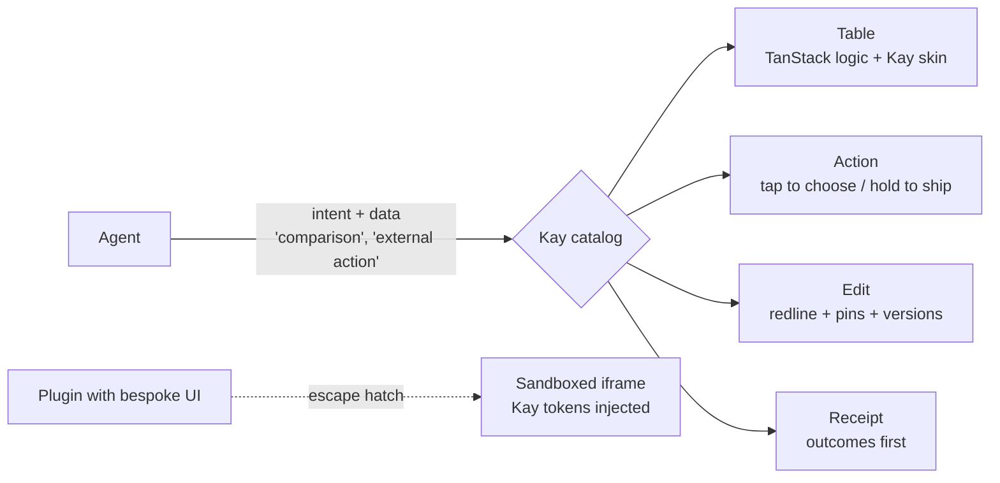
```mermaid
flowchart LR
  A[Agent] -->|"intent + data<br/>'comparison', 'external action'"| C{Kay catalog}
  C --> T[Table<br/>TanStack logic + Kay skin]
  C --> H[Action<br/>tap to choose / hold to ship]
  C --> E[Edit<br/>redline + pins + versions]
  C --> R[Receipt<br/>outcomes first]
  P[Plugin with bespoke UI] -.->|escape hatch| S[Sandboxed iframe<br/>Kay tokens injected]
```

What the same move looks like at Kay's scale:

| Without a system | With one |
| --- | --- |
| The agent writes a custom "Send" button with a confirm popup | The agent uses `<Action effect="external">`, and it automatically gets tap-to-choose / hold-to-ship (ADR-010) |
| The agent overwrites a doc however it likes | The agent uses `<Edit>`, and it automatically gets a redline, respects pins, and records a version (ADR-011/012/013) |
| The agent writes a wall of text about what it did | The agent emits events, and the outcomes-first receipt renders itself (ADR-005/006) |

Why this matters:
the legibility patterns stop being one-off screens and become building blocks that every future
surface gets for free.
Problem 2 falls out of problem 1.

The film version: episodic TV has a different guest director almost every week, yet it feels like
one show because of the showrunner and the show bible.
The catalog is the show bible, written so well that a thousand guest directors - most of them agents
- still make one show without the showrunner reviewing every cut.

Senior-engineer takeaway: when output volume outgrows review capacity, stop reviewing outputs and
start constraining inputs.
Your `never` exhaustiveness check is the same idea in miniature: the compiler, not a reviewer,
guarantees coverage.

### A drag is data: measure once, compute the rest

Reordering lanes on the canvas could have been a tangle of event handlers moving DOM nodes about.
Instead the surface measures once, when the grip is pressed, and everything after is a calculation
over that measurement. `apps/web/src/canvas.ts` holds the arithmetic, and it has no idea what a
pointer is:

```ts
// Where each lane sat when the grip was pressed; the lift itself never moves the targets.
export type Slot = { left: number; width: number };

// A lane passes a neighbour once its centre crosses the neighbour's, and not before.
export function landingIndex(slots: Slot[], from: number, dx: number): number {
  const dragged = centre(slots[from]) + dx;
  let to = from;
  for (let i = from + 1; i < slots.length; i++) if (dragged > centre(slots[i])) to = i;
  for (let i = from - 1; i >= 0; i--) if (dragged < centre(slots[i])) to = i;
  return to;
}
```

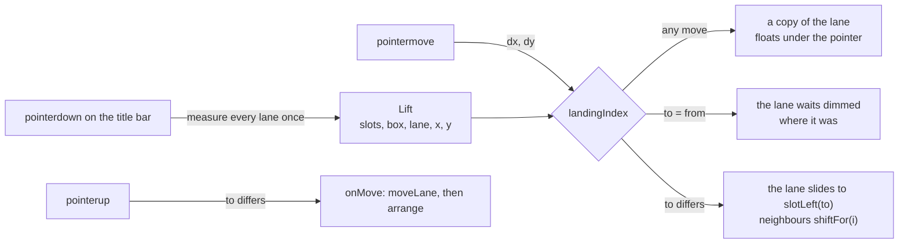
```mermaid
flowchart LR
  D[pointerdown on the title bar] -->|measure every lane once| L["Lift<br/>slots, box, lane, x, y"]
  M[pointermove] -->|dx, dy| C{landingIndex}
  L --> C
  C -->|any move| G[a copy of the lane<br/>floats under the pointer]
  C -->|to = from| K[the lane waits dimmed<br/>where it was]
  C -->|to differs| S["the lane slides to slotLeft(to)<br/>neighbours shiftFor(i)"]
  U[pointerup] -->|to differs| R[onMove: moveLane, then arrange]
```

The film version: a dolly grip marks the track before the take. Once the marks are down, the
camera's position at any moment is a number along the track, not a fresh survey of the set.
The marks are the `Slot` list; `dx` is how far the dolly has rolled; `landingIndex` reads the
marks.

One choice in the flow is easy to miss: the row's DOM is never reordered while the lane is in
hand. The dimmed lane slides to its slot by a transform, and the real move happens on the drop.
Moving the pressed element in the DOM would release its pointer capture mid-drag, so the
choreography that looks like a live reorder is drawn, not done, until the hand opens.

Senior-engineer takeaway: the pure functions are the ones with unit tests (`canvas.test.ts` for
the landing arithmetic, the runtime's `workspace.test.ts` for the lane edits), the browser lever
proves the measuring and the drawing, and the two never have to be debugged at the same time.

### Test screenings, not beauty contests

The usual way to test a chart is to show two versions and ask "which do you prefer?"
People pick the prettier one, and UX research keeps finding that preference and performance often
disagree: the chart someone likes can be the one they misread.

`catalog-lab` flips this.
Every Storybook story is a scenario that carries the question a real user would ask, so the same
fixture serves development and research:

```ts
// packages/catalog/src/fixtures.ts
// Each scenario pairs a user question with a fixed agent payload,
// so a test session never depends on a live model's mood.
export const scenarios: Record<
  string,
  { label: string; question: string; payload: unknown }
> = {
  trend: {
    label: "Weekly trend",
    question: "How did closed cases change this week?",
    payload: trend,
  },
  // ...snapshot, comparison, sparse, missing, empty, unsupported, unsafe
};
```

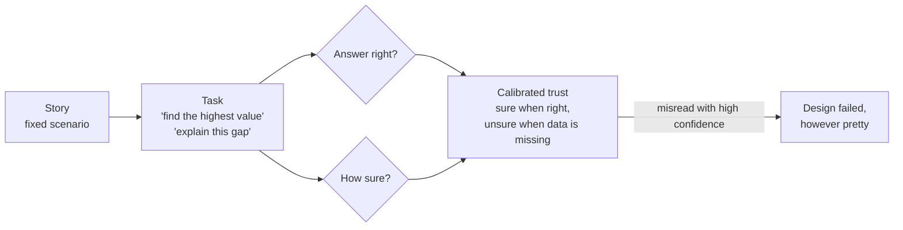
```mermaid
flowchart LR
  S[Story<br/>fixed scenario] --> T[Task<br/>'find the highest value'<br/>'explain this gap']
  T --> A{Answer right?}
  T --> C{How sure?}
  A --> M[Calibrated trust<br/>sure when right,<br/>unsure when data is missing]
  C --> M
  M -->|misread with high confidence| X[Design failed,<br/>however pretty]
```

Two measurements matter: task success (did they get it right?) and confidence (how sure were they?).
Confidence is the one AI products forget.
The dangerous user is not the confused one; it is the confidently wrong one, who reads a missing
value as zero and acts on it.
Good legibility produces calibrated trust: sure when the data supports it, unsure when it does not.
That is the posting's "show too little and they cannot trust it" problem, measured.

The film version: at a test screening, the useful question is not "did you like the cut?" but "what
happened in act two?"
If the audience cannot retell the story, the edit failed, however beautiful it looks.

Say it in the interview in one line: "I don't ask users which chart they like; I give them a task
and measure whether they got it right and how confident they were, because with AI the danger is
confident misreading."

### Continuity: every interactive surface reports back

The moment a card becomes interactive, the agent and the user can end up looking at different
things.
The agent answered about gross profit; the user dragged the slider to net; the user asks "why did
Saturday drop?"; the agent confidently explains a chart the user is no longer looking at.
Nothing looks broken, which is what makes it the worst kind of legibility failure.

The film version is continuity: the script supervisor makes sure the next shot matches what the
audience last saw.
Dragging the slider changed the set, so the next take has to know.

The fix (ADR-030): the card's current state rides along with the user's next message as a visible,
removable chip, the same rule as the skill chip (ADR-009).
Silent context would also work technically, but then the user cannot see or control what the agent
acts on.

```ts
// Sketch: what the next message carries when the user has moved a control.
type OutgoingMessage = {
  text: string; // "Why did Saturday drop?"
  attachments: {
    kind: "card-state";
    turnId: string; // the card the state came from
    label: string; // shown on the chip: "Net profit · Sep 14–20"
    state: Record<string, string>; // { measure: "Net" }
  }[];
};
```

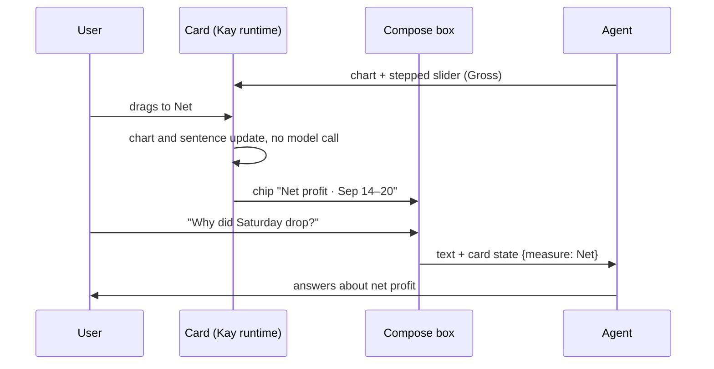
```mermaid
sequenceDiagram
  participant U as User
  participant C as Card (Kay runtime)
  participant K as Compose box
  participant A as Agent
  A->>C: chart + stepped slider (Gross)
  U->>C: drags to Net
  C->>C: chart and sentence update, no model call
  C->>K: chip "Net profit · Sep 14–20"
  U->>K: "Why did Saturday drop?"
  K->>A: text + card state {measure: Net}
  A->>U: answers about net profit
```

Say it in the interview: "When a surface is interactive, the agent has to know what the user
changed, and the user has to see that the agent knows."

### Reframe on the action: one rule for anything that expands

A camera operator does not wait for the director to shout "tilt up" every time an actor stands;
reframing on movement is the operator's standing job.
In the thread, the scroller is the camera operator, and it now reframes on its own: no component has
to ask.

```ts
// packages/catalog/src/threadReveal.ts: move only if the card is clipped, and only enough to rest
// it 20px above the compose box; a card taller than the view starts at its top; never scroll up.
export function nudgeScrollTop(target: Span, view: Viewport): number {
  const bandBottom = view.scrollTop + view.height - view.insetBottom;
  if (target.bottom <= bandBottom) return view.scrollTop;
  const bottomAligned = target.bottom - view.height + view.insetBottom;
  const topAligned = target.top - view.insetTop;
  return clamp(Math.max(view.scrollTop, Math.min(bottomAligned, topAligned)), view.maxScrollTop);
}
```

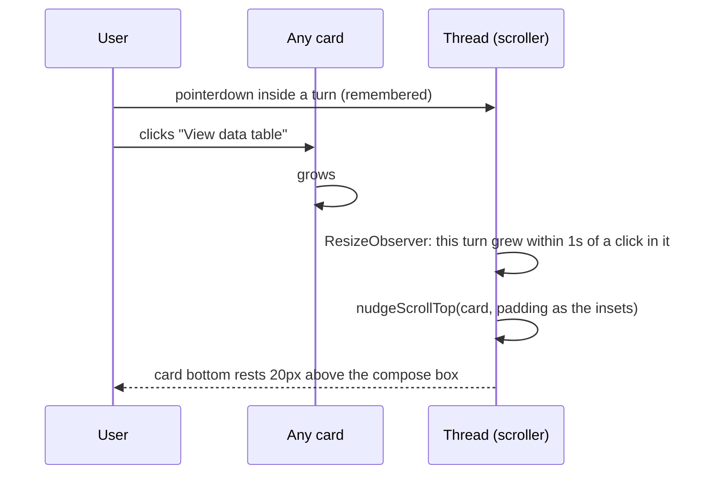
```mermaid
sequenceDiagram
  participant U as User
  participant C as Any card
  participant T as Thread (scroller)
  U->>T: pointerdown inside a turn (remembered)
  U->>C: clicks "View data table"
  C->>C: grows
  T->>T: ResizeObserver: this turn grew within 1s of a click in it
  T->>T: nudgeScrollTop(card, padding as the insets)
  T-->>U: card bottom rests 20px above the compose box
```

Two details make it hold up.
The insets come from the scroller's own padding, which already includes the dock card, so a nudged
card lands exactly where the thread's last card rests: one resting line, not two.
And growth nobody asked for (a chart sizing, a font loading) never nudges; it only keeps a thread
that was at its end at its end.

Say it in the interview: "Expansion is a camera move, so the thread owns it, and it moves the camera
as little as possible: only when something would be hidden, only as far as the resting line."

### Separation of concerns: the recap reports, "Needs you" asks

A "previously on" montage recaps the story; it never stops to ask the audience a question.
When the recap carried a "Needs you" line, a blocked agent waited ten idle minutes to be noticed,
and the user had to read history to find a decision.
Now the question is its own validated payload, and the host always adds the exit.

```ts
// packages/catalog/src/awaiting.ts: the agent supplies the question and its branches; the host
// renders them numbered and always appends "Chat about something else" (AwaitingInputCard.tsx).
export const awaitingSchema = z.strictObject({
  question: text,
  options: z.array(z.strictObject({ label: ..., detail: text.optional() })).min(1).max(4),
  answer: z.strictObject({ placeholder: ... }), // one concrete question, typed in the card
  elsewhere: z.string()...optional(), // the way out, worded for the moment
});
```

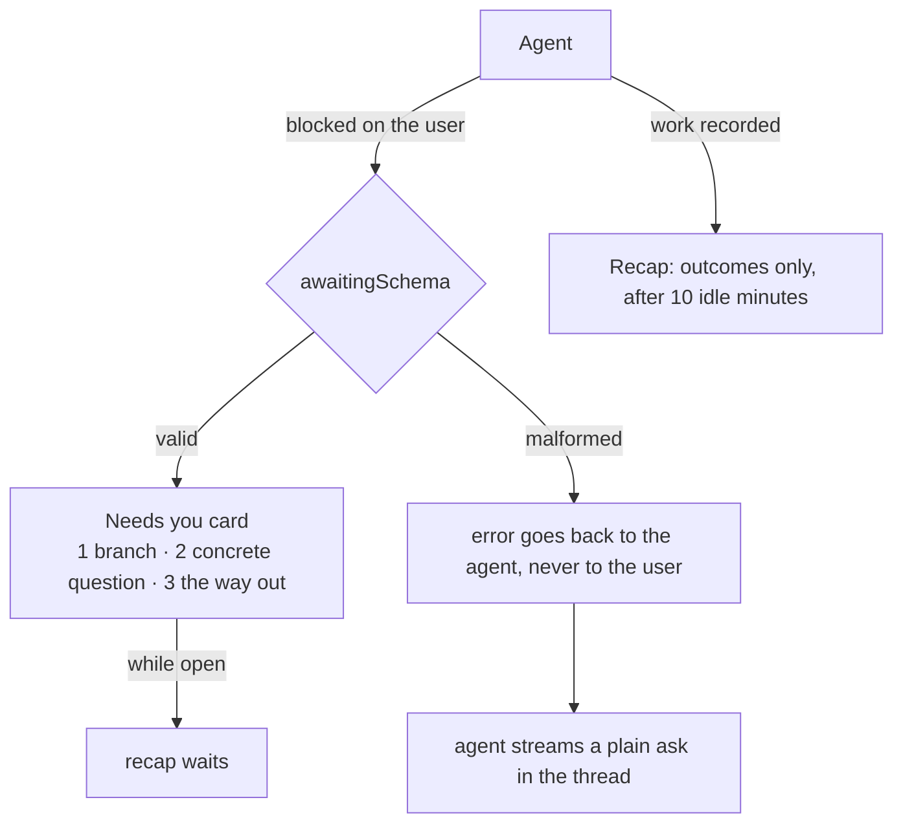
```mermaid
flowchart TD
  A[Agent] -->|blocked on the user| Q{awaitingSchema}
  Q -->|valid| N["Needs you card<br/>1 branch · 2 concrete question · 3 the way out"]
  Q -->|malformed| E[error goes back to the agent, never to the user]
  E --> S[agent streams a plain ask in the thread]
  A -->|work recorded| R[Recap: outcomes only, after 10 idle minutes]
  N -->|while open| H[recap waits]
```

Say it in the interview: "A recap is for catching up; a question is for deciding. Mixing them made
the decision wait and made the history noisy."

### One seam for a real model: the UI reports, the agent answers

A film set does not care whether the voice on the other end of the walkie-talkie is the real
director or a stand-in reading the script; it only needs the channel to work the same way.
The thread panel now talks to the agent through one channel, `Agent`, and the lab's scripted
stand-in is just one voice on it.

```ts
// packages/catalog/src/agent.ts: the only contract the thread knows.
export type AgentEvent =
  | { kind: "message"; text: string; attachments: CardAttachment[] }
  | { kind: "answer"; text: string }
  | { kind: "question-rejected"; reason: string; question: unknown };

export type Agent = {
  respond(event: AgentEvent, signal: AbortSignal): AsyncIterable<string>;
};
```

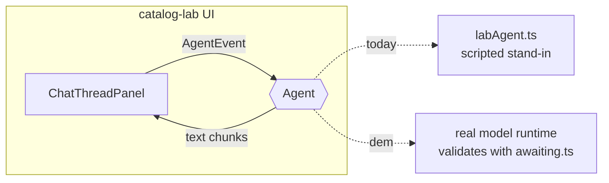
```mermaid
flowchart LR
  subgraph UI[catalog-lab UI]
    P[ChatThreadPanel] -->|AgentEvent| A{{Agent}}
    A -->|text chunks| P
  end
  A -.today.-> L[labAgent.ts<br/>scripted stand-in]
  A -.demo.-> R[real model runtime<br/>validates with awaiting.ts]
```

Two details make it hold up.
A reply is an `AsyncIterable` of text chunks, which is exactly the shape a model's token stream
already has, so a real agent is an adapter, not a rewrite.
And the `AbortSignal` lets the panel stop a reply the moment it unmounts, so nothing streams into a
thread nobody is looking at.

To run the UI against a real model later: write an `Agent` whose `respond` calls a small server
route (keeping the API key off the browser), stream its text back, and pass it as `<ChatThreadPanel
agent={realAgent} />`.

Say it in the interview: "The components never know who is answering; that is how the same UI is
tested with a script and shipped with a model."

### Three rings of proof: read it, run it, watch it

A linter reads code. A test runs it. A screenshot shows what a person would see. Each ring catches
what the one inside it cannot, and each runs where it is cheapest.

The middle ring is new: every story is now also a test. One Vitest config holds both kinds:

```ts
// packages/catalog/vite.config.ts and apps/storybook/vite.config.ts: two projects, one command (`pnpm test`)
projects: [
  // Plain functions and schemas, in Node: fast, no browser.
  { extends: true, test: { name: "unit", include: ["src/**/*.test.{ts,tsx}"] } },
  // Every story mounts in headless Chromium, runs its play function, then axe checks it.
  // A story that throws, or has a nested control or a low-contrast label, fails here.
  {
    extends: true,
    plugins: [storybookTest()],
    test: { name: "storybook", browser: { enabled: true, provider: playwright() } },
  },
],
```

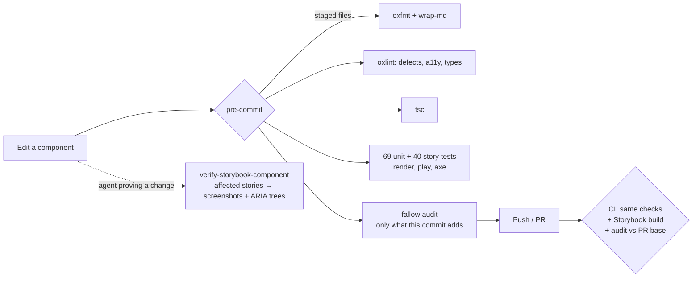
```mermaid
flowchart LR
  E[Edit a component] --> H{pre-commit}
  H -->|staged files| F[oxfmt + wrap-md]
  H --> L[oxlint: defects, a11y, types]
  H --> T[tsc]
  H --> S[69 unit + 40 story tests<br/>render, play, axe]
  H --> A[fallow audit<br/>only what this commit adds]
  A --> P[Push / PR]
  P --> C{CI: same checks<br/>+ Storybook build<br/>+ audit vs PR base}
  E -.->|agent proving a change| V[verify-storybook-component<br/>affected stories → screenshots + ARIA trees]
```

The film version: the linter is the script supervisor reading pages, the story tests are the table
read where every scene is actually performed, and the screenshots are dailies. A script can look
fine on paper and still fall apart when read aloud; the modal's focus trap did exactly that.

Senior-engineer takeaway: put each check where it is cheapest to run and hardest to skip. The hook
catches it in seconds on your machine; CI catches whoever skipped the hook; the verify skill covers
what no automated check can judge, which is whether it looks right.

### Roll sound before action: attach the reader before you wait

The gateway must choose its HTTP status before it sends a byte, but it only learns whether Claude
accepted the request once the request is in flight. The natural order is "wait for the answer,
then start reading", and it passes every test on a laptop. It is still wrong: the SDK's stream
hands each event only to readers already listening, so an event that lands in between is lost,
like a line spoken before the boom mic was switched on.

```ts
// apps/gateway/src/app.ts: the order is the whole point.
const reply = anthropic.messages.stream({ model, max_tokens, thinking, system, messages });
// Roll sound: the reader starts listening now, before any event can arrive.
const body = reply.toReadableStream(); // → one JSON event per line
// Then call action: a 4xx/5xx from Claude throws here, before we answer the browser,
// so the route can still reply 502 { error: "upstream", status }.
await reply.withResponse();
return body;
```

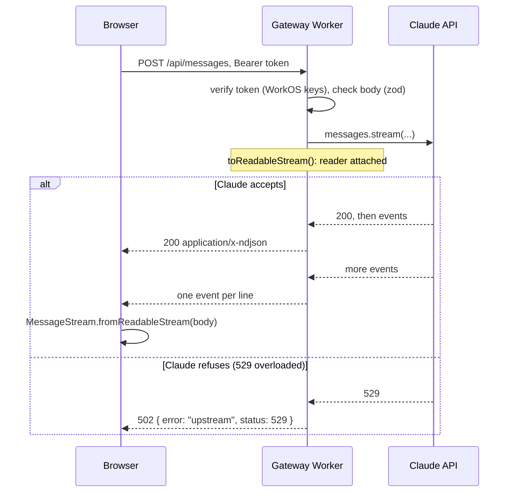
```mermaid
sequenceDiagram
  participant B as Browser
  participant G as Gateway Worker
  participant A as Claude API
  B->>G: POST /api/messages, Bearer token
  G->>G: verify token (WorkOS keys), check body (zod)
  G->>A: messages.stream(...)
  Note over G: toReadableStream(): reader attached
  alt Claude accepts
    A-->>G: 200, then events
    G-->>B: 200 application/x-ndjson
    A-->>G: more events
    G-->>B: one event per line
    B->>B: MessageStream.fromReadableStream(body)
  else Claude refuses (529 overloaded)
    A-->>G: 529
    G-->>B: 502 { error: "upstream", status: 529 }
  end
```

To prove the point, the two lines were swapped on purpose and the whole suite still passed: in
node, the gateway happened to resume before the SDK parsed its first event. The order is right
because the SDK's source says its iterator starts with an empty queue, not because a test says so,
and the comment in the code says that, so nobody tidies it back later.

Senior-engineer takeaway: when a test passes, ask whether the code is right or the timing was
kind. A race that a fast machine hides is still a race; settle it by reading the source, then write
down why, where the next editor will look.

### The daemon backstage: one door, checked on both sides

Kay's desktop app never runs the agent in its window; a daemon does, and the window only talks to
it. The slice keeps that blocking with a Web Worker, so moving to Kay means recasting the worker
as their daemon, not rewriting the UI (ADR-076). One reply, in the worker, reads like a call sheet:

```ts
// packages/runtime/src/agentLoop.ts: one reply, in the order that loses nothing.
await update(loop, store, conversationId, (c) => withUserTurn(c, event, now())); // saved first
const agent = createAgent(spec, { store, conversationId, accessToken }); // lab or gateway
let text = "";
for await (const piece of agent.respond(event, signal)) {
  if (signal.aborted) break; // the user pressed stop
  text += piece;
  post({ kind: "chunk", requestId, text: piece }); // the page checks it on arrival
}
if (text.trim() !== "") {
  await update(loop, store, conversationId, (c) => withAgentReply(c, text, now())); // then this
}
post({ kind: "done", requestId });
```

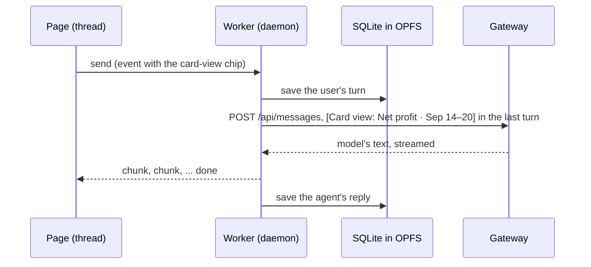
```mermaid
sequenceDiagram
  participant P as Page (thread)
  participant W as Worker (daemon)
  participant S as SQLite in OPFS
  participant G as Gateway
  P->>W: send (event with the card-view chip)
  W->>S: save the user's turn
  W->>G: POST /api/messages, [Card view: Net profit · Sep 14–20] in the last turn
  G-->>W: model's text, streamed
  W-->>P: chunk, chunk, ... done
  W->>S: save the agent's reply
```

The film version: the stage manager writes the actor's line in the prompt book before the cue,
not after the scene, because a scene can be cut halfway and the book must still say what was said.

Senior-engineer takeaway: order your writes by what you cannot afford to lose. The user's words
are irreplaceable and go to disk first; the reply can always be asked for again.

### Move it, then prove it moved nothing

A layout move touches every file and changes no behaviour, which is exactly the kind of change
nobody re-tests. So the proof came first: every story was photographed twice from the old layout,
which also showed which six differ between two runs of the same code (live waveforms, a chart
mid-animation). After the move, and again after every token rename, the same forty screenshots
were compared byte for byte, and the only differences were those known animations.

```sh
# The same lever, before and after; cmp says identical or nothing.
node .agents/skills/verify-storybook-component/scripts/shoot.mjs $IDS --out before
git mv catalog-lab packages/catalog   # ... the whole move ...
node .agents/skills/verify-storybook-component/scripts/shoot.mjs $IDS --out after
for f in before/*.png; do cmp -s "$f" "after/$(basename "$f")" || echo "differs: $f"; done
```

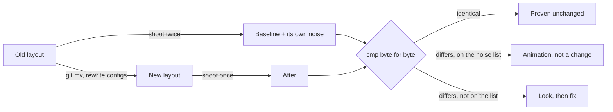
```mermaid
flowchart LR
  A[Old layout] -->|shoot twice| B[Baseline + its own noise]
  A -->|git mv, rewrite configs| C[New layout]
  C -->|shoot once| D[After]
  B --> E{cmp byte for byte}
  D --> E
  E -->|identical| F[Proven unchanged]
  E -->|differs, on the noise list| G[Animation, not a change]
  E -->|differs, not on the list| H[Look, then fix]
```

Senior-engineer takeaway: capture the baseline before you touch anything, and capture its noise
too, so "different" has a meaning when the comparison runs.

### The carry: a script on paper, a thin crew on set

A carry can end in half a dozen ways: a release over a target that accepts, a release anywhere
else, Escape, the window losing focus, a `pointercancel`, a lost pointer capture. Written as event
handlers, each ending would need its own cleanup and its own browser test. Instead the rules are
one pure function, `stepCarry`, which takes the state and what just happened and returns the next
state plus a list of effects. The DOM shell around it only reports what happened and performs
what it is told.

```ts
// packages/catalog/src/carry.ts: the rules, with no DOM. A move past LIFT_PX turns an armed
// press into a carry and names what the page must do, in order; nothing is done here.
function stepArmed(state: Armed, input: CarryInput): [CarryState, CarryEffect[]] {
  switch (input.kind) {
    case "move": {
      if (travelled(state.from, input.at) < LIFT_PX) return [state, []]; // still a click
      const { pointerId, carried } = state;
      const lifted: Carrying = { phase: "carrying", pointerId, carried, hover: null };
      const [next, hover] = hoverOver(lifted, input.target, input.at); // → leave / over effects
      return [next, [{ kind: "lift" }, { kind: "follow", at: input.at }, ...hover]];
    }
    // ...a release or a cancel before the lift ends it as a click
  }
}

// The thin shell: step, perform, and take the picture down last, even when a target's `drop`
// throws.
function dispatch(press: Press, input: CarryInput): void {
  const [next, effects] = stepCarry(carry, input); // → [CarryState, CarryEffect[]]
  carry = next;
  try {
    for (const effect of effects) if (effect.kind !== "end") perform(press, effect);
  } finally {
    for (const effect of effects) if (effect.kind === "end") perform(press, effect);
  }
}
```

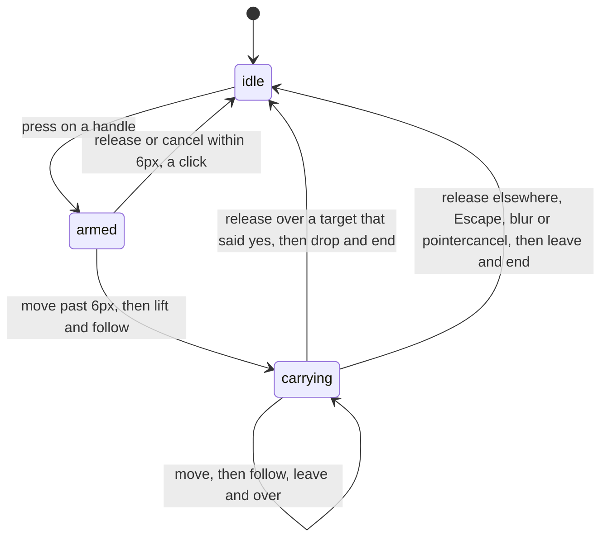
```mermaid
stateDiagram-v2
  [*] --> idle
  idle --> armed: press on a handle
  armed --> idle: release or cancel within 6px, a click
  armed --> carrying: move past 6px, then lift and follow
  carrying --> carrying: move, then follow, leave and over
  carrying --> idle: release over a target that said yes, then drop and end
  carrying --> idle: release elsewhere, Escape, blur or pointercancel, then leave and end
```

The film version: the rules are the shooting script, and `carry.test.ts` is the table read, where
every phase meets every input on paper before any set is built. The DOM shell is the crew, who
perform what the script calls for. The `finally` is the wrap call. Whatever went wrong in the
take, the set gets struck. The review found the take that needed it. A target whose `drop` threw
used to leave the picture on screen and the hand closed for good; now the error still reaches the
page, and the ghost, the hand and the listeners go regardless.

Senior-engineer takeaway: put the decisions where a test needs no browser, keep the part that
touches the browser too thin to hold a decision, and make the cleanup unconditional.

### One writer, one call sheet

The page never writes the workspace. It asks the worker, and for a write the worker answers
twice, first with the whole workspace as it now stands, then with a note that names the request.
The order is the point. By the time `create` resolves with a new thread's id, that thread is
already in the page's snapshot, so the page never looks up an id it cannot find.

```ts
// packages/runtime/src/agentLoop.ts: every write ends the same way, snapshot first.
async function write(
  loop: Loop,
  apply: (session: Session) => Extract<Notice, { kind: "created" | "done" }>,
): Promise<void> {
  const session = await started(loop);
  const answer = apply(session); // → { kind: "created" | "done", requestId, ... }
  pushState(loop, session); // the whole workspace, unless the page already has it
  loop.host.post(answer); // after the snapshot, so any id it names is already there
}

function pushState(loop: Loop, { store, source }: Session): void {
  const notice: Notice = {
    kind: "state",
    source,
    workspace: store.workspace(), // → Workspace: projects, threads, lanes, shell, no messages
    replying: replying(loop),
  };
  const serialized = JSON.stringify(notice); // → string, compared with the last push
  if (serialized === loop.lastState) return;
  loop.lastState = serialized;
  loop.host.post(notice);
}
```

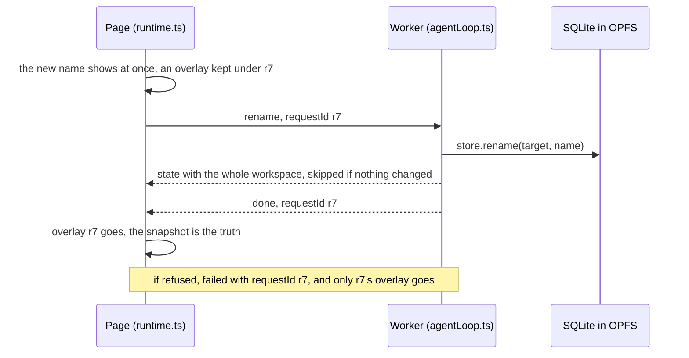
```mermaid
sequenceDiagram
  participant P as Page (runtime.ts)
  participant W as Worker (agentLoop.ts)
  participant S as SQLite in OPFS
  P->>P: the new name shows at once, an overlay kept under r7
  P->>W: rename, requestId r7
  W->>S: store.rename(target, name)
  W-->>P: state with the whole workspace, skipped if nothing changed
  W-->>P: done, requestId r7
  P->>P: overlay r7 goes, the snapshot is the truth
  Note over P,W: if refused, failed with requestId r7, and only r7's overlay goes
```

The film version: the production office prints one call sheet after every change, and the set
reads only the latest. Every note sent to the office carries a ticket number, and the reply
quotes it. The old office answered runners in the order they queued, so when one note came back
refused, every runner still waiting was told no.

Senior-engineer takeaway: let one place write, push whole state, and match answers by id. Then an
optimistic edit is only an overlay on the last truth, and rollback is free, because the next truth
replaces it.

### A check that has never failed has proven nothing

Every predicate in `apps/web/scripts/workspace-check.mjs` was run on `main` before the work it
checks began, and recorded failing with a number: the title clipped at half the bar, a 1px rule
under the rename field, one native drag with `cursor: auto`, a card appended at the end of the
row, a 0px inset. A check that passes on the old code cannot see the bug, however green it looks.

```js
// apps/web/scripts/shell-checks.mjs, P9: once the layout is Thread, how much of its tab does
// the thread fill? Run first on the code before ADR-106, it read 80.
await layoutButton(page, "Thread").click();
await page.waitForTimeout(300);
const alone = await page.locator('[role="tabpanel"]:not([inert])').evaluate((tab) => {
  const thread = tab.querySelector('[data-slot="resizable-panel"]');
  const share = thread.getBoundingClientRect().width / tab.getBoundingClientRect().width;
  return Math.round(share * 100); // → 80 before the fix, 100 after
});
```

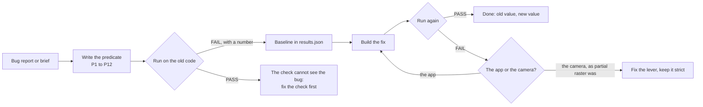
```mermaid
flowchart LR
  B[Bug report or brief] --> W[Write the predicate<br/>P1 to P12]
  W --> O{Run on the old code}
  O -->|FAIL, with a number| R[Baseline in results.json]
  O -->|PASS| X[The check cannot see the bug:<br/>fix the check first]
  R --> F[Build the fix]
  F --> N{Run again}
  N -->|PASS| D[Done: old value, new value]
  N -->|FAIL| L{The app or the camera?}
  L -->|the app| F
  L -->|the camera, as partial raster was| C[Fix the lever, keep it strict]
```

The film version: before a shoot, the camera team puts a test chart in front of the old lens and
the new one. If the chart looks the same through both, the test cannot show the difference you
are paying for. The lever is the chart. P7 taught the other half. A failing lever still needs
reading, because its two loads differed at a few corners from how Chromium rastered them, not
from any change in the app (ADR-107).

Senior-engineer takeaway: write the check, watch it fail on the old code with a number, then
build, and report old value against new value. When it fails after the fix, ask whether the app
or the camera is wrong before touching either.

### A surface is a lighting setup, not a paint job

The green bar holds a dozen shadcn primitives: tabs, ghost buttons, a toggle group, a badge, an
avatar, a skeleton. None of them got a colour of its own. The bar redefines what the colour
*words* mean inside it, and every primitive, which only ever says "ink" or "hover fill", comes out
right.

```css
/* packages/catalog/src/tokens.css: one rule re-lights everything inside the bar. */
.chrome-surface {
  --ink: var(--on-chrome); /* cream, 8.98:1 on the green */
  --soft-ink: var(--on-chrome-soft); /* cream at 72%, 5.56:1 */
  --paper-deep: var(--chrome-hover); /* the hover fill */
  --focus: var(--on-chrome); /* the ring, cream */
  /* shadcn's roles resolve on :root, so the ones the bar's primitives read are restated */
  --accent: var(--paper-deep);
  --ring: var(--focus);
  background: var(--chrome);
}
/* A piece of cream on the bar puts the night inks back, as a spotlight inside a gel. */
.chrome-surface .chrome-pill {
  --ink: var(--on-chrome-pill);
}
```

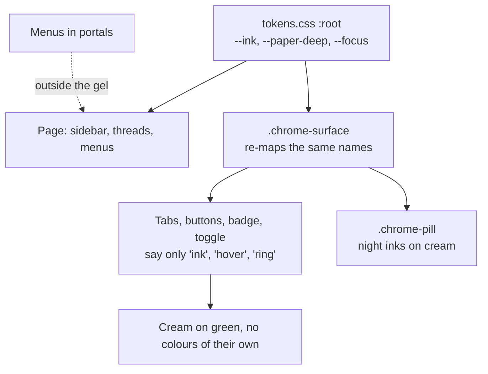
```mermaid
flowchart TD
  T[tokens.css :root<br/>--ink, --paper-deep, --focus] --> P[Page: sidebar, threads, menus]
  T --> C[.chrome-surface<br/>re-maps the same names]
  C --> B[Tabs, buttons, badge, toggle<br/>say only 'ink', 'hover', 'ring']
  B --> G[Cream on green, no colours of their own]
  C --> Pill[.chrome-pill<br/>night inks on cream]
  M[Menus in portals] -.outside the gel.-> P
```

The film version: you do not repaint the actors' costumes for a night scene; you change the gel on
the lights. The bar is a gel. One catch is worth remembering: a custom property that refers to
another (`--accent: var(--paper-deep)`) is worked out where it is declared, so shadcn's roles,
declared on `:root`, would keep the page's values inside the bar. The surface has to restate each
role its primitives read. `.attention-surface` taught that pattern first.

Senior-engineer takeaway: when a region needs a different look, re-map the meaning of the tokens
for that region instead of restyling the components in it. Then a new component dropped into the
bar is right on day one, and the contrast lives in one place, where a unit test can check every
ratio from the token values.

### Settle a layout fight with a ruler, not a meeting

The phone bar had four candidate fixes and a fixed budget: 390 pixels. Rather than argue which
control deserved the space, each candidate was a few lines of CSS injected into the real app, and
one script measured what the active tab's title got.

```js
// apps/web/scripts/shell-checks.mjs, P13: how much of the active title does the list show?
const list = bar.querySelector('[role="tablist"]').getBoundingClientRect();
const title = bar.querySelector('[role="tab"][aria-selected="true"] .truncate');
const shown = title.getBoundingClientRect();
return Math.round(Math.min(shown.right, list.right) - Math.max(shown.x, list.x));
// → 17px with the Layout group inline, 37px with an icon marker, 82px behind a trigger
```

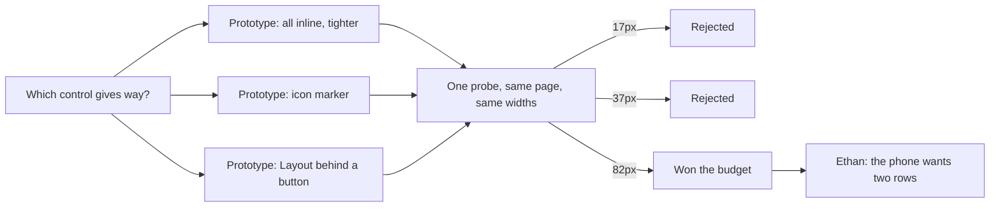
```mermaid
flowchart LR
  Q[Which control gives way?] --> P1[Prototype: all inline, tighter]
  Q --> P2[Prototype: icon marker]
  Q --> P3[Prototype: Layout behind a button]
  P1 --> M[One probe, same page, same widths]
  P2 --> M
  P3 --> M
  M -->|17px| X1[Rejected]
  M -->|37px| X2[Rejected]
  M -->|82px| K[Won the budget]
  K --> E[Ethan: the phone wants two rows]
```

The film version: when two camera positions compete, you do not debate them in the production
office; you shoot both on the stand-in and look at the monitor. The probe is the stand-in, and
the winning shot's numbers become the continuity sheet (P13) that every later take is checked
against.

Senior-engineer takeaway: if a design question has an answer you can measure, measure it. The
numbers end the argument, and the script that produced them becomes the regression test.

The twist is the other half of the lesson. The ruler answered "what fits in 44px?" perfectly,
and the answer was set aside, because the 44px rule was meant for the desktop and nobody had
asked what a phone should be. A measurement settles the question you put to it; it cannot tell
you that you asked the wrong one. When the question is "what should this be?", put a working
build in the person's hand, as the picture of Amp's two rows did here, before you optimise.

### Plan as data, act at the edge

Four features needed "something happens later": a snooze wakes, an idle thread archives, a
deleted one is purged, a share expires. Rather than four timers with four sets of bugs, one pure
function reads the rows and the time and returns a plan; a thin actor applies it and sets one
timer for the plan's `next`.

```ts
// packages/runtime/src/settle.ts (abridged): a calculation, no clock and no database
export function planSettle({ rows, shares, now, starting }: SettleInput): SettlePlan {
  const wake = rows.filter((row) => row.snoozedUntil !== null && row.snoozedUntil <= now); // due
  const archive = deadlines.filter((each) => each.at <= now).map((each) => each.id); // idle 14d
  const purge = tombs.filter((each) => starting || each.at <= now).map((each) => each.id);
  const expire = shares.filter((share) => share.expiresAt <= now).map((share) => share.id);
  const next = ahead.toSorted().at(0) ?? null; // → the earliest moment anything falls due
  return { wake, archive, purge, expire, next };
}
```

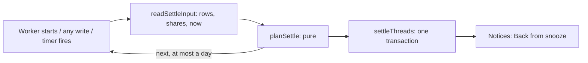
```mermaid
flowchart LR
  T[Worker starts / any write / timer fires] --> R[readSettleInput: rows, shares, now]
  R --> P[planSettle: pure]
  P --> A[settleThreads: one transaction]
  A --> N[Notices: Back from snooze]
  P -->|next, at most a day| T
```

The film version: the script supervisor does not shout "wake up" at an actor whenever they
remember; they keep a call sheet of who is due when, check it at every break, and set one alarm
for the next entry. The call sheet is data you can read and test; the alarm is the only moving
part.

Senior-engineer takeaway: Grokking Simplicity's split in practice. The rules (calculations) got
exhaustive unit tests with made-up times; the actions (writing SQLite, posting a notice) are
thin enough to trust, and a hand-cranked timer in the agent-loop tests proves they are wired.

### The key never goes to the vault

"Public for 1 day" is only a promise if something enforces it. The data rides to the gateway
already sealed; the key rides in the part of the URL a browser never sends.

```ts
// apps/web/src/shell/share-thread.ts (abridged): seal on the page, send only ciphertext
const { sealed, key } = await sealThread({ v: 1, title, messages, expiresAt }); // → bytes, key
const response = await client.fetch(`${client.base}/api/shares?ttl=${seconds}`, {
  method: "POST",
  body: sealed, // the server stores this with expirationTtl = seconds
});
const link = threadLink(created.id, key, { href: client.base }); // → /share.html#t=<id>.<key>
```

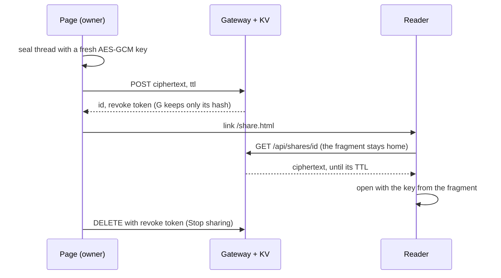
```mermaid
sequenceDiagram
  participant P as Page (owner)
  participant G as Gateway + KV
  participant R as Reader
  P->>P: seal thread with a fresh AES-GCM key
  P->>G: POST ciphertext, ttl
  G-->>P: id, revoke token (G keeps only its hash)
  P->>R: link /share.html#t=id.key
  R->>G: GET /api/shares/id (the fragment stays home)
  G-->>R: ciphertext, until its TTL
  R->>R: open with the key from the fragment
  P->>G: DELETE with revoke token (Stop sharing)
```

The film version: you hand the vault a locked canister stamped "destroy on the 29th", and mail
the key to your friend inside the invitation. The vault can prove it destroyed the canister, and
it never had the key to peek.

Senior-engineer takeaway: when privacy is the product, put the guarantee where a mistake cannot
reach it. A server that never holds the key cannot leak the thread, and a store that deletes on
a TTL cannot forget to.

### Name the job, not the kind: selectors are casting calls

A query is a casting call. `[data-pending] button` asks for "any actor in a costume"; it worked
while one actor wore one. The day the lane's collapse toggle joined the scene in the same costume,
the call went to the wrong person, and the focus followed.

```ts
// apps/web/src/components/thread-pane.tsx: where the focus rests while a thread opens or fails.
const REST: Record<Turns["kind"], string> = {
  loading: "[data-pending]",
  failed: "[data-pending] [data-retry]", // Try again, not the collapse or the menu in the bar
  open: ".compose-box textarea",
};
```

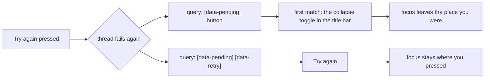
```mermaid
flowchart LR
  P[Try again pressed] --> F{thread fails again}
  F --> Q1["query: [data-pending] button"]
  F --> Q2["query: [data-pending] [data-retry]"]
  Q1 --> T[first match: the collapse toggle in the title bar]
  Q2 --> R[Try again]
  T --> X[focus leaves the place you were]
  R --> OK[focus stays where you pressed]
```

The same idea runs through the lane: the reorder grip is `[data-collapsed="true"]`, the strip's
parts are `[data-lane-strip-title]` and `[data-lane-strip-grip]`, and the focus hand-off asks for
`[data-lane-close], [data-lane-toggle]`. Each names what the element is for, so adding a second
button anywhere nearby cannot recast the scene.

Senior-engineer takeaway: when code finds an element to act on, find it by its role in the story
(a data attribute or an accessible name), never by its tag or its position. And keep a check that
drives the real flow, like the web lever did here, because a wrong match compiles and renders
fine.

### The matte goes in first: a mask is layer order, not a paint job

Three splash looks, one stacking rule. In Figma a mask is the bottom layer of its group and cuts
everything above it; in CSS a mask is a property of the layer it cuts. Either way the picture is
never edited: a plate says how much of it shows, and the plate is authored on its own.

```css
/* apps/web/src/index.css: Atlas is a stencil (black on alpha) used as a mask and filled with a
   token, so he themes; a second mask, a gradient, fades his feet out before the edge. */
html[data-splash="vitruvian"] .splash-drawing {
  background: var(--splash-figure); /* the ink at 30%: the paint */
  mask-image: url("/splash/atlas.webp"), linear-gradient(black 55%, transparent); /* two plates */
  mask-composite: intersect; /* a pixel shows only where both plates let it */
}
```

```mermaid
flowchart BT
  P[Paper: the open space] --> L[Lit fill: the carry's tint]
  L --> M["Picture under its plate<br/>a radial gradient, or the stencil ∩ a fade"]
  M --> D[Dots, redrawn on the field's grid]
  D --> W[Words and button]
  W --> S["Splash · look (debug switch)"]
```

The film version: a garbage matte never touches the negative. The colourist grades the plate, the
compositor decides where it shows, and the two jobs stay in two rooms. Ethan's Figma group went
wrong because the matte was loaded second; the fix was not a better gradient, it was putting the
plate in first.

Senior-engineer takeaway: when a look depends on order, make the order the design. The three looks
share one DOM and one stack; the attribute on `<html>` picks the plate, and nothing else moves.


### One clock, two actors: a wave is a delay, not a second animation

The "agent working" glyph (Storybook: Motion/Agent working) is Kay's 2x2 task-size squares,
animated so a band of green sweeps left to right. There is only one keyframe track. Every square
plays it; the right column is simply started 25% of a cycle later, so it peaks while the left
column fades. Colour rides on opacity inside that one track: solid is moss, half-faded
is olive, nearly clear is sage.

```css
/* packages/catalog/src/motion.css */
.agent-working {
  --working-duration: 2000ms; /* one knob; Storybook scrubs it */
  /* a head start of 75% is the same as a lag of 25%, and never shows a blank first frame */
  --working-lag: calc(var(--working-duration) * -0.75);
}
.agent-working-cell:nth-child(even) {
  --working-offset: var(--working-lag); /* right column: same track, shifted */
}
```

```mermaid
sequenceDiagram
  participant L as Left column
  participant R as Right column
  Note over L,R: one 2000ms cycle, same keyframes
  L->>L: 0-25% fade in, sage → moss
  R->>R: 25-50% fade in (25% behind)
  L->>L: 25-35% hold solid, then 35-65% fade out
  R->>R: 50-60% hold solid while left clears
  L->>L: 65-100% rest, clear
  R->>R: 60-90% fade out, moss → olive → sage
  Note over L,R: 90-100% all four clear: the wave completes
```

The film version: two dancers, one piece of music, the second one counting in late. You do not
choreograph a second routine, you cue the same one later. A canon in music works the same way.

The first cut ran at 150ms: nearly seven loops a second, which the eye reads as flicker, not a
travelling wave, and the fade through the greens lasted about 75ms, too short to register. It now
ships at 2000ms (after stops at 1200 and 1500), with a rest in each loop: the motion fits in the
first 65% of a square's cycle and it sits clear for the rest, so the wave lands before the next
one starts. A rest is what separates steady work from an alarm; an alarm never pauses. The Speeds
story plays five lengths side by side, because timing is a taste call that is easier to defend
with the alternatives on screen than in words.

Colour got its own track later. A second animation on each square walks through seven brand
greens, one per loop, and jumps only while the square is clear, so every flash is one shade from
its first frame to its last. Each square starts somewhere else in the seven. The starting points
were solved, not guessed: the wave's right column already runs a shade ahead and the six-square
orbit's middle-left square one behind, so a hand-picked set had two squares matching in every
loop. A browser test now checks all four layouts: every loop, every square a different green,
all seven taking a turn. It is a lighting board with seven gels on a wheel per lamp: the cue
stays the same, but each lamp comes up in a different colour every time, so the eye never
catches the pattern.

The orbit variant runs on the same clock. Clockwise order is data, a table of each square's
place in the lap (`CLOCKWISE_STEP` in `AgentWorking.tsx`), and CSS turns that place into a delay:
step / cells of a loop. The orbit's keyframes rise fast and fall slowly, like a comet, because a
symmetric fade has no front: the eye cannot tell which way a blob of light is going unless one
edge is sharp. Six squares (two columns of three in the same 12px height) use the same table
with six stops.

The tree (Storybook: Motion/Agent tree) is a second glyph on the same clock and palette: Kay's
three pills, a crest of green running down them, left then right, and the base holding solid for
a beat. Then the base slides down under the icon's bottom edge, and as it is half clipped the top
branch fades in over the same beat, on the same curve, one pill leaving as the other arrives. It
borrows a trick from side-scrolling games and car shots on a
soundstage: the car stays put and the background scrolls, so the eye reads motion the other way.
It is also a cheat, the good kind: only the two lit pills move. The base scrolls out under the
bottom edge while the top branch scrolls in over the top edge, both 4px on the same curve, so
they read as one strip of film passing the gate, and the eye supplies the rest of the tree.
Equal distance matters: the base only needed 3px to leave, but at 3px against the branch's 4px
the two would drift apart and the strip would tear. Once the base is out of frame it jumps
home, invisible, and fades back in where it began, like a stagehand resetting a prop during a
blackout.

Senior-engineer takeaway: when motion must stay in sync, derive every actor from one clock. A
second keyframe track would drift the moment someone changed one duration and not the other.

### A knob on the desk proves nothing: audit every control

Storybook writes a control for every prop a component takes, so the Controls panel fills itself.
That is the trap: a control's presence says nothing about whether it does anything. An audit of
all 62 stories found 92 dead ones. Some only seeded state once (a draft, a start-open flag), some
were raw data or slots only the host app can fill, one needed a stylesheet the story never
loaded (a catalog card's thread look), and one started unticked while the component treated
"unset" as on, so the first click set what was already true.

```js
// .agents/skills/verify-storybook-component/scripts/audit-controls.mjs: for each visible control, move it
// and compare the story before and after, in the DOM and in pixels.
const before = await snapshot(page); // → { dom, pixels }
await setArgs(page, storyId, { [name]: value }); // the Controls panel's own message
const after = await snapshot(page);
if (before.dom === after.dom) findings.push({ kind: "dead", name }); // nothing moved
```

```mermaid
flowchart LR
  P[Every prop] --> I[Storybook infers a control]
  I --> Q{Does moving it change the screen?}
  Q -- yes --> K[Keep, with a real starting value]
  Q -- only on click or drag --> H[Keep, mark it for a hand check]
  Q -- no --> X[Hide the row: table disable]
```

It is a sound mixer with a fader for every channel in the building. Before a show you push each
one and listen, and tape over the ones wired to nothing, because a guest who reaches for a dead
fader decides the whole desk is broken.

Senior-engineer takeaway: generated surfaces need an owner. When a tool creates UI for you, the
question is not "does it render" but "does each part do what it says", and only a check that
moves every part can answer it.

### Pull the arithmetic out of the scene

A component is an action: it reads the shell, renders, and wires clicks. Tucked inside it is often
a small calculation, a rule that turns data into data. Left inline, the rule gets copied: the
Share item in the thread menu and the new Share button in the title bar both spelled out
"Private, or Until Fri 9:00" by hand. Lifted out, it has one name and one home.

```tsx
// apps/web/src/shell/share-menu.tsx: the rule, pure: a share (or none) in, words out
function shareStatus(share: ThreadShare | undefined): string {
  return share === undefined ? "Private" : `Until ${wakeText(new Date(share.expiresAt), "menu")}`;
}

// Both scenes now read the same line from the script
const share = liveShare(shell, thread); // → ThreadShare | undefined
const status = shareStatus(share); // → "Private" | "Until Fri 9:00"
```

```mermaid
flowchart LR
  S[shell.workspace.shares] --> L["liveShare: pick the live one"]
  L --> C["shareStatus: pure words"]
  C --> I[ShareItem: menu row]
  C --> B[ThreadShareButton: title bar]
```

The same pass made two smaller moves of that kind. The tab's `nextTitle` now takes the Escape case
too (`null` in, `null` out), so the rename hook is only "if there is a new name, send it". And the
thread pane builds its title bar's end once and hands the same value to the open panel and the
waiting frame, so the two can no longer disagree about what the bar carries.

The film version: the continuity note lives on the script supervisor's sheet, not in each actor's
memory. Two actors reading one sheet cannot drift apart.

Senior-engineer takeaway: when two components compute the same thing, the thing is a calculation
asking for a name. Pull it out, keep it free of hooks and clocks, and let the components stay thin
actions around it.

### Don't send a runner to the vault for a shot you already have

The white flash is the classic cost of fetching in an effect. React paints first and runs
effects after, so a component that starts in "loading" and asks for its data in `useEffect` will
paint "loading" at least once, however fast the answer comes. When the answer is already on hand,
decide in the first render instead:

```tsx
// apps/web/src/components/turns.ts - a calculation: data in, data out
export function turnsBefore(thread: ThreadSummary): Turns {
  return thread.turnCount === 0 ? NONE : LOADING; // → open and empty, or ask the worker
}

// apps/web/src/components/thread-pane.tsx - read once, as the pane mounts
const [turns, setTurns] = useState(() => turnsBefore(thread)); // → Turns
useEffect(() => {
  if (asking) void load(); // only a thread with turns still asks
}, [runtime, id, asking]);
```

```mermaid
sequenceDiagram
  participant E as Ethan
  participant P as Thread pane
  participant W as Worker
  Note over E,W: Before
  E->>P: press "+"
  P->>E: frame 1: "Opening..." on bare paper
  P->>W: open(id), from useEffect after the paint
  W-->>P: no turns
  P->>E: frame 2: the welcome and its painting
  Note over E,W: After
  E->>P: press "+"
  P->>P: the snapshot says turnCount 0
  P->>E: frame 1: the welcome and its painting
```

The film version: the script supervisor already has the take on the sheet, so nobody sends a
runner to the vault for it while the audience watches a blank screen.

Senior-engineer takeaway: an effect is for what you truly do not know yet. Anything you can
decide from what you already hold (props, a snapshot, a cache) belongs in the first render, and
a wait people cannot perceive deserves no message at all.

### A mirror plays the tape backwards

Ethan asked for the peek to go back "with the same curve and duration". The slide took that
literally: one custom property, so the two directions cannot drift apart. The fade could not,
because a fade that races ahead on the way out has to trail behind on the way back:

```css
/* apps/web/src/index.css - one slide both ways; the fade reversed, not copied */
[data-slot="sidebar"][data-peek] > [data-slot="sidebar-container"] {
  --peek-slide: transform 220ms cubic-bezier(0.32, 0.72, 0, 1);
  transition:
    var(--peek-slide),
    opacity 120ms cubic-bezier(0.23, 1, 0.32, 1); /* out: solid early */
}
[data-slot="sidebar"][data-peek="leaving"] > [data-slot="sidebar-container"] {
  transition:
    var(--peek-slide),
    opacity 120ms cubic-bezier(0.68, 0, 0.77, 0) 100ms; /* back: the same curve reversed, late */
}
```

```mermaid
gantt
  title The peek's tracks, in ms
  dateFormat x
  axisFormat %L
  section Out
  Slide, drawer curve       :0, 220
  Fade in, strong ease-out  :0, 120
  section Back, before
  Slide                     :0, 160
  Fade out, front-loaded    :crit, 0, 160
  section Back, after
  Slide, drawer curve       :0, 220
  Full strength             :0, 100
  Fade out, reversed curve  :100, 220
```

A curve reversed in time swaps and flips its control points: `(x1, y1, x2, y2)` becomes
`(1 - x2, 1 - y2, 1 - x1, 1 - y1)`, which is how `(0.23, 1, 0.32, 1)` became `(0.68, 0, 0.77, 0)`.
In the edit suite it is the difference between reversing a clip and pasting the same dissolve at
both ends: only the reversed clip reads as the same move going home.

### A stand-in inherits the whole call sheet

The drag ghost is a clone laid out far from home, under `<body>`. To look the same it wears empty
copies of its ancestors (`display: contents`, so they draw nothing and still match the CSS), and
that is where the bug hid: the copies also inherited the job of being size containers, a job
that needs a body.

```ts
// packages/catalog/src/carryGhost.ts
shell.style.display = "contents"; // → matches .thread-panel, draws no box
shell.style.containerType = "normal"; // → but is no longer a container nobody can measure

// Every real container at home comes back as a plain box at its home size, outermost first
return homeContainersOf(lift).reduceRight((inner, container) => {
  const box = standInFor(container); // → <div style="container: thread; width: 426.6px">
  box.append(inner);
  return box;
}, shells);
```

```mermaid
flowchart TB
  subgraph Before
    G1[".carry-ghost, sized, named thread"] --> S1
    S1[".thread-scroll copy<br/>display: contents<br/>container: thread"]
    S1 --> C1["card: @container thread asks<br/>'width?' → unknown → wide layout"]
  end
  subgraph After
    G2[".carry-ghost"] --> B2["stand-in box, container: thread<br/>426.6px, the home width"]
    B2 --> S2[".thread-scroll copy<br/>display: contents, not a container"]
    S2 --> C2["card: 'width?' → 426.6px → compact layout"]
  end
```

On set, a stand-in takes the lead's marks for lighting, not the lead's lines. The copies here
now do the same: they stand where the ancestors stood for the selectors, and leave the measuring
to boxes that have a body.

### Hide the cut in the gate: a step that moves nothing

The peek slides the panel with `transform`, but a closed panel is parked with `left` (shadcn's
offcanvas). So the slide back has to end with a switch from one to the other. Done with motion
on, the switch would play `left` as a second slide. Done at the one moment both describe the same
pixels, with motion off, nobody can see it:

```ts
// apps/web/src/shell/peek.ts - when the slide back ends, the rest step is marked instant
left: (state) => (state.phase === "leaving" ? { phase: "away", instant: true } : state),
```

```css
/* apps/web/src/index.css - a step marked instant runs no transition at all */
[data-slot="sidebar-container"][data-peek-instant] {
  transition: none;
}
/* leaving ends at   left: 0    + translateX(-100%)   → the panel sits one width to the left
   away starts at    left: -W   + no transform        → the same pixels, behind the rail's edge */
```

```mermaid
sequenceDiagram
  participant P as Pointer
  participant T as peekIntent (timing)
  participant R as nextPeek (reducer)
  participant C as Panel (CSS)
  P->>T: leaves the rail and the panel
  T->>T: waits 250ms, the grace
  T->>R: hide
  R->>C: phase "leaving": transform to -100%, fade late
  C-->>R: transitionend, the last of two
  R->>C: phase "away", instant: data-peek-instant, transition none
  Note over C: left -W with no transform: the same pixels as translateX(-100%) at left 0
  C->>R: box read (useSettle), then "settled"
  R->>C: instant off; parked behind the rail's edge, inert
```

The film version is a cut hidden in the gate: two shots join on the frame where the camera
whip-pans through black, and the audience sees one move. The engineering rule underneath: when
two mechanisms own the same property at different times, hand over on a frame where their
outputs agree, and turn the motion off for exactly that frame.

### Read the graph, not the thumbnail

Ethan asked for motion that is "fast in the beginning and then a bit of an ease into the final
position", with a small sketch of a curve. A CSS easing curve is the same object as a keyframe
pair in After Effects' value graph: time runs left to right, value bottom to top, and the two
handles are the keyframes' tangents. The first handle says how hard the move leaves, the second
how softly it lands.

The first try read the handles off the sketch, (0.34, 1) and (1, 1), and missed: the sketch was a
thumbnail with no scale, and a handle one third of the way along leaves the gate gently. Ethan
answered with a screen recording of the real thing, a text layer moving 500px to 1500px over 100
frames, with its value graph open. Sampling the red curve pixel by pixel and fitting a cubic
Bezier to the samples gave the handles his graph actually holds:

```css
/* apps/web/src/index.css - fitted to the value graph of Ethan's After Effects move */
:root {
  --panel-ease: cubic-bezier(0.17, 1.02, 0.58, 1); /* handles at 17% and 58% of the time */
  --panel-peek: 220ms; /* the hover peek, unchanged */
  --panel-pin: 250ms; /* a click on the toggle: was shadcn's 200ms linear */
}
```

```mermaid
xychart-beta
  title "How far the panel has travelled (%), 0 to 220ms"
  x-axis "ms" [0, 20, 40, 60, 80, 100, 120, 140, 160, 180, 200, 220]
  y-axis "travel %" 0 --> 100
  line "old drawer curve" [0, 24, 59, 81, 90, 94, 97, 98, 99, 100, 100, 100]
  line "first try, off the sketch" [0, 23, 40, 54, 65, 75, 82, 88, 93, 96, 99, 100]
  line "fitted to the AE graph" [0, 39, 61, 76, 85, 91, 95, 98, 99, 100, 100, 100]
```

The fitted curve is 39% of the way there after 20ms, where both others sit near 23%: that is the
"fast acceleration". Past 90% it spends the second half of the move closing the last few
pixels: the "slower and smooth settle". The fit sits within 0.2% of Ethan's graph at every
sampled point. In edit-suite terms, the first try matched the shape of a speed ramp from a
storyboard frame; the second measured the ramp off the actual clip.

### Fix the stamp, not the prints

Two bugs this week had one cause. The splash's "+" came out square, and the "Unpin thread" label
came out as a black box with an arrow, because the vendored shadcn parts (the base-lyra preset)
default to square corners and a box tooltip. Every call site had been undoing the default by
hand: a dozen `rounded-[var(--radius)]` overrides on buttons, and a `variant="pill"` on the
rail's labels only. The fix moved the rule to where the parts are made:

```tsx
// packages/ui/src/components/button.tsx - the default is the brand, at every size
const buttonVariants = cva("group/button inline-flex ... rounded-lg border ...", {
  // rounded-lg is --radius, the site's 4px (design pillars, rule 8)
});

// packages/ui/src/components/tooltip.tsx - one look, no variant to forget
<TooltipPrimitive.Popup data-slot="tooltip-content" className={cn(PILL, className)} />
```

```mermaid
flowchart LR
  subgraph Before
    D1["shadcn default<br/>square, box tooltip"] --> A1["call site A<br/>override: 4px"]
    D1 --> B1["call site B<br/>override: pill"]
    D1 --> C1["call site C<br/>forgot → square"]
  end
  subgraph After
    D2["Kay default<br/>4px, pill"] --> A2["call site A"]
    D2 --> B2["call site B"]
    D2 --> C2["call site C<br/>right by default"]
  end
```

Proof that nothing else moved: every button's computed corner, surveyed in four views before and
after, read the same, and the screenshots matched to the pixel. In print terms, a typo on the
plate is fixed on the plate; correcting each copy by hand works until the one copy nobody
checked goes out.

### The line belongs to the set, not the actor

Docked, a hairline parts the rail from the panel. It was first drawn on the panel's own left
edge, which made sense at rest and failed in motion: during a pin the panel slides out from
behind the rail's edge, so its left edge (and the line on it) stayed hidden behind the clip for
the whole slide and only arrived on the last frames. With the curve's long settle, those last
frames move by fractions of a pixel, so the 1px line smeared into view like a fade. Ethan: "it
fades in and doesn't feel considered".

The line is part of the set, the rail's edge, not of the actor sliding past it. So it moved onto
the rail, and it switches with the docked state rather than riding the panel:

```css
/* apps/web/src/index.css - the rail's edge, on from a pin's first frame, off after an unpin */
[data-slot="rail"] {
  transition: box-shadow 0s var(--panel-pin); /* going off: hold, then step at 250ms */
}
[data-slot="sidebar-wrapper"]:has([data-slot="sidebar"][data-state="expanded"])
  [data-slot="rail"] {
  box-shadow: inset -1px 0 0 var(--hairline);
  transition: none; /* coming on: at once */
}
```

```mermaid
sequenceDiagram
  participant T as Toggle
  participant R as Rail edge (line)
  participant P as Panel
  T->>R: pin: data-state expanded, line on at frame 1
  T->>P: slides out from behind the line, 250ms
  T->>P: unpin: slides back behind the line, 250ms
  R-->>R: 0s transition, delayed 250ms: line off as the panel lands
```

The trick in the middle is a transition with no duration and a delay: the browser holds the old
value for the delay, then steps. A transition runs on the rules of the state it arrives at, so
the off state carries the delay and the on state carries none, and one line of CSS plays the
pin backwards for the unpin with no JavaScript. In film terms: the door frame is dressed before
the actor walks through it, and struck only after they have left the shot.

### Keep the frame dressed while the set moves

Three small tells made the panel's motion feel unconsidered, and they had one root: something
that should have been on screen for the whole move was only there for part of it.

- **The peek faded in.** For its first frames the panel was see-through, so the workspace's
  border showed through it and the panel's own edge line drew in slowly. The toggle never faded,
  which is why it read as sliding out from under the rail. The peek now slides out solid.
- **A pin from a peek dropped its edge.** Clicking the toggle while peeking moves only the
  workspace, which slides under the panel. The peek's edge line vanished at the click, and the
  workspace's rounded border only crept out from under the panel as the curve settled. The edge
  now holds for the pin's 250ms, the same delayed-step trick as the rail's divider.
- **The rows lingered on the way home.** They now fade in 60ms and are gone once the panel has
  three quarters of the trip behind it, on the peek and on the toggle alike.

```css
/* apps/web/src/index.css - a pin from a peek: the edge holds while the workspace moves under it */
[data-slot="sidebar"][data-state="expanded"] > [data-slot="sidebar-container"] {
  transition-property: left, right, width, box-shadow, clip-path;
  transition-duration: var(--panel-pin), var(--panel-pin), var(--panel-pin), 0s, 0s;
  transition-delay: 0s, 0s, 0s, var(--panel-pin), var(--panel-pin);
}
```

```mermaid
gantt
  title A pin from a peek, in ms
  dateFormat x
  axisFormat %L
  section Before
  Peek edge                 :crit, 0, 1
  Workspace slides under    :0, 250
  Rounded border creeps out :crit, 150, 250
  section After
  Peek edge held            :0, 250
  Workspace slides under    :0, 250
```

One catch in that rule: naming `transition-property` in plain CSS outranks the layered Tailwind
utilities that turn transitions off for a key press, a drag and reduced motion. So each of those
gets its own `transition: none` again, and P20 and P21 check that a key, a drag and reduced
motion still move nothing. The film habit underneath: a door frame stays dressed while the dolly
moves past it, and is struck only once the shot is over.

### A continuity desk for pixels

`tools/verify-ui-drift` adds a review room without building a second set of scenes. The production
catalog
owns the components, Storybook owns their examples, and the verification CLI photographs those
examples in Chromium, Firefox, and WebKit. The React review app only reads the evidence.

Think of approved screenshots as continuity photographs. A new take is compared with the approved
take, not with a fresh photograph of itself. A missing reference means "not compared", not "looks
fine". An agent must name the captures it intends to approve and the expected count. It cannot
approve through the review page, and CI cannot approve at all.

The important distinction is between a reference and a report. Changing a costume should produce
a difference against the continuity photograph. It should not make that photograph disappear from
the comparison. But a report photographed before today's costume change is stale and cannot be
approved as today's result. Separate states encode that distinction instead of relying on a note
an agent might forget.

The tool also tests its own camera. It captures an untouched Button twice, then injects a wrong
text color and wrong padding. The first pair must match; both altered pairs must differ. Unit
tests alone cannot prove that the screenshot path actually sees the rendered CSS.

A real blooper appeared in the review tool itself. Imported tabs used a translucent foreground
instead of Kay's secondary-text role. Axe caught insufficient contrast. Using `--soft-ink` fixed
the surface without inventing another gray or changing the shared shadcn mapping. Rams separately
suggested increasing small labels. Its mobile Safari suggestion was outside this desktop tool's
scope. A reviewer is useful because it raises questions, not because every suggestion is a rule.

Hex and OKLCH are different notations for one color, like timecode and frame numbers naming the
same edit point. Switching notation in the inspector does not redesign the theme. Two roles can
also share one value without becoming one role. A recording indicator and destructive action may
look identical today and need to diverge tomorrow.

The senior-engineer habit is to keep the claims smaller than the evidence. Five stories across
three engines and two themes means 30 captures, not complete product coverage. A screenshot diff
does not establish accessibility. An axe pass does not establish taste. The review room makes each
claim and its missing evidence visible. The commands and operating limits live in
`tools/verify-ui-drift/README.md`.

### The review room needs a monitor, not just a checklist

The first verification page presented measurements and small screenshots. That answered whether
pixels changed, but made it difficult to judge whether the change looked right. The selected mockup
put three tools together. The results table locates a change, the before/after wipe exposes its
visual effect, and the pixel inspector enlarges its geometry. They now share one selected capture.

Think of a colorist switching between the scopes and the reference monitor. The scopes measure a
signal; the monitor supports a judgment. Neither replaces the other. Kay Verify keeps the measured
pixel count unchanged while the reviewer pans through zoomed captures and inspects corners.

Both images occupy one coordinate plane. A narrower baseline stays narrower. Content framing uses
the union of both images' visible content, never separate alignment that could hide displacement.
Full capture remains available, and resized captures start there. Every magnified crop samples the
same source coordinates without smoothing. Nothing in this viewer writes a baseline.

The verification script checks rendered colors at both ends of the wipe, then samples known pixels
from the magnifier. It also changes the real Button story's radius from 4px to 12px in an isolated
browser page. The resulting corner differences appear in both the main image and the inspector.
This proves that the review tool can expose a regression rather than merely displaying a slider.

Axe caught coordinate values inheriting secondary text color over a dark input background at
3.58:1 contrast. Using the primary text token fixed the values without changing their quieter
labels.
Rams separately recommended larger annotations; the new inspector uses 12px labels. These checks
complement the designer's judgment rather than assigning a numerical score to taste.

### The wide shot belongs beside the close-up

Storybook photographs components in isolation. The production SPA's demo now supplies the wide shot,
including the title bar, sidebar, and workspace. `pnpm verify-ui-drift run --app` records both
through the
same comparator. It does not rebuild the shell in a story. The inventory names all available stories
and distinguishes them from the five-story smoke test, just as a shot list distinguishes planned
coverage from footage already in the bin.

The inspector revealed a hit-area bug. An invisible range-input track covered the middle of every
image, so clicks intended for inspection moved the wipe instead. Only the visible handle now accepts
wipe drags. The image accepts inspection drags, and each coordinate field accepts horizontal scrubs
while retaining typing and keyboard controls. Labels sit outside the pixels they describe.

The review server also serves the Storybook build retained with each report. Opening a component
does not start a process, and it cannot accidentally show a newer build than the capture being
reviewed. File containment checks protect both the asset route and the inventory reader. The browser
tests pin their report too; following "Latest run" while another process publishes results made a
test change inputs halfway through.

Pixels comparisons use neon green as diagnostic ink, not a success status. Comparator proof uses
red for its deliberately introduced mistakes. A highlighted edge says "these takes differ".
Whether that difference improves the composition still belongs to the reviewer. The full-SPA test
checks its camera twice, then shifts the actual title bar and verifies that the changed pixels are
detected without promoting either capture to an approved baseline.

### Quiet prose is an editing decision, not another model

The interview demo at `/demo/weekly-brief` uses an authored conversation. Think of its content as
a script with emphasis already marked, rather than raw footage that another editor must interpret.
`quiet-prose.ts` holds paragraphs, headings, lists, and inline text segments. `timeline.ts` reveals
those segments by word count. `QuietProse.tsx` renders the same semantic elements before and after
the reveal finishes, so bold does not wait for a closing pair of Markdown asterisks.

This is deliberately not a live Markdown solution. A real provider would need a parser and tests
for unfinished syntax. The demo proves the reading treatment without claiming that integration:
15px Inter, 24px lines, 16px paragraph gaps, genuine italics, and 600-weight emphasis.

The finding stays on the transcript. Evidence sits behind **Work details**, and technical records
sit one disclosure deeper. Progress narration can change without deleting the record of earlier
work. Failed checks never display a successful chart. An interrupted reply keeps its partial text,
labels it incomplete, and offers a retry without duplicating the user's question. This preservation
lasts only for the mounted demo session, not a page reload.

Three isolated CSS candidates challenged the spacing. A separate judge preferred extra space
before the decision and final draft, but rejected a negative margin and a selector that could
never match. We kept one 24px rhythm between turns, 16px from prose to evidence, and a 20px resting
gap above the footer. The browser check in `apps/web/scripts/brief-check.mjs` exercises the actual
buttons, disclosures, pause, retry, narrow layout, and rendered fonts.

One blooper illustrates why screenshots matter: adding a semantic `main` inherited the catalog's
page margins and let the transcript overlap the controls. TypeScript could not catch that. A real
Replay click failed, and a geometry assertion now checks that the transcript stays above the footer.

The senior-engineer lesson is to separate three claims: the words are readable, the interface
explains what happened, and the runtime is durable. This demo demonstrates the first two in named
scenarios. It does not pretend to prove the third. The remaining promises are tracked in
`docs/demo-ui-checklist.md`.

CI caught another problem before merge: the page combined too many conditional rendering paths
in one function. The transcript, evidence, and playback controls now render through separate
components. A typed stage table keeps durations and transitions together, and the word reveal
passes its remaining budget through blocks, list items, and inline text. The audit thresholds stay
unchanged. Existing tests and the browser scripts check that this restructuring preserves the demo.

### The binder never moves the camera

The reading tools know which turn you want; they do not know how the thread scrolls, where the
compose box sits, or how a turn should glow. So they take the thread's data in and hand one id
out, and the panel, which owns the scroll, does the moving. Everything in between is pure.

```tsx
// packages/catalog/src/ChatThreadPanel.tsx: data in, one id out, the panel acts on it
<ReadingTools
  messages={messages} // → ThreadMessage[], including turns sent since the thread opened
  onJump={(turnId) => {
    flashTurn(scroller.current, turnId); // → centred and glowing, as the recap's jump
  }}
/>

// packages/catalog/src/threadReading.ts: the calculations, no DOM and no React
const matches = matchesOf(messages, "margin"); // → ["ask-1", "answer-1", "answer-4", ...]
const next = stepMatch(matches, current, 1); // → the next id, wrapping at the end
```

```mermaid
flowchart LR
  M[messages state] --> R["requestsOf / matchesOf (pure)"]
  R --> T[ReadingTools: menu + search bar]
  T -- "onJump(turnId)" --> P[ChatThreadPanel]
  P --> F["flashTurn: centre + glow"]
  F --> S[.thread-scroll]
```

The draft this replaced searched the DOM during render, reading `textContent` from elements React
had not yet updated, so a turn sent a moment ago could be missing from the count. Reading the
same `messages` the panel renders from means the binder and the page can never disagree.

Senior-engineer takeaway: a tool that points at things should not also move them. Give it the
data, take back an intent, and let the owner of the scroll, the focus or the network carry it
out.

### One fold builds the turn: the transcript is a view over events

The panel used to append text to a bubble. Now a reply is a stream of chunks, words and events
alike, and one pure function turns them into the turn the reader sees. The panel does not know
what a "step" or a "failure" is; it knows how to hand a chunk to the fold and draw the result.

```ts
// packages/catalog/src/reply.ts: the whole reply, one chunk at a time
let turn = startReply("reply-1", "now");                       // → { text: "", streaming: true }
turn = applyChunk(turn, { kind: "activity", text: "Thinking." }); // → activity set
turn = applyChunk(turn, { kind: "step", step: running });         // → work.steps: [running]
turn = applyChunk(turn, { kind: "text", text: "46", mark: "strong" }); // → blocks: [paragraph]
turn = applyChunk(turn, { kind: "failure", failure });            // → ended: "interrupted"
```

```mermaid
sequenceDiagram
  participant A as Agent.respond()
  participant P as ChatThreadPanel
  participant F as applyChunk (pure)
  participant D as Dock
  A->>P: "Thinking." (activity)
  P->>F: fold
  F-->>P: turn with activity
  A->>P: step, words, card
  P->>F: fold each
  F-->>P: turn with blocks and work
  A->>P: question
  P->>D: dock Needs attention
  A-->>P: stream ends
  P->>F: completeReply
```

Why it matters: the same fold serves the lab stand-in, the scripted demo and, later, a gateway
that streams structured chunks. Testing the reading experience is testing a function with an
array in and a turn out; no browser needed until the pixels are the question.

The film version: rushes arrive out of the camera as a stream; the editor's cut is what the
audience sees. Nobody shows rushes. The fold is the editor.

Senior-engineer takeaway: when a stream grows a second kind of item, do not add a second
consumer. Widen the type, keep one fold, and let the compiler's `never` check tell you where a new
kind of chunk has no cut yet.

### Lay runway, then land

Centring a turn is one line of arithmetic. Landing it is a question of room: the scroller can only
scroll as far as its content lets it. When the target is near the end, the right answer lies past
the last pixel, and the browser clamps.

```ts
// packages/catalog/src/threadReveal.ts: the room a jump needs, in px; 0 when the reach is enough
export function runwayFor(target: Span, view: Viewport): number {
  const band = view.height - view.insetTop - view.insetBottom;
  const centered = target.top - view.insetTop - (band - (target.bottom - target.top)) / 2;
  return Math.max(Math.ceil(centered - view.maxScrollTop), 0); // → the shortfall past the end
}
```

```mermaid
flowchart LR
  J[jump to turn] --> R{runwayFor > 0?}
  R -- no --> C[centre and glow]
  R -- yes --> L["set --jump-runway (padding)"] --> C
  C --> W[wait out the jump's own scroll]
  W --> E{reader scrolls with the end in view, or a turn lands}
  E -- yes --> X[release the runway: nothing moves]
```

The runway is padding, so it costs nothing to lay and nothing to remove when removing it moves
nothing. The reader never sees it as a thing; they see the turn where they expected it.

The film version: a dolly move that ends at the edge of the set needs track laid past the edge.
You lay it, take the shot, and strike it before the next setup.

Senior-engineer takeaway: when a correct calculation lands wrong, look for the constraint that
clamped it before you touch the calculation. Then relax the constraint for exactly as long as the
move needs.

### The label says what's in the case; the truck says who it's for

Two tools checked components under nearly the same name: the `verify-storybook` skill and the
`apps/verify` app. A teammate could not tell which one to reach for, or that the app never ships.
The rename splits the two questions a name has to answer. The name says what the tool does, and
the folder says who it is for:

```yaml
# pnpm-workspace.yaml - a third shelf beside apps and packages
packages:
  - apps/* # ships: web, gateway (and storybook, for now)
  - packages/* # shared: @yaklabs/catalog, ui, runtime, config
  - tools/* # the team's own: verify-ui-drift
```

```mermaid
flowchart LR
  E[Component change] --> S[verify-storybook-component skill<br/>one browser, no memory<br/>does this take look right?]
  S --> P[Pull request]
  P --> D[tools/verify-ui-drift<br/>3 engines x 2 themes vs baselines<br/>has anything drifted?]
  D -->|drift or axe violation| F[CI fails]
  D -->|intended change| A[A person approves locally<br/>new baseline committed]
```

"Internal" never went into the name. Every workspace here is already private, so the folder carries
that signal once and for all, and `pnpm verify-ui-drift run` stays about the job. Storybook is an
internal tool too; it still lives in `apps/` and is the obvious next move onto the `tools/` shelf.

Senior-engineer takeaway: when two things share a verb, name them by the question each answers,
and let the location tell who they serve.

### Swap the lens, keep the camera: one adapter owns the upstream

Moving from Claude to Kimi could have meant rewiring the whole signal chain. It did not, because
only one file decides where the gateway's requests go.

```ts
// apps/gateway/src/upstream.ts: the one place that knows who serves the model
export function openRouterClient(apiKey: string, options = {}): Anthropic {
  return new Anthropic({
    ...options, // test seams only: fetch, maxRetries
    baseURL: "https://openrouter.ai/api", // → POST https://openrouter.ai/api/v1/messages
    authToken: apiKey, // → Authorization: Bearer <key>, the header OpenRouter reads
    apiKey: null, // → no x-api-key header beside it
  });
}

// apps/gateway/src/worker.ts: the rest of the app only sees "a Messages API client"
upstream: openRouterClient(OPENROUTER_API_KEY), // → Anthropic, pointed at OpenRouter
```

```mermaid
sequenceDiagram
  participant W as Browser worker
  participant G as Gateway (Hono)
  participant O as OpenRouter /v1/messages
  participant K as Kimi K2.6
  W->>G: POST /api/messages (turns, WorkOS token)
  G->>O: Anthropic-format request (model, Bearer key)
  O->>K: translated for Kimi's provider
  K-->>O: reasoning, then the answer
  O-->>G: Anthropic stream events (thinking_delta, text_delta)
  G-->>W: same NDJSON as before
  W->>W: MessageStream.fromReadableStream keeps only text
```

The film version: the camera body (browser, worker, gateway routes) stays on the dolly, and we
changed the lens. OpenRouter's Anthropic-format endpoint is the mount adapter that lets a
different maker's glass fit without touching the rig.

Senior-engineer takeaway: keep the choice of vendor behind one small door, and make sure the
contract on the far side of it is one you already speak. The unit test that pins the upstream
URL, the Bearer header and a body with no stray fields is what lets a swap like this be boring.

### The prop list is the contract: tools as the agent's vocabulary

Telling a model "you can show cards" only matters if something turns what it says into a card.
In the playground each visible thing the agent can do is a tool, and each tool call becomes one
typed event the page knows how to draw.

```ts
// apps/gateway/src/playgroundTools.ts: one registry, one validator per tool
const HANDLERS: ReadonlyMap<string, Handler> = new Map([
  ["update_work", updateWork], // → { type: "work" }: the status line and Work details
  ["show_card", showCard], // → resolve(card) → { type: "card" }, or an error back to the model
  ["ask_question", askQuestion], // → resolveAwaiting → { type: "question" }, then the turn ends
  ["report_outcome", reportOutcome], // → { type: "outcome" }: settles one work item
  ["report_failure", reportFailure], // → { type: "failure" }: stays visible with its recovery
]);
```

```mermaid
sequenceDiagram
  participant P as /playground page
  participant G as Gateway loop
  participant K as Kimi (OpenRouter)
  P->>G: POST /api/playground (history)
  G->>K: round 1 (prompt + tools)
  K-->>G: tool_use show_card
  G->>G: resolve(card)
  G-->>P: {"type":"card",...}
  G->>K: round 2 (tool_result "shown")
  K-->>G: answer text, end_turn
  G-->>P: {"type":"text",...} then {"type":"end"}
  P->>P: reducePlayground folds each line
```

The film version: the prop department checks every prop at the stage door. The actor (Kimi) asks
for a chart by name, the props master (the gateway) checks it against the catalog before it goes
on set, and a prop that fails the check goes back with a note instead of reaching the audience.

Senior-engineer takeaway: when a model has to produce UI, make its vocabulary a set of typed
calls validated at one boundary, not text you parse later. The live runs proved why: whatever
the prompt left vague (when to use `report_failure`, what prose is for), the model filled with
its own guesses, and only the prompt and the validator stood between those guesses and the page.

### One Runtime, two sides: route by who owns the id

The shell has always talked to one `Runtime`: open a thread, rename it, mark it, hand me its agent.
The Demo and the worker are two runtimes. The tempting fix is to teach the shell which is which, and
every component would grow an `if`. Instead `composeRuntime` builds a third `Runtime` that asks one
question before every verb: whose id is this?

```ts
// apps/web/src/world/compose.ts: the side that answers for an id, asked before every verb
const sideOf = (id: string | null): Runtime =>
  id !== null && overlay.owns(id) ? overlay : worker; // → the Demo for its ids, else the worker

// ...and in the Runtime it returns, each verb asks first:
open: (id) => sideOf(id).open(id), // → ThreadMessage[] from the side that holds the thread
create: (item) => sideOf(ownerOf(item)).create(item), // → a new main joins its project's side
saveShell: (shell) => worker.saveShell(shell), // → the tabs and layout: the worker's alone
agent: (id, session) => sideOf(id).agent(id, session), // → a show's script, or the worker's agent
```

```mermaid
flowchart LR
  V["Shell calls a verb<br/>open, mark, delete, agent"] --> Q{"overlay.owns(id)?"}
  Q -- "yes: demo-brief, demo-new-t1" --> O["Overlay<br/>the Demo's Stage, in the page"]
  Q -- "no: playground, a device thread,<br/>a new project (no id)" --> W["Worker<br/>device store"]
  D["saveShell (tabs and layout)"] --> W
  O --> M["state(): worker's records,<br/>then the overlay's"]
  W --> M
  M --> V
```

Reads merge by concatenation, the worker's projects and threads first and the Demo's after them, so
the sidebar lists Live Playground and Demo without knowing there are two sources. Writes never
merge: each id lives on one side, and the Demo mints every id it makes with a `demo` prefix
(`apps/web/src/world/ids.ts`), so it can never claim one the worker made. The one record both sides
could want, the shell document, is written through the worker alone. No record has two writers, so
no record needs a rule for who wins.

The film version: two booths behind one wall, the dubbing stage and the foley stage. The director
talks to one window. Whoever holds the reel answers, and the mix the director hears is both booths
on one track. Nobody walks into the other booth's room.

Senior-engineer takeaway: when two systems must look like one, compose them behind the interface the
caller already uses, and route by ownership, not by a flag the caller has to carry. The `never`
check in `ownerOf` means a new kind of item fails the build until somebody decides which side owns
it.

### A lease is a promise a reset can revoke

Restart on a Demo show has a race built into it. The scripted reply is still streaming words when
the presenter presses Restart. The reset puts the opening back, and then the reply's next word
arrives and writes itself into the fresh take. Cancelling every timer in flight is one answer, and
it is a hunt: miss one and the ghost writes. The Stage takes the other answer. It hands out no
writer at all, only leases, and a lease remembers the epoch of each thread it covers.

```ts
// apps/web/src/world/stage.ts: a lease notes each thread's epoch as it joins
const seen = new Map(taken.map((id) => [id, epochOf(held, id)] as const)); // → id → epoch
const revoked = () =>
  held.state.kind !== "ready" || [...seen].some(([id, epoch]) => epochOf(held, id) !== epoch);

// ...and a reset moves the epoch on, in the same commit that puts the slice back
held.epochs.set(id, epochOf(held, id) + 1); // → every lease on it is revoked from here on
```

```mermaid
sequenceDiagram
  participant R as Scripted reply (holds a Lease)
  participant S as Stage
  participant U as Presenter
  participant P as Thread pane
  R->>S: lease(["demo-brief"]), epoch 0 noted
  R->>S: keep("demo-brief", the reply so far)
  S-->>P: new turns shown
  U->>S: Restart, reset(slice)
  S->>S: epoch 0 to 1, turns dropped, opening put back (one commit)
  S-->>P: turn count dropped
  P->>S: reread, the opening turns
  R->>S: hold("demo-brief", a late word)
  S->>S: revoked() is true (1 is not 0), nothing written
```

Nobody has to find the late writer. The epoch moves in the same commit as the reset, so there is no
moment when the new take is on screen and an old lease still works. The reset is also idempotent:
two Restarts with the same slice leave the same workspace. And it scopes to one show, its main and
the children it spawned, so the Live Playground thread next door never notices. The pane's side is
one generic rule in `apps/web/src/components/pane-turns.ts`: a thread's turns only grow, so a turn
count that drops means someone rewrote them, and the pane reads them again.

The film version: a day pass stamped with the shoot date. When the director calls "from the top",
the date on the board at the stage door changes. Yesterday's passes still exist in people's pockets,
but the door checks the date, so nobody from the old take walks onto the new set.

Senior-engineer takeaway: when work in flight can outlive the state it was started for, do not chase
the work to cancel it. Give it a token that names the state, and make the reset invalidate every
token in the same step. The stale write then fails by itself, however late it arrives.
