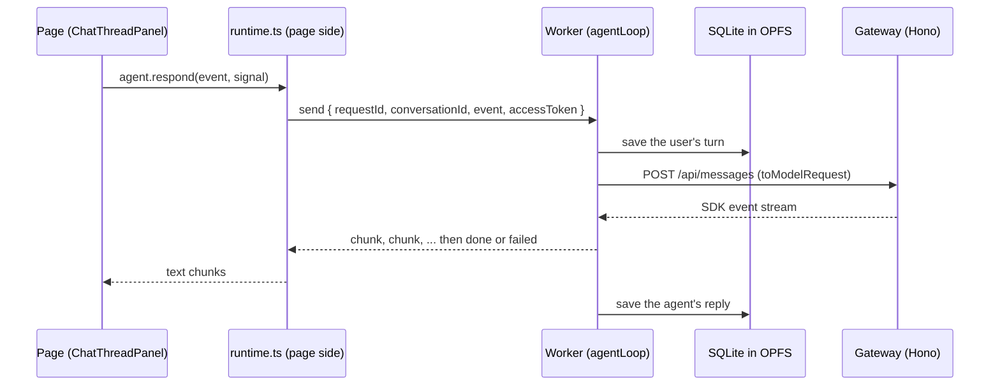

# @yaklabs/runtime

The slice's stand-in for Kay's daemon (ADR-076). A Web Worker owns the agent loop and the
conversation store; the page talks to it only through messages, and both directions are checked
with zod on arrival (ADR-086). Conversations live in SQLite in the browser's private file system
(OPFS), so they never leave the device (ADR-075, ADR-081).



## Starting it from an app

```ts
import { startRuntime } from "@yaklabs/runtime";
import { threads } from "@yaklabs/catalog/thread";

// Once per page. "lab" runs the catalog's scripted stand-in; "gateway" calls the model.
const runtime = startRuntime({ agent: { kind: "gateway", baseUrl: window.location.origin } });

const { storage } = await runtime.ready; // "opfs", or "memory" if OPFS is unavailable
const conversation = await runtime.open("demo", threads.profit); // the seed is used once
const agent = runtime.agent("demo", { getAccessToken }); // AuthKit's getAccessToken (ADR-084)

// <ChatThreadPanel thread={{ title: conversation.title, messages: conversation.messages }}
//                  agent={agent} />
```

`baseUrl` must be absolute: the worker resolves it, and the gateway sits on the page's own origin
under `/api` (ADR-086). `runtime.list()` returns every conversation, newest first, and
`runtime.dispose()` stops the worker.

The consuming app's Vite config needs these lines. This package's own `vite.config.ts` has the
same settings for its tests, naming the two worker dependencies directly; an app reaches them
through the runtime with Vite's `>` form:

```ts
export default defineConfig({
  optimizeDeps: {
    // Required: sqlite-wasm loads sqlite3.wasm from beside its own module, and pre-bundling
    // would move the module away from it.
    exclude: ["@sqlite.org/sqlite-wasm"],
    // Recommended: Vite's dependency scan does not follow `new Worker(new URL(...))`, so without
    // this it finds the worker's dependencies when the worker starts and reloads the page once.
    include: [
      "@yaklabs/runtime > hono/client",
      "@yaklabs/runtime > @anthropic-ai/sdk/lib/MessageStream",
    ],
  },
  worker: { format: "es" },
});
```

The `opfs-sahpool` storage mode needs no cross-origin isolation headers, so no COOP or COEP setup
is needed. ADR-081 has the page ask the browser to keep the data with
`navigator.storage.persist()`; that call is the app's to make, because Firefox shows a prompt.

## The protocol

`src/protocol.ts` holds the zod schemas and the types inferred from them. The catalog's shapes
(`AgentEvent`, `ThreadMessage`, `Thread`, `CardAttachment`) are typed against the catalog's own
types, so a field the catalog adds as required, or retypes, fails to compile here. A new
optional field compiles but is stripped on arrival until its schema learns it.

Page to worker (`Command`):

| kind    | fields                                                       | answered with       |
| ------- | ------------------------------------------------------------ | ------------------- |
| `init`  | `agent`: `{ kind: "lab" }` or `{ kind: "gateway", baseUrl }` | `ready`             |
| `open`  | `conversationId`, `seed?: Thread`                            | `opened`            |
| `send`  | `requestId`, `conversationId`, `event`, `accessToken?`       | `chunk`s, `done`    |
| `abort` | `requestId`                                                  | nothing             |
| `list`  | none                                                         | `listed`            |

A `send` ends with `done`, or with `failed` when the agent throws; an `abort` answers nothing, the
reply just stops.

Worker to page (`Notice`):

| kind      | fields                                  |
| --------- | --------------------------------------- |
| `ready`   | `storage: "opfs" \| "memory"`           |
| `opened`  | `conversation: Conversation`            |
| `chunk`   | `requestId`, `text`                     |
| `done`    | `requestId`                             |
| `failed`  | `requestId`, `reason`                   |
| `listed`  | `conversations: ConversationSummary[]`  |
| `error`   | `reason`                                |

`Conversation` is `{ id, title, messages: ThreadMessage[], updatedAt }`, with `updatedAt` an ISO
8601 instant. `ConversationSummary` is `{ id, title, updatedAt, preview }`, where the preview is
the latest message on one line, cut at 80 characters.

The page checks its own commands before posting them too, so a malformed one (say, an empty
token) rejects in the page instead of reaching the worker as an `error` nobody can match to a
call. A malformed notice, a worker that fails to load, or `dispose()` fails every call still
waiting, and every later one.

## The store

```ts
interface ConversationStore {
  open(id: string): Promise<Conversation | undefined>;
  save(conversation: Conversation): Promise<void>; // writes the whole conversation; idempotent
  list(): Promise<ConversationSummary[]>; // newest first, ties broken by id
  search(query: string): Promise<ConversationSummary[]>; // full text over message text
}
```

- `createMemoryStore()` keeps a `Map` and hands out copies. Tests use it, and the worker falls
  back to it when OPFS is unavailable.
- `openSqliteStore({ kind: "opfs", name })` opens SQLite through the `opfs-sahpool` VFS, one pool
  per database name, which works only inside a Worker. `openSqliteStore({ kind: "memory" })`
  opens an in-memory database, which is all node supports.

The SQLite schema is `conversations(id primary key, title, updated_at)` and
`messages(conversation_id, seq, role, text, time, extra_json)`, where `extra_json` holds the rest
of a turn: its id, card choices, files and cards. `messages_fts` is an external-content FTS5
table over `messages.text`, kept in step by insert, update and delete triggers. Rows read back are
parsed with the protocol's schemas before they become turns. `pragma user_version` is 1.

Search takes every word of the query as a prefix, ignoring case and accents, and finds
conversations with a message that holds them all. Both stores pass one shared test suite
(`src/store.test.ts`).

## The worker's contract

- `init` opens `yaklabs` in OPFS, or falls back to memory with a `console.warn`, then posts
  `ready`. Commands sent before `init` finishes wait for it; a command sent without any `init`
  fails. A second `init` keeps the store and swaps the agent.
- `open` returns the stored conversation. A new id with a seed is created from the seed (its
  title and turns) and saved; a new id without one comes back empty and is saved with its first
  turn.
- `send` saves the user's turn first, so a failed reply never loses what the user sent: a
  `message` becomes a user turn with its `attachments` and its `files` as `{ id, label }`, an
  `answer` becomes a user turn with its text, and `question-rejected` adds no user turn (ADR-040).
  Then the agent runs; each piece it yields is posted as a `chunk`, and at the end the reply is
  saved as an agent turn and `done` is posted. If the agent throws, `failed` carries the error
  message and nothing is saved for the reply. An `abort` stops the agent; what streamed so far is
  saved, and `done` is posted.
- New turns take `u<n>` and `a<n>` ids, one past the highest number each role already uses, so
  the seeds' u1/a1, u2/a2 pairing carries on. Times are `H:MM` in local time, like the seeds.
- One write happens at a time, so two replies ending together cannot lose each other's turns.
- The lab agent is `createLabAgent()` from `@yaklabs/catalog/labAgent`. The gateway agent
  (`src/gatewayAgent.ts`) reads the conversation, leaves out the user turn the worker just saved
  (the event carries it), builds its request with `toModelRequest`, posts it through Hono's typed
  client (`hc<AppType>`) with `Authorization: Bearer <token>`, and yields the text deltas that
  `MessageStream.fromReadableStream(response.body)` parses from the gateway's
  `toReadableStream()` body. A status other than 200 throws `The gateway replied <status>`, never
  the body.

`toModelRequest(conversation, event)` (`src/modelRequest.ts`, pure) is the point of the slice. A
user turn carries one `[Card view: <label>]` line per card choice and one `[Attached file: <name>]`
line per file, so the model sees what the user set on an interactive card (ADR-030, ADR-031). An
agent turn carries each card it showed as compact JSON in a fenced block. The incoming event is
the last user turn; a rejected question becomes a turn asking the agent to ask again in plain
words. When a thread outgrows the gateway's 200 turns, the oldest go first, and the request always
starts with a user turn.

Only one worker at a time can hold a database's OPFS pool. While one holds it, a second worker (a
second tab, say) falls back to memory, and its `ready.storage` says so; the browser tests pin
this. Once the first worker is gone, the next one gets OPFS again.

## Tests

```sh
pnpm --filter @yaklabs/runtime test        # both projects
pnpm --filter @yaklabs/runtime typecheck
```

- `unit` runs in node: the protocol, both stores, the model request, the gateway agent against an
  in-process Hono app that validates with the gateway's real contract, and the agent loop.
- `browser` runs in headless Chromium through `@vitest/browser-playwright`: SQLite in real OPFS
  across store instances and workers (through `src/sqliteStore.testWorker.ts`, since OPFS's fast
  mode exists only in a Worker), and the full round trip through `startRuntime` with the lab agent,
  read back by a second runtime.

`tsconfig.json` turns `noUncheckedIndexedAccess` off because the catalog's sources compile inside
this program and do not pass it yet. This package's own files do: check with
`npx tsc --noEmit --noUncheckedIndexedAccess true` and look only at `src/` lines.
